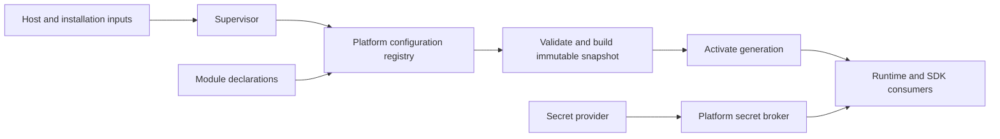
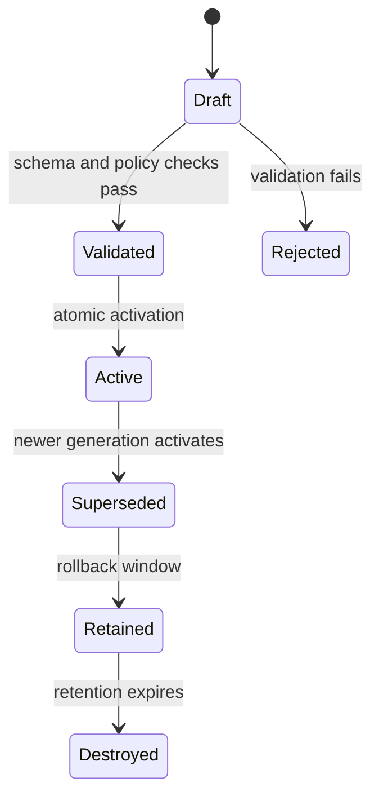

<!--
File: docs/engineering/guides/meg-005-runtime-architecture/18-configuration-and-secrets.md
Document: MEG-005
Status: Draft
-->

# Configuration And Secrets

> **Current direction:** Platform configuration is typed, validated and versioned. Secrets are a separate protected contract owned by Platform and exposed only through authorised SDK capabilities.

## Boundary of responsibility

The Platform owns configuration schemas, validation, active snapshots and change history. Administrators manage ordinary configuration through the authenticated admin UI and API. The Supervisor supplies bootstrap/deployment inputs, starts activation and reports failures. Modules declare configuration schemas and requested secret capabilities; they do not load files, read environment variables, own secret stores or create independent configuration systems.

This keeps deployment concerns in the Supervisor, runtime policy in Platform and domain-specific declarations in Modules.

## Configuration sources and precedence

Configuration is resolved in a documented order:

1. Platform defaults;
2. installation or deployment profile;
3. persisted administrator configuration;
4. Supervisor-provided environment or command-line overrides; and
5. explicitly permitted runtime overrides.

Higher-precedence values must be visible in the resulting diagnostic metadata. The admin UI/API is the normal authoring path; deployment inputs remain available for bootstrap and recovery. Secret values are never treated as ordinary configuration values and are not included in snapshots, GraphQL responses, logs or support bundles.

## Schema and activation

Every configuration key has a type, owner, default (when safe), validation rules, sensitivity classification and activation policy. Changes are validated as a complete candidate snapshot before activation. A failed candidate leaves the previous generation active.

Each generation has an identifier, source metadata, validation result and activation timestamp. Changes are classified as hot-reloadable or structural. Safe changes apply live and atomically. For structural changes, Supervisor may compose and warm a new generation, switch traffic/session ownership, and retire the previous generation; restart is the fallback when a seamless transition is unsafe.

## Secret contract

Secret lifecycle and storage rules remain authoritative in [MEG-009 — Security Architecture](../meg-009-security-architecture/index.md), especially its [Secrets Management](../meg-009-security-architecture/06-secrets-management.md) chapter. This Runtime contract adds the Platform integration boundary:

- Platform resolves secrets through a broker. Local deployments use the operating-system keychain where available and an encrypted Platform vault as fallback; the source remains hidden from consumers.
- Access requires a declared Module capability and a Policy Decision Point approval for the current subject, device and session.
- Modules are compiled Go libraries inside the Platform binary, so there is no transport boundary between Module and Platform. The SDK still enforces the same capability boundary: a Module receives only the minimum named credential or a Platform operation that uses it, and never receives provider handles or private signing keys unless explicitly required.
- Secret versions can be rotated and revoked independently of ordinary configuration. Consumers receive an invalidation signal or a bounded refresh result rather than silently retaining stale credentials.
- Secret metadata (availability, version, expiry and last rotation) may be diagnosed; values must not be observable.

Integration credentials for services such as Jellyfin are Platform-managed resources requested by a Module, not Module-owned storage.

## Change, audit and recovery

Configuration and secret changes are authenticated, policy-authorised and recorded with actor, device, generation/version, source and outcome. Values are redacted before events or diagnostics are emitted. The Platform must support listing active and previous safe generations, validating a candidate without activation, and rolling back a failed configuration generation.

The deployment master key is backed up only as encrypted material protected by a separate recovery key. Losing both keys intentionally makes encrypted secrets unrecoverable rather than weakening protection.

## Guarantees

- one typed configuration registry serves Platform and Modules;
- Modules cannot bypass validation or introduce private configuration stores;
- ordinary configuration and secrets have separate visibility and lifecycle rules;
- activation is atomic, versioned and recoverable; and
- every access or change is policy-checked and auditable without exposing values.
