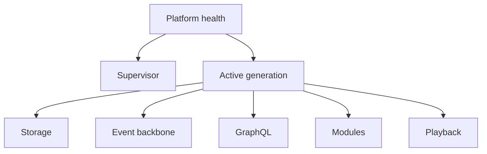

<!--
File: docs/engineering/guides/meg-005-runtime-architecture/19-observability-and-diagnostics.md
Document: MEG-005
Status: Draft
-->

# Observability And Diagnostics

> **Current direction:** Platform observability is local-first, admin-visible and privacy-preserving. Operational procedures belong in [MOP-001 — Observability Operations](../../operations/mop-001-observability-operations/index.md).

## Signals

Platform writes structured `.log` files locally. The admin UI exposes authorised log views, metrics, traces and diagnostic summaries without requiring an external telemetry service. External export may be added later, but is not a v1 dependency.

Logs and traces MUST redact credentials, tokens, media secrets and personal data. Events identify the Platform generation, component, Module and program version where useful.

## Component health

Health is reported per component rather than as one opaque Platform status. At minimum the health tree covers Supervisor, Platform generation, storage, event backbone, GraphQL, each Module and playback.

Each component reports status, reason, last transition, dependency impact and remediation hint. Aggregate health is derived from these details and may be `healthy`, `degraded`, `unavailable` or `unknown` without hiding the component-level cause.

## Failure handling

Repeated Module failures use criticality-aware policy. A non-critical Module is restarted with bounded exponential backoff and marked degraded; repeated failure opens a circuit until an operator or health transition permits retry. A critical Module follows the same backoff discipline but can prevent a generation from becoming active or trigger Supervisor rollback when its contract is required for safe operation.

## Support bundles

Support bundles are fully anonymised by default. They may include program version, Platform generation, Module identifier, component health, redacted logs, event categories and configuration schema/version metadata. They MUST NOT include names, account identifiers, content identifiers, addresses, tokens, credentials or raw configuration values.

## Guarantees

- local `.log` files are the baseline diagnostic record;
- administrators can inspect authorised diagnostics in the admin UI;
- health remains component-level with an explainable degraded state;
- failure retries respect Module criticality and bounded backoff; and
- support data is safe to share with the open-source community without PII.

