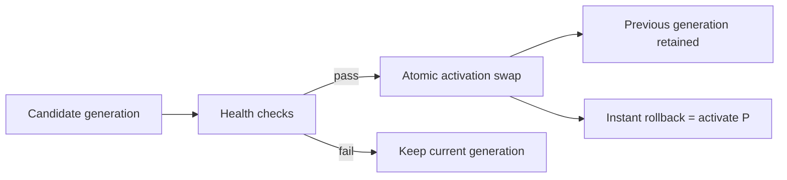
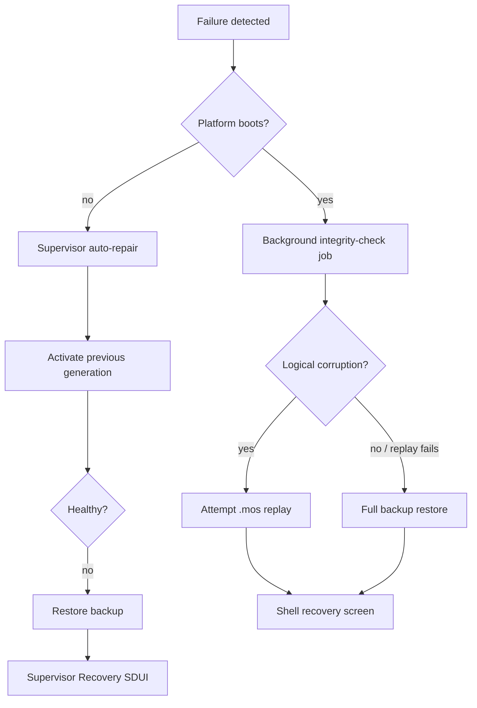

<!--
File: docs/engineering/guides/meg-005-runtime-architecture/20-persistence-and-recovery.md
Document: MEG-005
Status: Draft
-->

# Persistence And Recovery

## Generations and database boundary

A Generation contains the executable and presentation surfaces:

```text
Platform + Shell + Modules + manifests + assets + signatures
```

The PostgreSQL database is never inside a Generation. Supervisor activates a complete Generation atomically and can roll back by activating an earlier Generation. Rollback never undoes database mutations or attempts to repair business state.



## Migration strategy

Database migrations have an independent lifecycle. Application upgrades use expand/contract migration:

1. add new tables, columns, indexes or schema views;
2. run old and new application generations against the compatible shape;
3. cut over to the new shape; and
4. defer destructive drops and renames to a later release after rollback risk has passed.

Where practical, pgroll-style dual schema views provide the closest database analogue to generation activation: old and new shapes coexist over the same tables and cutover is a pointer change. This protects schema cutover, but it does not protect against corrupted data. Every migration MUST trigger a synchronous pre-migration backup before it starts.

## Backup and export artifacts

Mosaic defines three separate artifacts with separate scopes and triggers:

| Artifact | Handler | Trigger and scope |
|---|---|---|
| PostgreSQL dump/WAL backup | `postgres_backup` | Scheduled (default 24 hours, configurable) and mandatory pre-migration backup; whole database |
| `.mos` portability package | `mos_export` | On demand; selected library, work or container |
| NFO export | `nfo_export` | On demand; selected local-media scope, excluding remote-only paths |

All three are jobs in the existing jobs table and execute through the worker pool. NFO generation is owned by the Local Media Module’s export capability; Platform provides the job, storage and policy contracts.

Backup scheduling and retention are administrator-configurable in the admin UI. Mosaic supplies safe defaults (daily backups with a rolling daily/weekly retention window), while allowing the user to choose the schedule, daily and weekly retention counts, optional monthly retention, storage location and maximum backup volume. The Platform enforces a disk-capacity guard, never deletes an in-use or restore-required backup, and reports when the selected policy cannot be satisfied.

## Recovery paths

Recovery distinguishes boot failure from data integrity failure.



When Platform cannot boot, Supervisor owns the BIOS-like Recovery SDUI and tries generation rollback before backup restore. When Platform boots but integrity checks find corruption, Platform publishes an event and the Shell’s recovery screen presents repair progress; Recovery SDUI is not used because Platform remains healthy.

## Guarantees

- generations are code/presentation artifacts and never contain PostgreSQL;
- generation rollback is activation of an earlier artifact, not data undo;
- migrations are additive-first, reversible at cutover where possible, and always preceded by a synchronous backup;
- backup, `.mos` and NFO exports remain distinct jobs; and
- recovery chooses the least destructive viable path for the detected failure class.
