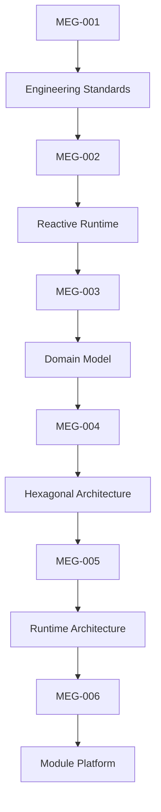
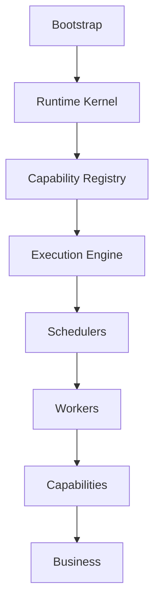

<!--
File: docs/engineering/guides/meg-005-runtime-architecture/index.md
Document: MEG-005
Status: Draft
Version: 0.4
-->

# MEG-005 — Runtime Architecture

> *The Runtime is not a collection of services. It is the operating system of the Mosaic platform.*

---

# Purpose

Previous engineering specifications established:

- how software is written
- how the runtime behaves
- how the business is modelled
- how technology is isolated from the business

MEG-005 answers a different question.

> **How is the Runtime itself constructed?**

The Mosaic Runtime is more than an event bus.

It is responsible for:

- capability discovery
- dependency composition
- lifecycle management
- scheduling
- execution
- orchestration
- observability
- resource ownership

This document defines the internal architecture of the Runtime itself.

Unlike [MEG-002](../meg-002-event-driven-runtime/index.md), which describes **runtime behaviour**, MEG-005 describes **runtime structure**.

---

# Relationship to MEG



[MEG-002](../meg-002-event-driven-runtime/index.md) answers:

> **How should work execute?**

MEG-005 answers:

> **What components make that execution possible?**

---

# Scope

This specification defines:

- Runtime philosophy
- Runtime composition
- Platform runtime components
- Capability registry
- Service lifecycle
- Dependency graph
- Execution engine
- Worker manager
- Scheduler architecture
- Resource ownership
- Supervisor model
- Capability discovery
- Startup architecture
- Shutdown architecture
- Runtime state
- Runtime extensibility

This specification intentionally does **not** define:

- Domain modelling
- Business behaviour
- Event semantics
- Module SDKs
- Storage implementation

Those concerns belong to other MEG specifications.

---

# Guiding Question

MEG-005 exists to answer one question.

> **How should the Mosaic Runtime itself be architected so that it remains modular, resilient and extensible?**

---

# Runtime Statement

Within Mosaic:

> **The Runtime is an execution platform, not a business platform.**

The Runtime exists to provide capabilities with an execution environment.

It owns:

- execution
- coordination
- lifecycle
- resources

It does **not** own:

- playback
- metadata
- libraries
- recommendations
- users

Business belongs to capabilities.

Execution belongs to the Runtime.

---

# Runtime Hierarchy

The Runtime intentionally separates itself into architectural layers.



Each layer owns exactly one responsibility.

The Runtime should resemble a small operating system.

Not a large application.

---

# Expected Outcome

After reading MEG-005 contributors should understand:

- how the Runtime is internally organised
- how capabilities are discovered
- how services start
- how workers are managed
- how scheduling integrates with execution
- how dependencies are resolved
- how resources are owned
- how the Runtime evolves without becoming a monolith

without discussing individual business capabilities.

---

# Repository Structure

```

engineering/

└── meg/

    └── MEG-005 Runtime Architecture/

        README.md

        00-document-control.md

        01-runtime-philosophy.md

        02-runtime-kernel.md

        03-capability-registry.md

        04-service-lifecycle.md

        05-dependency-graph.md

        06-execution-engine.md

        07-worker-manager.md

        08-scheduler-architecture.md

        09-resource-management.md

        10-startup.md

        11-shutdown.md

        12-runtime-state.md

        13-runtime-modelling-guidelines.md

        14-supervisor-model.md

        15-adrs.md

        16-contributor-guidance.md

        17-references.md

        glossary.md
```

---

# Dependencies

Required reading:

- [MEG-001 — Go Engineering Standards](../meg-001-go-engineering-standards/index.md)
- [MEG-002 — Event-Driven Runtime](../meg-002-event-driven-runtime/index.md)
- [MEG-003 — Domain-Driven Design](../meg-003-domain-driven-design/index.md)
- [MEG-004 — Hexagonal Architecture](../meg-004-hexagonal-architecture/index.md)

Future companion specifications:

- [MEG-006 — Module Platform](../meg-006-module-platform/index.md)
- [MEG-007 — Storage Architecture](../meg-007-storage-architecture/index.md)
- [MEG-008 — Observability](../meg-008-observability/index.md)

---

# Design Goals

The Runtime Architecture is intended to produce a platform that is:

- Modular
- Observable
- Deterministic
- Extensible
- Replaceable
- Resource aware
- Fault tolerant
- Operationally simple

The Runtime should feel more like a lightweight operating system than a traditional backend application.

Every new capability should integrate into the Runtime rather than modifying it.
