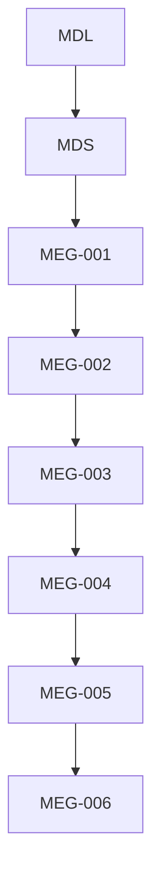
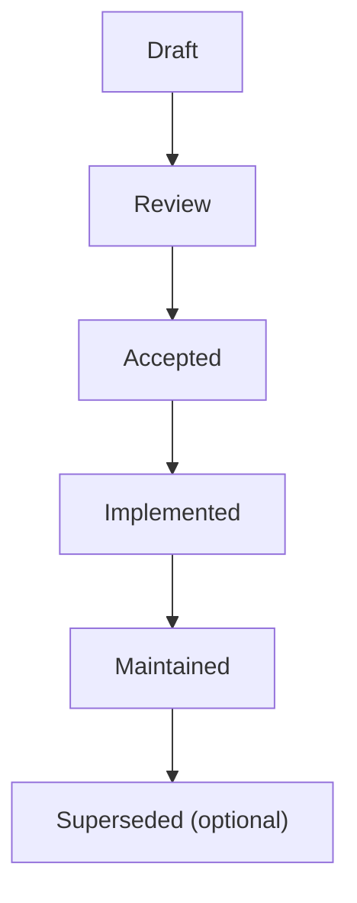

<!--
File: docs/engineering/guides/meg-006-module-platform/00-document-control.md
Document: MEG-006
Status: Draft
Version: 0.8
-->

# Document Control

---

# Document Information

| Field | Value |
|---------|--------|
| Document ID | MEG-006 |
| Title | Module Platform |
| File | 00-document-control.md |
| Status | Draft |
| Version | 0.8 |
| Owner | AdamNi-7080 |
| Classification | Internal Architecture Specification |

---

# Purpose

This document establishes the governance, authority and lifecycle of the Mosaic Module Platform specification.

MEG-006 defines how independently developed capabilities become part of the Mosaic platform.

Unlike Runtime Architecture, which defines **how capabilities execute**, this specification defines:

- how capabilities are discovered
- how they are described
- how they are validated
- how they are composed into Platform packages
- how they become operational

The Module Platform is the mechanism through which the platform evolves without modifying the Platform.

Version 0.8 defines the Test Harness as a deterministic suite of development-only Modules, records event-simulation ownership and defers versioned Scenario Profiles pending a protocol decision.

---

# Authority

MEG-006 is the authoritative specification governing module development throughout the Mosaic ecosystem.

This specification applies to:

- Built-In Capabilities
- First-party Modules
- Third-party Modules
- Enterprise Modules
- SDK Development
- Developer Platform tooling
- Local Module development
- Test Harness Modules
- Test Harness deterministic datasets
- Test Harness event simulation
- deferred Scenario Profiles
- Marketplace Integration

Every capability intended to execute within the Mosaic Runtime SHOULD comply with this specification.

---

# Relationship to Other Specifications

MEG specifications intentionally build upon one another.

Specifically:

- **[MEG-001](../meg-001-go-engineering-standards/index.md)** defines engineering.
- **[MEG-002](../meg-002-event-driven-runtime/index.md)** defines runtime behaviour.
- **[MEG-003](../meg-003-domain-driven-design/index.md)** defines business modelling.
- **[MEG-004](../meg-004-hexagonal-architecture/index.md)** defines architectural boundaries.
- **[MEG-005](../meg-005-runtime-architecture/index.md)** defines the Capability Runtime.
- **MEG-006** defines how capabilities join that Runtime.

Together they establish the complete lifecycle of a Mosaic capability.

---

# Normative Language

Unless explicitly stated otherwise, the following keywords are interpreted according to RFC 2119.

| Keyword | Meaning |
|----------|---------|
| **MUST** | Mandatory requirement. |
| **MUST NOT** | Prohibited behaviour. |
| **SHOULD** | Strong recommendation. Deviation requires architectural justification. |
| **SHOULD NOT** | Discouraged except where clearly justified. |
| **MAY** | Optional behaviour based upon engineering judgement. |

Examples and diagrams are informative unless explicitly identified as normative.

---

# Module Principles

The Mosaic Module Platform is built upon several foundational principles.

- Everything beyond the Runtime is a capability.
- Every capability is described by a manifest.
- Discovery precedes execution.
- Validation precedes activation.
- Module composition occurs at build time.
- Runtime plugins are prohibited.
- Runtime stability takes precedence over module flexibility.
- Capabilities remain independently deployable.
- Built-in and third-party capabilities are architectural equals.
- Modules evolve the platform without modifying the Runtime.

Every subsequent chapter expands one or more of these principles.

---

# Document Lifecycle

MEG specifications evolve alongside the platform.

Each document progresses through the following lifecycle.

Accepted specifications become part of the canonical Mosaic architecture.

Historical revisions SHOULD remain available for future reference.

---

# Platform Evolution

The Module Platform is expected to evolve.

However, changes affecting:

- capability manifests
- registration
- discovery
- dependency resolution
- permissions
- activation
- SDK contracts
- build-time composition
- generated imports
- Developer Platform boundaries
- local development composition
- testing and publication workflow ownership

SHOULD be accompanied by an Architectural Decision Record (ADR).

Platform evolution should remain deliberate and predictable.

---

# Compliance

All modules intended for the Mosaic Runtime SHOULD comply with MEG-006.

Where deviation becomes necessary, module authors SHOULD document:

- architectural reason
- compatibility impact
- migration strategy
- operational implications

The Runtime should remain capable of validating compliance before activation.

---

# Design Philosophy

MEG-006 intentionally favours:

- manifest-driven discovery
- explicit capability contracts
- deterministic build-time composition
- dependency validation
- runtime isolation
- version compatibility
- operational transparency

The Runtime should understand a module completely before executing it.

A machine-readable manifest describing identity, dependencies, permissions and capabilities has become the dominant approach for modern module ecosystems because it enables validation and discovery before code execution.  [Chrome for Developers](https://developer.chrome.com/modules/manifest)

---

# Scope of Authority

MEG-006 governs the Module Platform.

It does **not** define:

- business modelling
- runtime execution
- storage architecture
- deployment topology

Those concerns belong to other MEG specifications.

Keeping module concerns separate from runtime concerns allows both to evolve independently.
