<!--
File: docs/engineering/guides/meg-006-module-platform/01-module-philosophy.md
Document: MEG-006
Status: Draft
Version: 0.8
-->

# Module Philosophy

> *The Runtime should never need to know what tomorrow's capabilities look like. It should simply know how to host them.*

---

# Purpose

Traditional software grows by modifying the Platform foundation.

Every new feature requires:

- new services
- new modules
- new dependencies
- new deployment

Over time, the Platform foundation becomes increasingly complex.

Mosaic intentionally rejects this approach.

Instead:

The Runtime remains small.

The platform grows by adding capabilities.

This document establishes the architectural philosophy behind the Mosaic Module Platform.

---

# Philosophy

Within Mosaic:

> **The Platform evolves through build-time capability composition, not through Runtime plugin loading.**

Every new business feature should ideally be introduced by:

- adding a capability
- registering it
- allowing the Runtime to execute it

Rather than modifying the Runtime itself.

The Runtime should become increasingly capable without becoming increasingly complicated.

Mosaic does not support runtime plugins.

Modules are ordinary Go libraries that are statically linked into a Platform Binary.

Mosaic also does not use RPC between local Modules.

Local Module collaboration occurs through Platform capabilities, Capability Managers and the Event Bus.

---

# Why Modules Exist

Consider adding support for:

- Books
- Comics
- Audiobooks
- Music
- Podcasts
- IPTV

Traditional architecture.

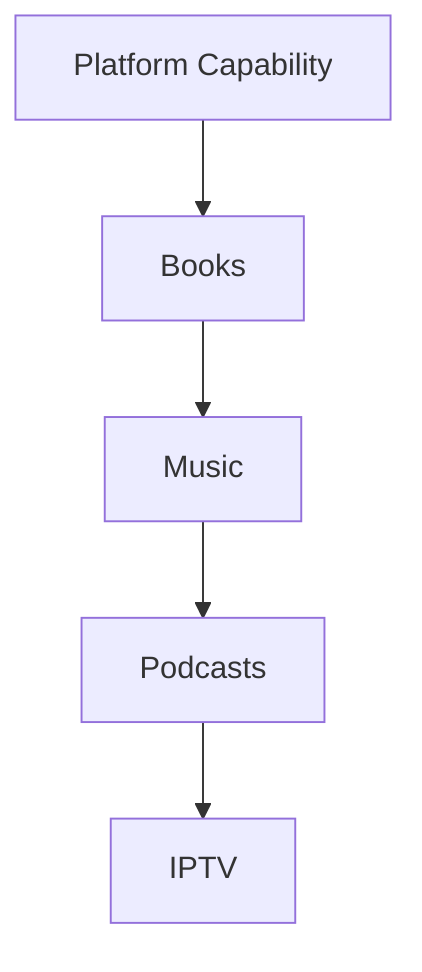

Eventually:

The base application owns every business concept.

Instead.

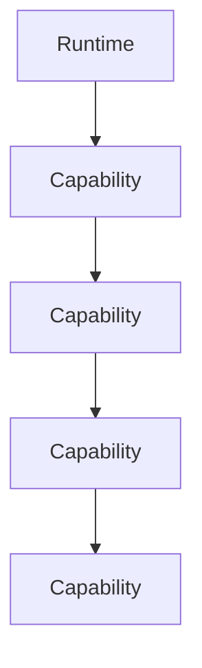

The Runtime remains unchanged.

Only capabilities increase.

---

# Capabilities Before Features

Within Mosaic:

Features are not architectural units.

Capabilities are.

Example.

Poor.

```

Add Podcast Feature
```

Preferred.

```

Podcast Capability
```

The distinction matters.

Capabilities possess:

- lifecycle
- dependencies
- contracts
- manifests
- ownership

Features do not.

---

# The Runtime Is Complete

One of the most important ideas within Mosaic is:

The Runtime should already contain everything required to execute future capabilities.

Adding a capability should **not** require:

- Runtime modification
- Runtime redesign

It does require producing a new Platform package for the selected Generation.

The stable Runtime foundation remains unchanged.

The composed Platform Binary changes.

The composition flow is:

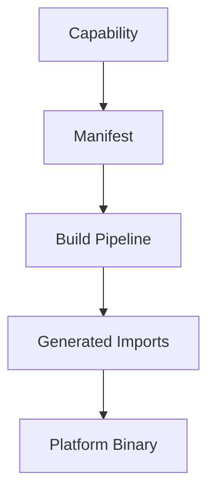

The Runtime should recognise statically registered capabilities at startup.

---

# No Runtime Plugins

Mosaic intentionally avoids runtime plugin mechanisms.

Modules are not:

- plugin framework artefacts
- dynamic libraries
- DLLs
- RPC services
- reflection-discovered packages
- runtime-loaded extensions

They are normal Go libraries.

Example.

```text
module-anilist/

    go.mod
    module.go
    metadata.go
    artwork.go
```

The final Runtime is a single statically linked Go executable.

To the finished binary, there is no meaningful distinction between Platform code and Module code.

There is only Go code selected for the current Platform package.

---

# What Is A Module?

A Module is a normal Go project.

Example.

```text
module-anilist/

    go.mod
    module.go
    metadata.go
    artwork.go
    graphql.go
```

There is no special runtime container, DLL boundary, reflection registration layer or RPC sidecar.

The Module depends on the Mosaic SDK.

The Module implements Platform-owned contracts.

The Module is compiled into the selected Platform Binary.

---

# Module Responsibilities

A Module may contribute one or more Platform capabilities.

Examples include:

- Metadata Provider
- Artwork Provider
- Media Provider
- Search Provider
- Authentication Provider
- GraphQL Schema
- Event Handlers
- Scheduled Jobs

A Module never modifies the Platform.

It contributes implementations for Platform-owned contracts.

---

# Built-In Capabilities Are Not Special

Architecturally:

Platform capabilities should be treated exactly like module capabilities.

Example.

```

Playback
```

```

Metadata
```

```

Library
```

All are capabilities.

The only distinction is:

Delivery.

Platform capabilities ship with the Runtime.

Modules ship independently.

Execution should remain identical.

This module-first philosophy keeps the Platform foundation small and stable by giving built-in and module-delivered capabilities the same architectural model.  [Bifrost](https://docs.getbifrost.ai/architecture/platform/plugins)

---

# Runtime Neutrality

The Runtime should remain neutral.

It should not know:

- Anime
- Movies
- Books
- Jellyfin
- Stremio
- TMDB

It should know only:

```

Capability
```

Everything else belongs to the capability itself.

---

# Platform Growth

The preferred growth model is:

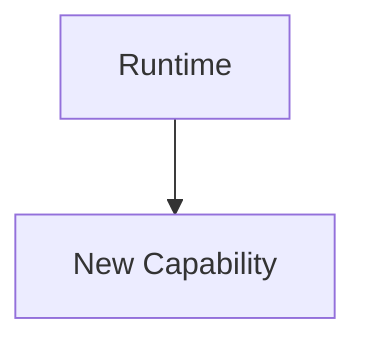

Not:

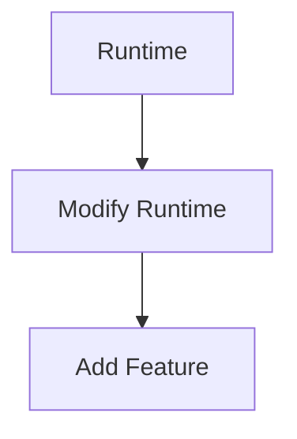

The platform grows by composition.

Not accumulation.

---

# Discovery Before Execution

One of the defining characteristics of the Module Platform is:

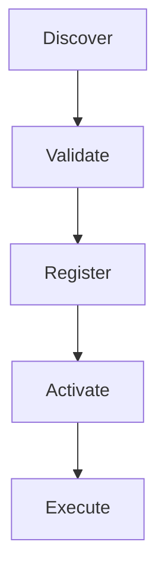

The Runtime should completely understand a capability before executing any of its code.

Discovery should be metadata driven.

Execution should come later.

Mosaic separates **manifest resolution** from **build-time composition**, allowing validation before executable code becomes part of an activated Generation.

---

# Manifest First

Every capability begins with a manifest.

The manifest describes:

- identity
- dependencies
- permissions
- contracts
- configuration
- capabilities

The Supervisor and Build Pipeline should understand the manifest before the implementation becomes part of a Platform package.

The manifest becomes the Supervisor's primary source of truth for Module composition.

---

# Capabilities Are Products

Capabilities should be developed as independently evolving products.

Each capability owns:

- business behaviour
- documentation
- lifecycle
- testing
- versioning

Capabilities should not depend upon private Runtime implementation.

The Runtime provides the platform.

Capabilities provide value.

---

# Runtime Contracts

Every interaction with the Runtime should occur through stable contracts.

Examples include:

- lifecycle
- execution
- configuration
- scheduling
- permissions

Capabilities should never depend upon Runtime internals.

This allows the Runtime to evolve independently.

---

# Replaceability

Capabilities should remain replaceable.

Suppose:

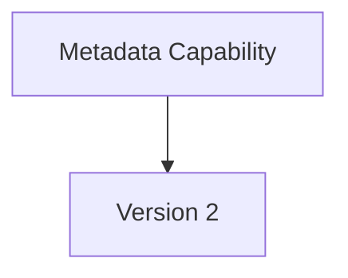

The Runtime should require:

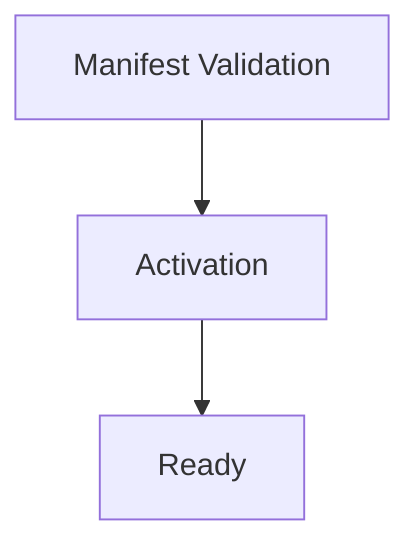

Nothing else.

Capabilities should be interchangeable wherever practical.

---

# Capability Isolation

Every capability should execute independently.

Suppose:

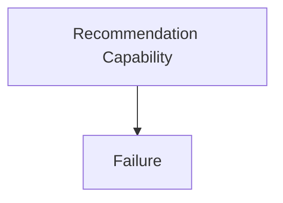

The Runtime should ensure:

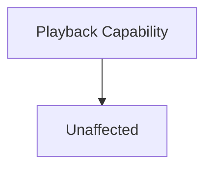

Capability failures should never destabilise the platform.

Isolation is one of the defining responsibilities of the Runtime.

---

# Runtime Evolution

The Runtime evolves by improving execution.

Capabilities evolve by improving business behaviour.

These concerns should remain independent.

Examples.

Runtime.

- faster scheduler
- improved worker pools
- better observability

Capabilities.

- better metadata
- improved playback
- smarter recommendations

Neither should require modifying the other.

---

# Module Equality

The Runtime should never distinguish between:

- Platform capabilities
- First-party
- Third-party

Every capability should satisfy the same Runtime contracts.

Every capability should participate in:

- lifecycle
- discovery
- execution
- observability

Architectural equality greatly simplifies the platform.

---

# Marketplace Thinking

The Runtime should eventually support an ecosystem.

That ecosystem depends upon:

- predictable contracts
- stable manifests
- manifest resolution
- build-time composition
- version compatibility

The Runtime should therefore be designed for capabilities that have not yet been written.

Platform ecosystems thrive when the host defines stable module boundaries and capabilities register through manifests rather than bespoke integration code.  [arc42 Quality Model](https://quality.arc42.org/approaches/plugin-architecture)

---

# Simplicity

The Module Platform should remain conceptually simple.

Everything reduces to one sentence.

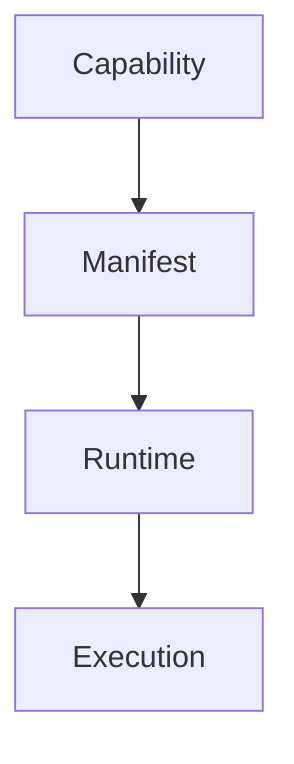

Everything else is implementation.

---

# Mosaic Principles

Within Mosaic:

- The Runtime grows through capabilities.
- Capabilities are first-class architectural units.
- Built-in and module-delivered capabilities are architectural equals.
- Discovery precedes execution.
- Manifests define Runtime contracts.
- Runtime neutrality must be preserved.
- Capabilities remain independently deployable.
- Runtime evolution and capability evolution remain independent.

These principles define the identity of the Module Platform.

---

# Relationship to MEG

[MEG-005](../meg-005-runtime-architecture/index.md) defined:

> **How the Runtime executes capabilities.**

MEG-006 now begins defining:

> **How capabilities become part of the Runtime.**

The next chapter introduces the **Capability Manifest**, the machine-readable contract through which every capability describes itself to the platform.

---

# Summary

The Module Platform exists for one purpose.

> **Allow the platform to grow forever without growing the Runtime.**

The Runtime should become increasingly powerful by hosting more capabilities.

Not by accumulating more business behaviour.

That distinction is what transforms Mosaic from an application into a platform.
