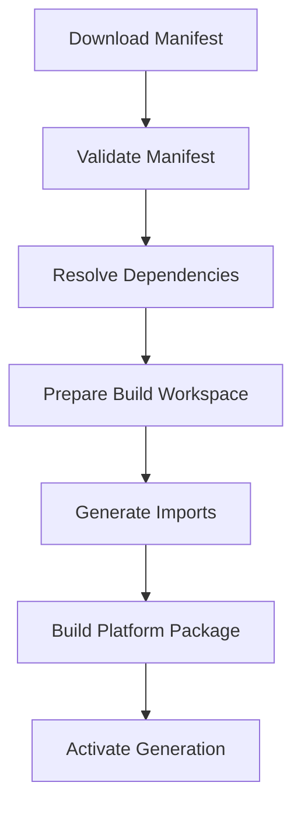

<!--
File: docs/engineering/guides/meg-006-module-platform/02-module-manifest.md
Document: MEG-006
Status: Draft
Version: 0.8
-->

# Module Manifest

> *Module engineering begins with the manifest, but the protocol belongs to [MIP-002](../../protocols/mip-002-module-manifest-protocol/index.md).*

---

# Purpose

MEG-006 explains how engineers build the Module Platform.

The authoritative manifest contract is defined by **[MIP-002 — Module Manifest Protocol](../../protocols/mip-002-module-manifest-protocol/index.md)**.

This chapter describes the engineering implications of that protocol.

---

# Engineering Guidance

Module composition should always follow the same order:



The Supervisor should not execute or analyse Go source to discover identity, dependencies, permissions or contracts.

The manifest is the Supervisor's primary source of truth.

SDK or CLI tooling may generate the manifest from Go Module definitions during development.

Once generated, the manifest remains the build-time contract consumed by the Supervisor.

Generated manifests must be validated the same way as hand-authored manifests.

Tooling convenience must not turn executable Module code into the Supervisor's discovery source.

---

# Manifest Example

```yaml
id: anilist
version: 1.0.0
sdk: ">=2.0"
capabilities:
  metadata:
    supports:
      media:
        - Anime
      identifiers:
        - AniList
        - MAL
    priority: 100
permissions:
  network:
    - graphql.anilist.co
events:
  publishes:
    - anime.episode.released
  subscribes:
    - library.item.added
```

This gives the Supervisor enough information to resolve compatibility, permissions, provider routing and event declarations before the Build Pipeline runs.

---

# Implementation Expectations

Module Platform implementations should provide:

- deterministic manifest discovery
- clear validation errors
- permission review before activation
- dependency resolution before execution
- diagnostic visibility into accepted and rejected modules
- build workspace inputs derived from manifests

---

# Reference

Protocol authority is provided by:

- [MIP-002 — Module Manifest Protocol](../../protocols/mip-002-module-manifest-protocol/index.md)
