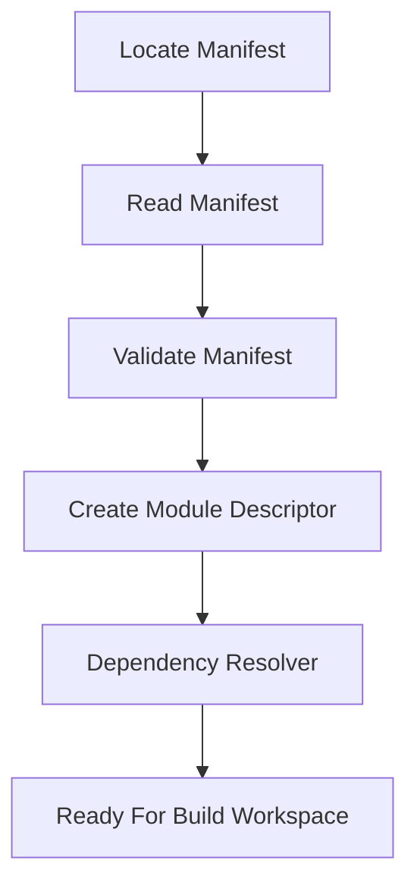
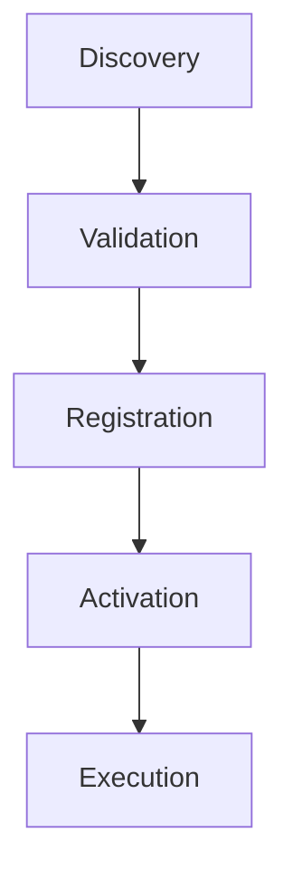
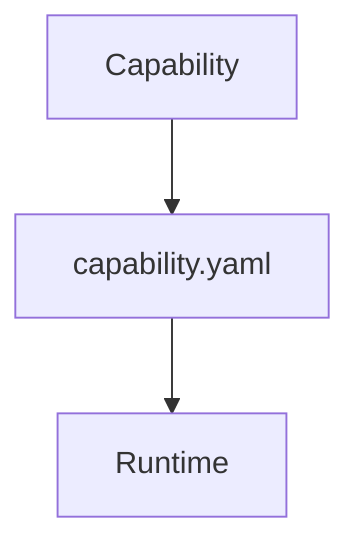
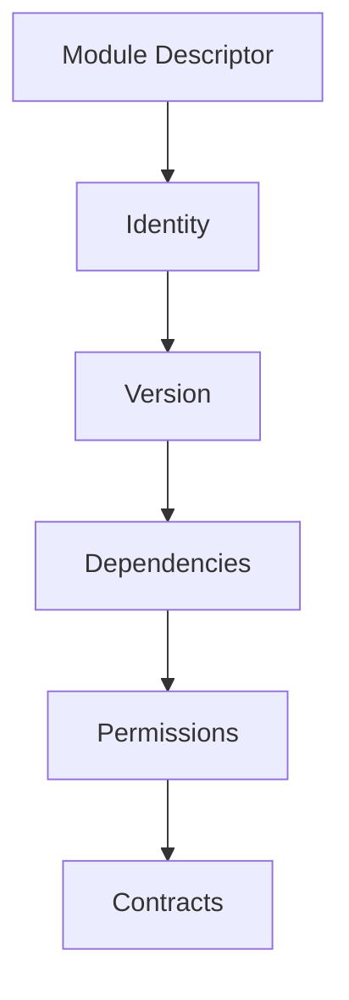
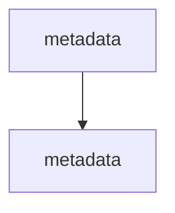
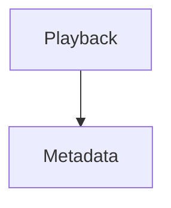
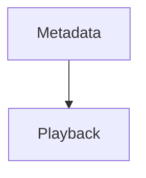
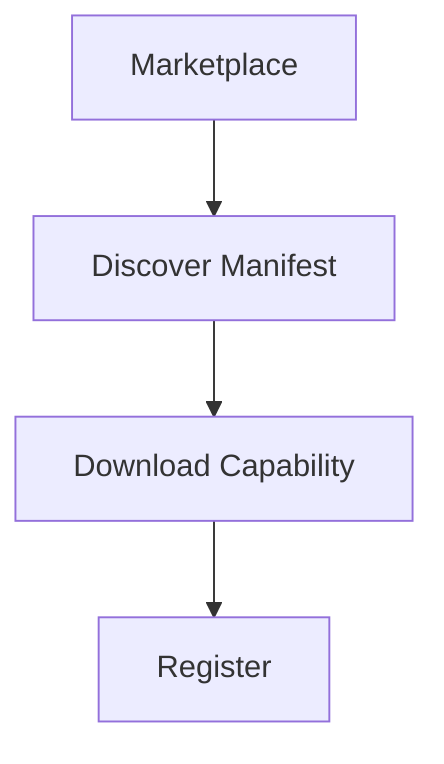

<!--
File: docs/engineering/guides/meg-006-module-platform/03-discovery.md
Document: MEG-006
Status: Draft
Version: 0.8
-->

# Discovery

> *A Module cannot participate in Mosaic until the Supervisor has resolved its manifest.*

---

# Purpose

The Module Manifest defines **what** a Module contributes.

Discovery defines **how** the Supervisor finds it before build-time composition.

The Discovery process is responsible for locating every selected Module before the Build Pipeline creates a Platform package.

Discovery is intentionally separated from:

- registration
- dependency resolution
- activation
- execution

A discovered Module is not yet trusted.

It is merely known.

---

# Philosophy

Within Mosaic:

> **Discovery identifies Modules. It never executes them.**

The Supervisor should discover:

- manifests
- metadata
- dependencies
- contracts

without loading any executable code.

A Module should be completely understood before the Build Pipeline is invoked.

---

# Discovery Pipeline

Every selected Module follows the same discovery pipeline.



Execution has not yet begun.

Only metadata has been processed.

---

# Discovery Before Execution

One of the most important Runtime guarantees is:



A capability should never execute simply because it exists on disk.

The Supervisor must first determine:

- what it is
- whether it is valid
- whether it is compatible

---

# Discovery Sources

Modules MAY be discovered from multiple sources.

Examples include:

```

Platform Capability
```

```

Modules Directory
```

```

Marketplace Cache
```

```

Enterprise Repository
```

```

Development Workspace
```

Regardless of origin:

Every selected Module enters the Build Pipeline through the same discovery process.

---

# Manifest Source Discovery

The default discovery mechanism is manifest resolution from configured sources.

Conceptually.

```

module-index/

    anilist.yaml

    jellyfin.yaml

    tmdb.yaml
```

The Supervisor reads manifests from selected Module sources.

It should not inspect executable code during discovery.

Manifest parsing separates selection and validation from build-time composition.

---

# Module Catalogue

The Module Catalogue is the metadata-only view of Modules available from configured discovery sources.

The Supervisor queries the Module Catalogue during onboarding so the Shell can present current feature, provider and optional Module choices.

Catalogue entries are derived from Module manifests.

The Shell must not maintain a separate hardcoded list of available Modules.

Adding a manifest to a configured discovery source should make that Module available as a selection candidate without requiring a Shell release.

Catalogue presence does not establish compatibility.

Catalogue discovery does not:

- download or execute Module code
- register Modules with the Platform
- activate capabilities
- guarantee that a selected Module is compatible

Selection creates desired composition input.

Manifest admission, dependency resolution and SDK compatibility validation still occur before the Build Pipeline is invoked.

---

# Build Workspace Preparation

After discovery and dependency resolution, the Supervisor invokes the Build Pipeline to prepare a temporary build workspace.

Conceptually.

```text
workspace/

    platform/
    sdk/
    modules/
    generated/
```

The Supervisor must ensure that composition does not modify the Platform source repository or Module source repositories.

The Build Pipeline uses the temporary workspace to:

1. resolve selected Go modules,
2. update the temporary `go.mod`,
3. generate `imports.go`,
4. build the Platform Binary.

The workspace is an assembly area.

It is not a new source of architectural truth.

---

# Built-In Capability Discovery

Platform capabilities participate in discovery exactly like modules.

Example.

```

platform/

    playback/

        capability.yaml

    metadata/

        capability.yaml
```

The Supervisor should not maintain a special discovery path for built-in capabilities.

Built-in capabilities differ only in delivery.

Architecturally, it remains another capability.

---

# Manifest Discovery

Discovery operates entirely on manifests.

Example.



No Go code should execute.

No modules should load.

No lifecycle methods should run.

Discovery should remain metadata driven.

---

# Capability Descriptor

Following successful discovery, the Supervisor constructs a Module Descriptor.

Conceptually.



The Descriptor becomes the Supervisor's internal representation of the Module during composition.

The manifest itself is no longer required for most Runtime operations.

---

# Discovery Validation

Discovery performs structural validation only.

Examples include:

- manifest exists
- schema valid
- required fields present
- identifier valid
- version valid

Discovery should **not** validate:

- dependency compatibility
- permission approval
- Runtime contracts

Those occur during later stages.

Each phase should own one responsibility.

---

# Duplicate Detection

Discovery MUST detect duplicate capability identifiers.

Poor.



The Runtime should reject ambiguous capability identities.

Identifiers must remain globally unique within one Runtime instance.

---

# Discovery Errors

Discovery failures should be explicit.

Examples include:

- missing manifest
- malformed manifest
- unsupported schema version
- duplicate identifier

Capabilities failing discovery should never progress further into the Runtime lifecycle.

---

# Discovery Order

Discovery order should not matter.

Suppose:



or



The resulting Capability Registry should be identical.

Ordering should become relevant only during dependency resolution.

---

# Lazy Discovery

The Supervisor MAY support lazy manifest retrieval for specialised deployment models.

Example.



However:

Platform package preparation should generally prefer discovering every selected Module before the Build Pipeline begins.

Predictability outweighs marginal startup optimisation.

---

# Discovery Metadata

Discovery SHOULD record:

- source
- manifest version
- discovery timestamp
- capability location

This metadata improves:

- diagnostics
- auditing
- marketplace tooling

It should not influence business behaviour.

---

# Discovery Events

The Supervisor MAY record events describing discovery for diagnostics.

Examples include:

```

CapabilityDiscovered
```

```

CapabilityRejected
```

```

ManifestValidated
```

These are operational events.

Not Domain Events.

---

# Discovery Performance

Discovery should remain inexpensive.

The Runtime should parse:

- manifests
- metadata

It should avoid:

- reflection
- package loading
- dependency injection
- executable inspection

Build preparation performance depends heavily upon efficient discovery.

---

# Discovery Caching

The Supervisor MAY cache discovery results.

Examples include:

- manifest hashes
- parsed descriptors
- schema validation

Caching should never bypass validation after a manifest changes.

Correctness always outweighs startup speed.

---

# Runtime Visibility

Operators should be able to answer:

- Which capabilities were discovered?
- Which failed discovery?
- Why were they rejected?
- Where were they found?

Discovery should remain fully observable.

Hidden discovery behaviour inevitably complicates debugging.

---

# Security

Discovery should treat every capability as untrusted.

Until:

- validation
- dependency resolution
- permission evaluation

complete successfully,

the Runtime should assume the capability cannot execute.

Trust should be earned.

Not assumed.

---

# Anti-Patterns

The following practices are prohibited.

## Executing During Discovery

Loading Go code merely to inspect a capability.

---

## Reflection-Based Discovery

Requiring executable inspection to determine metadata.

---

## Implicit Registration

Automatically registering discovered capabilities without validation.

---

## Runtime Side Effects

Discovery modifying Runtime state beyond the Capability Registry.

---

## Discovery Ordering Dependencies

Assuming discovery sequence determines execution behaviour.

---

## Multiple Discovery Mechanisms

Different capability types using fundamentally different discovery pipelines.

Every capability should follow one canonical process.

---

# Mosaic Guidelines

Within Mosaic:

- Discovery MUST occur before execution.
- Discovery MUST operate on manifests rather than executable code.
- Every capability MUST produce a Capability Descriptor.
- Duplicate identifiers MUST be rejected.
- Discovery SHOULD remain deterministic.
- Discovery SHOULD remain observable.
- Built-in and module-delivered capabilities MUST use the same discovery pipeline.
- Discovery MUST treat capabilities as untrusted until later validation stages.

---

# Relationship to MEG

The Capability Manifest defines:

> **What a capability declares.**

Discovery determines:

> **How the Runtime finds those declarations.**

The next chapter introduces **Registration**, where successfully discovered capabilities become recognised participants within the Runtime and enter the Capability Registry.

---

# Summary

Discovery is the Runtime's first interaction with every capability.

It should answer one question:

> **What capabilities are available to this Runtime?**

Nothing more.

By separating discovery from validation, activation and execution, the Mosaic Runtime remains predictable, observable and secure while allowing the platform to grow through independently developed capabilities.
