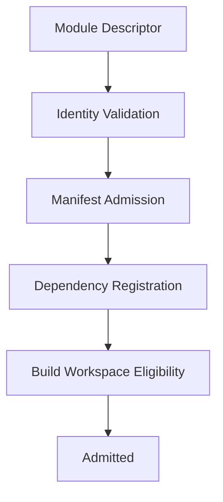
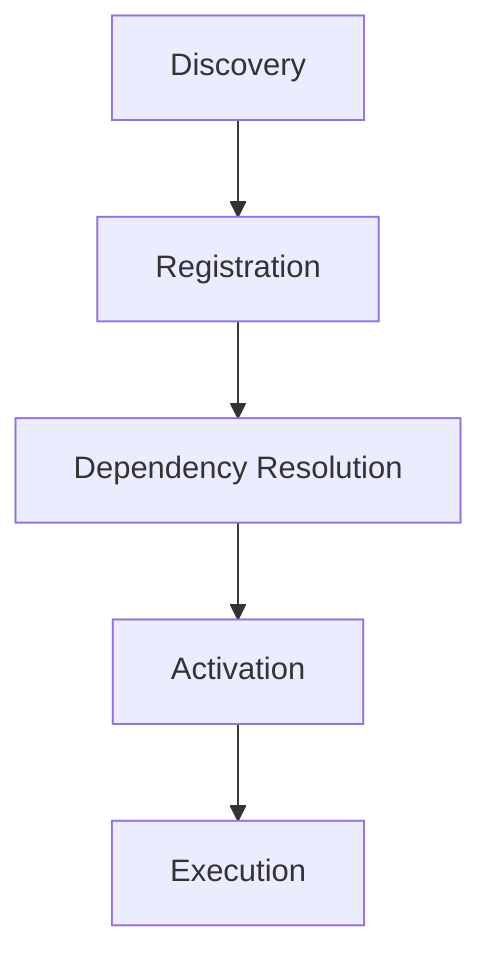
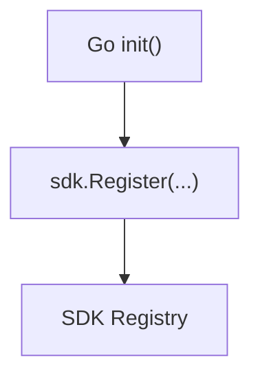
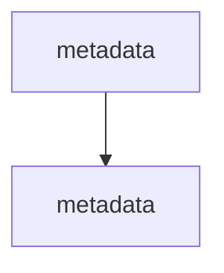
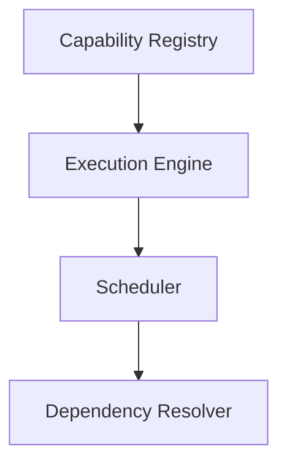
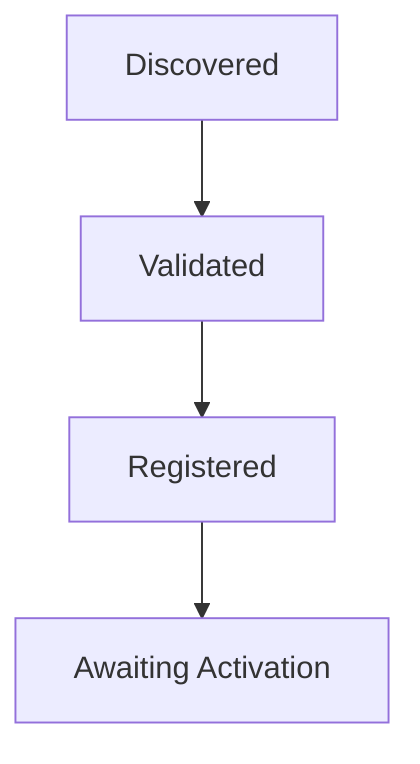

<!--
File: docs/engineering/guides/meg-006-module-platform/04-registration.md
Document: MEG-006
Status: Draft
Version: 0.8
-->

# Registration

> *Manifest admission happens before build. Runtime registration happens through the SDK registry at startup.*

---

# Purpose

Discovery locates Module manifests.

Registration has two distinct meanings in Mosaic.

Before build, manifest admission determines whether a selected Module may enter the Build Pipeline.

At Runtime startup, Go initialisation calls the Module's registration function and admits it into the SDK registry.

Registration establishes:

- identity
- ownership
- Runtime visibility
- lifecycle participation

These phases must not be confused.

Manifest admission is metadata only.

Runtime registration is code registration only.

---

# Philosophy

Within Mosaic:

> **Modules register through the SDK. Registration must never perform work.**

Registration should establish the Module's metadata and capability declarations.

It should never execute capability logic, start work or perform I/O.

The Platform should complete registration before activating capability behaviour.

---

# Build-Time Admission Pipeline

Every selected Module follows the same build-time admission pipeline.



Executable code has still not run.

The Supervisor now knows whether the Module may participate in the Build Pipeline.

---

# Runtime Registration Pipeline

The Platform Binary contains the selected Modules as statically linked Go libraries.

Go only includes packages that are imported.

The Build Pipeline therefore generates a single imports file.

```text
generated/

    imports.go
```

Conceptually.

```go
package generated

import (
    _ "github.com/mosaic/module-anilist"
    _ "github.com/mosaic/module-playback"
    _ "github.com/mosaic/module-jellyfin"
)
```

Blank imports trigger each Module package's `init()`.

Each Module registers itself with the SDK.

```go
func init() {
    sdk.Register(NewModule())
}
```

The only permitted responsibility of `init()` is registration.

The Module definition should expose metadata and capability declarations.

Example.

```go
func NewModule() sdk.Module {
    return sdk.Module{
        ID: "anilist",
        Capabilities: ...
    }
}
```

The SDK stores this definition in its runtime registry.

The definition should describe the Module.

It should not activate the Module.

---

# Generated Code Boundary

The Build Pipeline should generate exactly one Go integration file.

```text
generated/

    imports.go
```

That file exists only to blank-import selected Modules so Go package initialisation can register them.

The Build Pipeline should not generate:

- Module adapters
- Capability Manager code
- provider routing code
- event handlers
- GraphQL resolvers
- business logic

All integration after registration should occur through SDK contracts and Platform-owned managers.

---

# Registration Before Activation

Registration intentionally precedes activation.



A registered Module may still fail:

- dependency resolution
- permission validation
- compatibility checks

Registration simply makes the Module visible to the SDK registry.

---

# Runtime Admission

Runtime registration admits the Module into the SDK registry.

Conceptually.



Once registered, the Platform may reason about:

- dependencies
- contracts
- lifecycle
- compatibility

without executing the capability.

---

# Identity Registration

Every registered capability MUST possess:

- unique identifier
- version
- manifest version

Example.

```yaml
id: metadata

version: 2.1.0

manifest: 1
```

Registration should fail immediately if identity conflicts exist.

Identity becomes immutable after registration.

---

# Registry Population

Registration populates the Capability Registry.

Typical information includes:

- identity
- metadata
- dependencies
- permissions
- lifecycle
- configuration schema
- provided contracts
- consumed contracts

The Registry becomes the Runtime's authoritative source of capability information.

---

# Init Is Registration Only

Module `init()` functions MUST remain registration only.

They MUST NOT:

- start goroutines
- make HTTP requests
- read configuration
- perform filesystem I/O
- perform network I/O
- start background work

They SHOULD only call SDK registration APIs.

Activation remains a separate Platform-controlled lifecycle phase.

---

# Duplicate Registration

The Runtime MUST reject duplicate capability identifiers.

Example.



Only one capability may own one identifier.

Version does not change identity.

Identifiers remain globally unique.

---

# Runtime Visibility

Once registered, the capability becomes visible to Runtime Services.

Examples include:



Visibility does not imply availability.

Activation has not yet occurred.

---

# Registration State

Every capability progresses through a registration lifecycle.



The Capability Registry should expose this state.

Operators should understand precisely where each capability currently resides.

---

# Dependency Recording

Registration records dependency information.

Example.

```yaml
dependencies:

  - playback

  - library
```

The Runtime stores these declarations.

Resolution occurs later.

Registration records.

Resolution evaluates.

Responsibilities remain intentionally separate.

---

# Contract Registration

Capabilities SHOULD register the contracts they provide.

Example.

```yaml
provides:

  - MetadataProvider

  - ArtworkProvider
```

Likewise.

```yaml
consumes:

  - BlobStore

  - Scheduler
```

The Runtime now understands:

- provided services
- required services

before activation begins.

---

# Event Registration

Capabilities SHOULD register Runtime event metadata.

Example.

```yaml
publishes:

  - MetadataFetched
```

```yaml
subscribes:

  - MediaImported
```

Registration records these relationships.

The Runtime later builds:

- subscription graphs
- diagnostics
- architecture visualisations

No executable code is required.

---

# Permission Registration

Requested permissions SHOULD be recorded.

Example.

```yaml
permissions:

  - blob.read

  - scheduler.use
```

Permission approval occurs later.

Registration simply records requested capabilities.

This separation keeps admission distinct from authorisation.

---

# Configuration Registration

Configuration schemas SHOULD be registered.

Example.

```yaml
configuration:

  refreshInterval:

    type: duration
```

Tooling may immediately use these schemas to:

- validate configuration
- generate user interfaces
- produce documentation

Again:

No executable code is required.

---

# Registration Events

The Runtime MAY publish Runtime Events describing registration.

Examples include:

```

CapabilityRegistered
```

```

CapabilityRejected
```

```

CapabilityUpdated
```

These remain Runtime Events.

They do not represent business behaviour.

---

# Registration Persistence

The Runtime MAY persist registration metadata.

Persisted information might include:

- capability inventory
- versions
- dependency graph
- manifest hashes

Persisted registration accelerates diagnostics and upgrade planning.

It should never replace manifest validation.

The manifest remains authoritative.

---

# Registration Diagnostics

Operators should be able to answer:

- Which capabilities registered?
- Which failed?
- Why?
- Which version?
- Which dependencies?

Registration should remain fully observable.

Hidden registration behaviour complicates platform operations.

---

# Registration Independence

Registration should remain independent from:

- dependency resolution
- activation
- execution
- lifecycle callbacks

Each stage owns one concern.

Combining them increases Runtime complexity unnecessarily.

---

# Security

Registration should assume:

Every capability remains untrusted.

Registration records metadata.

It does not grant execution rights.

Execution should occur only after:

- dependency validation
- compatibility checks
- permission evaluation

complete successfully.

---

# Anti-Patterns

The following practices are prohibited.

## Executable Registration

Running capability code during registration.

---

## Implicit Registration

Automatically registering capabilities without validation.

---

## Registration Side Effects

Registration modifying Runtime behaviour immediately.

---

## Duplicate Registries

Maintaining capability information outside the Capability Registry.

---

## Runtime Mutation

Registration changing Runtime Services directly.

---

## Coupled Registration

Combining:

- registration
- activation
- execution

into one Runtime phase.

---

# Mosaic Guidelines

Within Mosaic:

- Registration MUST remain metadata driven.
- Registration MUST populate the Capability Registry.
- Registration MUST NOT execute capability code.
- Capability identifiers MUST remain globally unique.
- Registration SHOULD record dependencies, permissions and contracts.
- Registration SHOULD remain observable.
- Registration MUST precede activation.
- Registration MUST treat capabilities as untrusted until later validation stages.

---

# Relationship to MEG

Discovery answers:

> **What capabilities exist?**

Registration answers:

> **Which capabilities belong to this Runtime?**

The next chapter introduces **Dependency Resolution**, where the Runtime transforms registered capabilities into a validated capability graph ready for activation.

---

# Summary

Registration is the Runtime's admission process.

It transforms discovered metadata into recognised Runtime participants without executing a single line of capability code.

By separating:

- discovery
- registration
- dependency resolution
- activation
- execution

the Mosaic Runtime gains a predictable, observable and secure capability lifecycle that scales naturally as the platform grows.
