<!--
File: docs/engineering/guides/meg-006-module-platform/05-dependency-resolution.md
Document: MEG-006
Status: Draft
Version: 0.8
-->

# Dependency Resolution

> *Registration records dependencies. Dependency Resolution determines whether the platform can actually exist.*

---

# Purpose

After manifest discovery and build-time admission, the Supervisor possesses a complete catalogue of selected Modules.

However, knowing which capabilities exist is insufficient.

The Supervisor must determine whether:

- required capabilities exist
- versions are compatible
- contracts are satisfied
- dependency cycles are absent
- activation is possible

This process is known as **Dependency Resolution**.

Dependency Resolution transforms a collection of selected Module manifests into a coherent Platform package plan.

---

# Philosophy

Within Mosaic:

> **The Supervisor should reject an invalid Module set before invoking the Build Pipeline.**

Capability execution should never begin while dependency uncertainty exists.

Validation belongs before activation.

Not during execution.

---

# Dependency Resolution Pipeline

Every Generation preparation follows the same dependency pipeline.

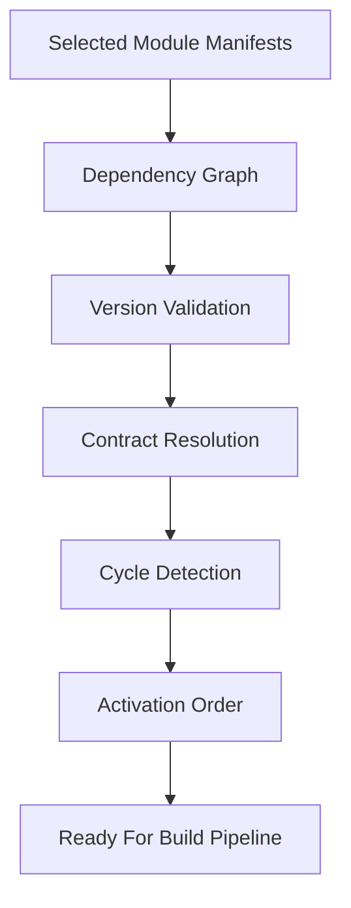

Executable Module code has still not run.

The Supervisor now knows whether the selected Module set is architecturally valid.

---

# Why Dependency Resolution Exists

Suppose:

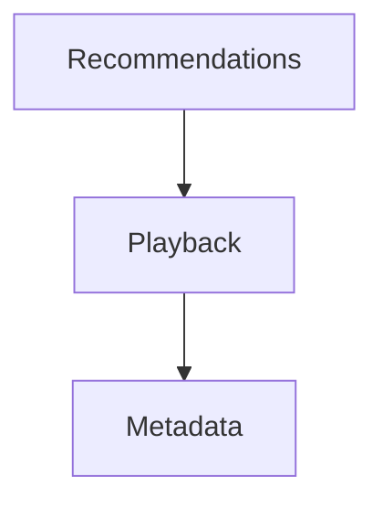

If:

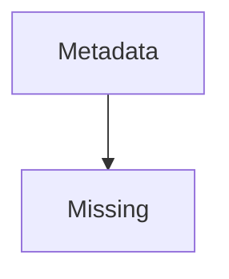

The Runtime should reject the platform.

Not:

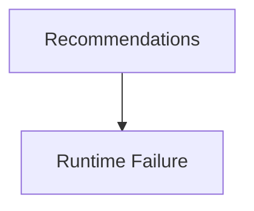

Dependency failures should be detected during startup.

Not during execution.

---

# Required Dependencies

Every required dependency MUST exist.

Example.

```yaml
dependencies:

  playback: ">=2.0.0"

  metadata: "^1.5.0"
```

Missing required dependencies MUST prevent activation.

The Runtime should fail fast.

---

# Optional Dependencies

Optional dependencies do not prevent activation.

Example.

```yaml
optionalDependencies:

  machine-learning: "^1.0.0"
```

If present:

Additional functionality becomes available.

If absent:

The capability continues operating.

The Runtime should clearly distinguish between:

- required
- optional

dependencies.

---

# Version Resolution

The Runtime MUST validate version compatibility.

Example.

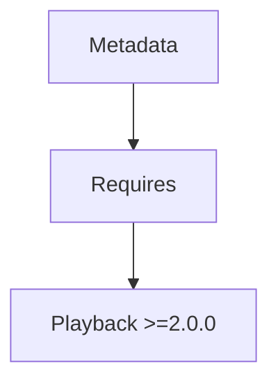

If:

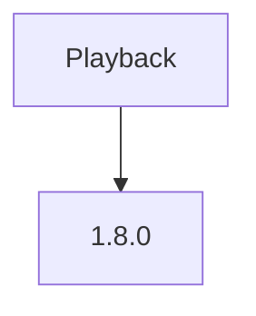

Activation fails.

Version incompatibility should never be discovered during execution.

---

# Contract Resolution

Capabilities declare:

```yaml
provides:

  - MetadataProvider
```

and

```yaml
consumes:

  - MetadataProvider
```

The Runtime resolves these contracts.

Every required contract MUST be satisfied before activation.

Capabilities should depend upon contracts.

Not implementations.

---

# Capability Graph

Dependency Resolution constructs a Capability Graph.

Example.

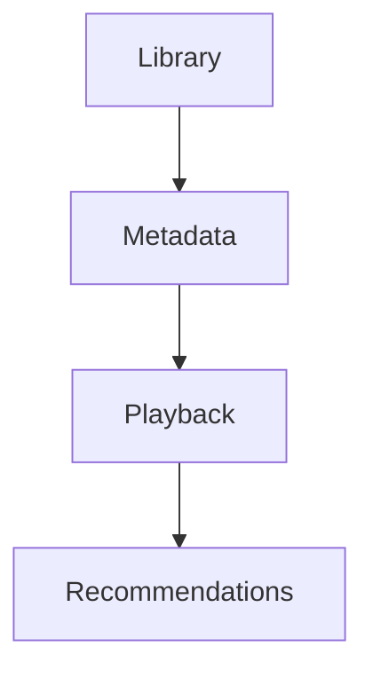

This graph becomes the authoritative model for:

- activation
- startup
- shutdown
- diagnostics

It is distinct from the Runtime Dependency Graph defined in [MEG-005](../meg-005-runtime-architecture/index.md).

The Runtime Graph describes Runtime Services.

The Capability Graph describes platform capabilities.

---

# Cycle Detection

The Capability Graph MUST remain acyclic.

Valid.

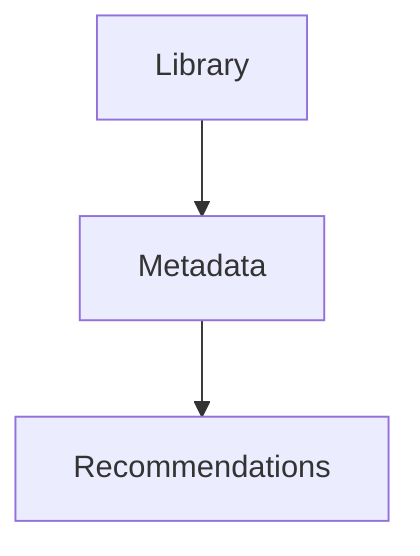

Invalid.

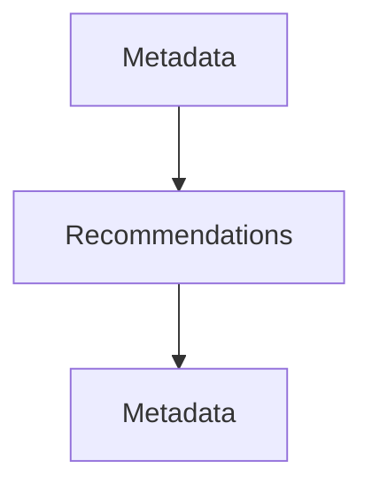

Circular capability dependencies should prevent activation.

Dependency resolution commonly relies on topological sorting with cycle detection to ensure modules load only after their dependencies are satisfied.  [Hexdocs](https://hexdocs.pm/raxol_core/Raxol.Core.Runtime.Plugins.DependencyResolver.html)

---

# Topological Ordering

Once validated, the Runtime performs a topological sort.

Example.


Activation should follow this ordering automatically.

No manually maintained activation order should exist.

The dependency graph is authoritative.

---

# Dependency States

Each dependency relationship should resolve to one of:

```

Satisfied
```

```

Optional Missing
```

```

Missing
```

```

Version Conflict
```

```

Cycle Detected
```

Only:

```

Satisfied
```

and

```

Optional Missing
```

allow activation to continue.

---

# Multiple Providers

A contract MAY have multiple providers.

Example.

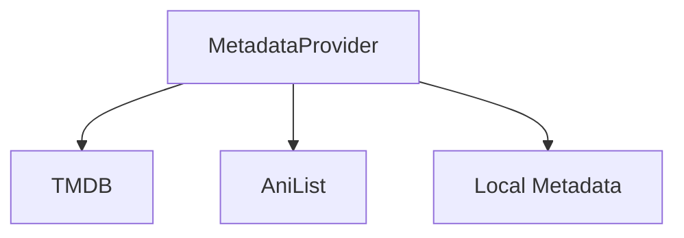

Selection policy belongs to Runtime configuration.

Dependency Resolution simply verifies that at least one compatible provider exists.

Resolution should remain deterministic.

---

# Conflicts

Capabilities MAY declare conflicts.

Example.

```yaml
conflicts:

  - legacy-metadata
```

Conflicting capabilities should not activate simultaneously.

The Runtime should reject incompatible platform configurations before execution begins.

Modern module systems often validate both dependency and conflict declarations before computing load order.  [Hexdocs](https://hexdocs.pm/raxol_core/Raxol.Core.Runtime.Plugins.DependencyResolver.html)

---

# Capability Groups

The Runtime MAY support grouped capabilities.

Example.

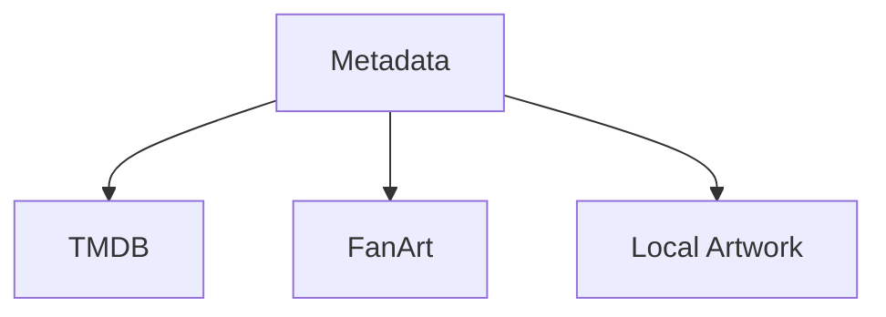

The group activates only if all required internal dependencies are satisfied.

Grouping remains a Runtime convenience.

Individual capabilities remain independently versioned.

---

# Incremental Resolution

The Runtime SHOULD support incremental dependency resolution.

Example.

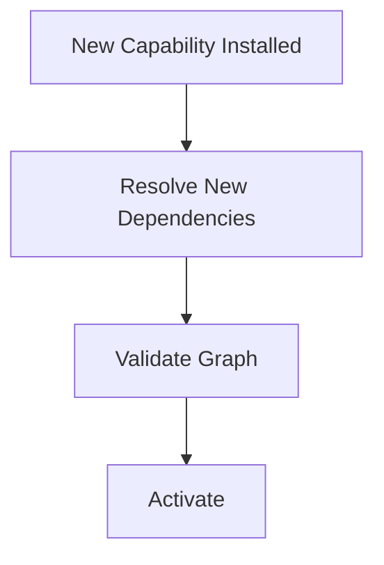

The Runtime should avoid rebuilding the entire platform graph unnecessarily.

Only affected portions should require re-evaluation.

Incremental dependency resolution is a common optimisation for module platforms that support runtime installation.  [Hexdocs](https://hexdocs.pm/raxol_core/Raxol.Core.Runtime.Plugins.DependencyResolver.html)

---

# Failure Reporting

Dependency failures should be explicit.

Examples.

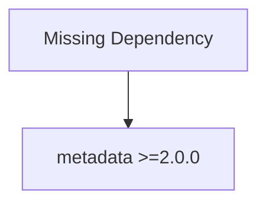

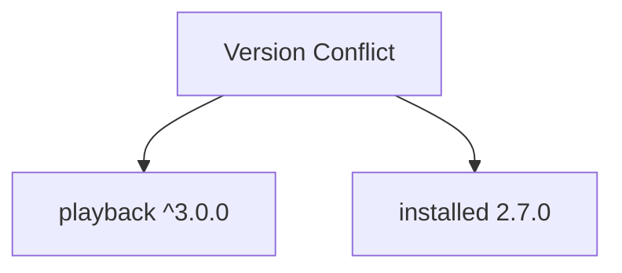

Operators should immediately understand:

- what failed
- why
- which capability caused it

Hidden dependency failures complicate operations.

---

# Diagnostics

The Runtime SHOULD expose:

- resolved dependency graph
- activation order
- optional dependencies
- missing dependencies
- version conflicts
- contract providers

Dependency Resolution should become a first-class diagnostic capability.

---

# Runtime Behaviour

Dependency Resolution belongs exclusively to startup and capability installation.

Capabilities should never:

- resolve dependencies
- locate providers
- negotiate versions

Those responsibilities belong entirely to the Runtime.

---

# Security

Dependency Resolution should occur before permission evaluation.

The Runtime should first determine:

> **Can this platform exist?**

Only afterwards should it determine:

> **May these capabilities execute?**

Each stage owns one concern.

---

# Anti-Patterns

The following practices are prohibited.

## Runtime Discovery

Capabilities searching for dependencies during execution.

---

## Manual Activation Order

Hard-coded capability startup ordering.

---

## Silent Version Downgrade

Automatically accepting incompatible versions.

---

## Circular Dependencies

Capability dependency cycles.

---

## Hidden Contracts

Capabilities depending upon undeclared Runtime contracts.

---

## Runtime Guessing

The Runtime selecting arbitrary providers without deterministic rules.

---

# Mosaic Guidelines

Within Mosaic:

- Every required dependency MUST be satisfied before activation.
- Version compatibility MUST be validated.
- Contract providers MUST be resolved explicitly.
- Capability graphs MUST remain acyclic.
- Activation order MUST be derived from the graph.
- Optional dependencies MUST remain explicitly identified.
- Dependency failures MUST remain observable.
- Dependency Resolution MUST complete before activation begins.

---

# Relationship to MEG

Registration answers:

> **Which capabilities belong to this Runtime?**

Dependency Resolution answers:

> **Can those capabilities operate together?**

The next chapter introduces **Activation**, where a validated capability graph becomes a living part of the Runtime and begins participating in platform execution.

---

# Summary

Dependency Resolution is the Runtime's architectural gatekeeper.

It ensures that every capability entering execution does so within a platform that is:

- complete
- compatible
- deterministic
- internally consistent

By validating the platform before executing it, the Mosaic Runtime avoids an entire class of operational failures and preserves one of its governing principles:

> **The Runtime should understand the platform completely before it begins executing it.**
