<!--
File: docs/engineering/guides/meg-006-module-platform/06-activation.md
Document: MEG-006
Status: Draft
Version: 0.8
-->

# Activation

> *A registered capability exists. An activated capability participates.*

---

# Purpose

Following:

- discovery
- build-time admission
- dependency resolution
- Platform package build
- Runtime registration

the Runtime possesses a validated capability graph.

However:

No executable capability has yet joined the Runtime.

Activation is the controlled transition from:

```

Registered Module Capability
```

to:

```

Operational Capability
```

Activation is therefore the moment a capability becomes part of the live platform.

---

# Philosophy

Within Mosaic:

> **Activation is deliberate. It is never implicit.**

Capabilities should activate only when:

- dependencies are satisfied
- permissions are approved
- configuration is valid
- Runtime resources are available

Activation should never occur simply because Module code was statically linked.

---

# Activation Pipeline

Every capability follows the same activation sequence.

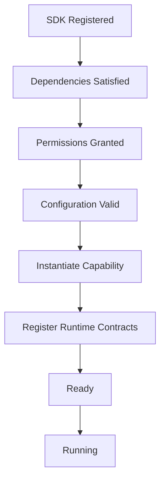

Activation is the first stage where executable code participates.

Everything beforehand is metadata driven.

---

# Why Activation Exists

Without activation:

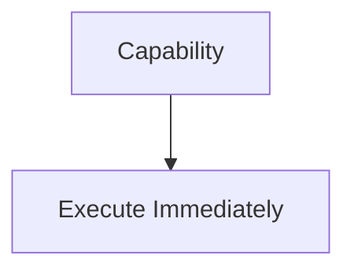

The Runtime loses the opportunity to:

- validate
- observe
- reject
- coordinate

Instead.

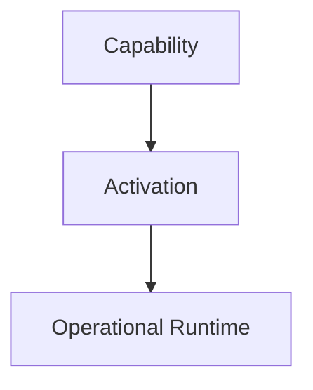

The Runtime remains in control of platform composition.

---

# Activation Is Runtime Controlled

Capabilities should never activate themselves.

Poor.

```go
func init() {

    start()

}
```

Preferred.

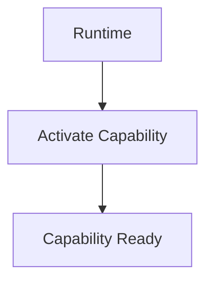

Lifecycle ownership belongs entirely to the Runtime.

Capabilities participate.

They do not control.

---

# Activation Prerequisites

Before activation begins, the Runtime MUST verify:

- registration completed
- dependency graph resolved
- version compatibility satisfied
- permissions approved
- configuration validated

If any prerequisite fails:

Activation must not begin.

Failing capabilities should remain inactive rather than partially operational.

---

# Capability Construction

Activation is responsible for constructing the capability instance.

Conceptually.

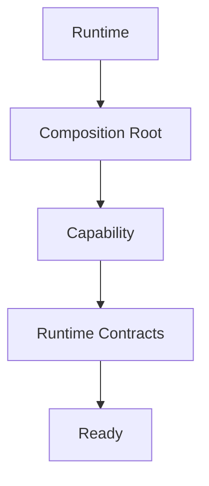

Construction should occur only once.

Repeated activation should create a new capability instance only after a complete deactivation cycle.

---

# Runtime Contracts

During activation, the Runtime provides:

- scheduler access
- execution services
- configuration
- observability
- lifecycle notifications

Capabilities receive Runtime contracts through dependency injection.

They should never discover Runtime Services dynamically.

---

# Lifecycle Hooks

Capabilities MAY expose lifecycle hooks.

Conceptually.

```text
Initialise()

Start()

Stop()

Dispose()
```

These hooks belong to capability lifecycle.

They should not perform registration or dependency resolution.

The Runtime already completed those phases.

The capability simply prepares itself to execute.

---

# Readiness

Activation should distinguish between:

```

Initialised
```

and

```

Ready
```

A capability becomes:

```

Ready
```

only after:

- resources allocated
- Runtime contracts injected
- internal initialisation completed

Only then may the Runtime dispatch work.

Separating activation from readiness avoids dispatching work before a capability has completed its own initialisation.  [DeepWiki](https://deepwiki.com/antfu/vscode-open-in-github-button/2.1-module-lifecycle-and-activation)

---

# Activation Order

Activation follows the validated Capability Graph.

Example.

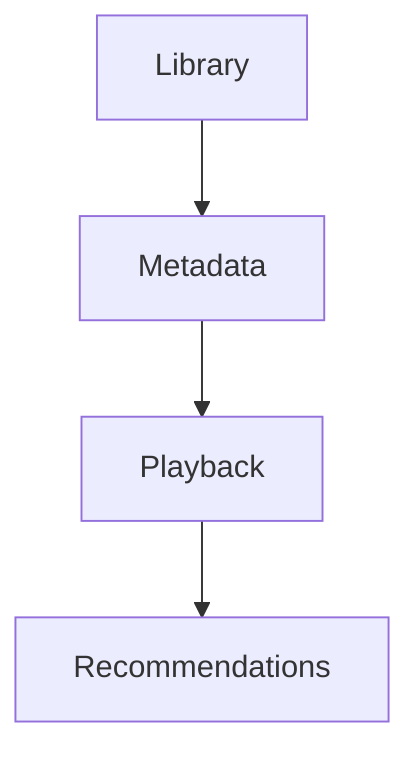

The Runtime should never activate:

```

Recommendations
```

before:

```

Playback
```

Dependency order remains authoritative.

---

# Parallel Activation

Independent capabilities SHOULD activate concurrently.

Example.

```

Playback
```

and

```

Authentication
```

may activate simultaneously if no dependency exists.

Parallel activation should never violate dependency ordering.

---

# Activation Failure

Suppose activation fails.

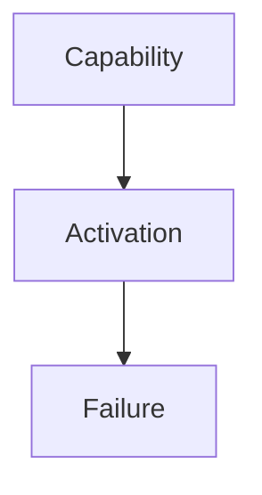

The Runtime should:

- report the failure
- release allocated resources
- mark capability unavailable
- continue only if platform integrity remains intact

Activation should never leave partially initialised capabilities inside the Runtime.

---

# Partial Platform Activation

The Runtime MAY continue operating when optional capabilities fail activation.

Example.

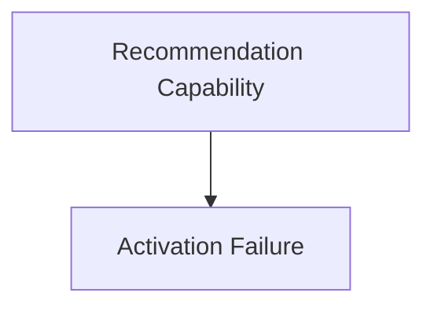

The platform may continue providing:

- playback
- metadata
- libraries

Critical capability failures, however, SHOULD prevent Runtime startup.

Capability criticality should be declared within the manifest.

---

# Activation Events

The Runtime MAY publish Runtime Events.

Examples include:

```

CapabilityActivating
```

```

CapabilityActivated
```

```

CapabilityActivationFailed
```

These events improve observability.

They do not represent business behaviour.

---

# Runtime Visibility

Operators should be able to answer:

- Which capabilities are active?
- Which failed activation?
- Why?
- Which dependencies blocked activation?

Activation should remain completely observable.

Hidden activation behaviour complicates operations.

---

# Lazy Activation

The Runtime MAY support lazy activation.

Example.

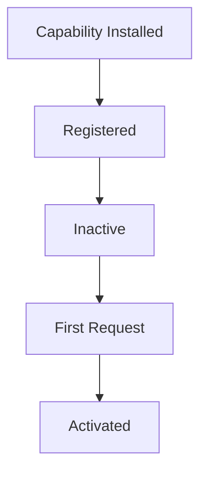

Lazy activation should remain an explicit Runtime policy.

Capabilities should not determine their own activation strategy.

---

# Activation And Modules

Built-in and third-party capabilities activate identically.

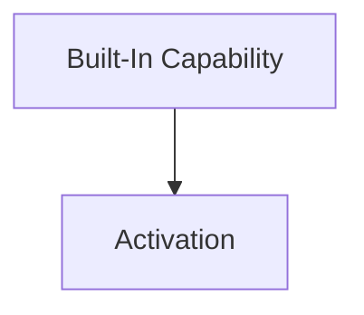


The Runtime should not distinguish between them.

Architectural equality remains one of the defining principles of the platform.

---

# Deactivation

Activation always implies the possibility of deactivation.

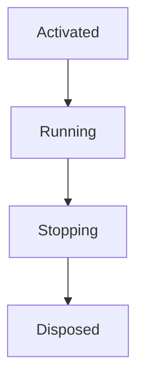

Every activated capability should support a graceful lifecycle.

Future chapters define lifecycle behaviour in greater detail.

---

# Security

Activation should occur only after:

- permission approval
- dependency validation
- configuration validation

Execution should never begin before these Runtime guarantees have been satisfied.

Trust should be established before activation.

Not afterwards.

---

# Anti-Patterns

The following practices are prohibited.

## Self Activation

Capabilities activating themselves.

---

## Hidden Initialisation

Background work beginning during object construction.

---

## Activation Before Validation

Executing capability code before dependency or permission checks.

---

## Partial Activation

Leaving half-initialised capabilities registered.

---

## Runtime Discovery During Activation

Capabilities dynamically searching for Runtime Services.

---

## Business Behaviour During Activation

Executing business workflows as part of capability startup.

Activation prepares the capability.

It does not perform business work.

---

# Mosaic Guidelines

Within Mosaic:

- Activation MUST remain Runtime controlled.
- Activation MUST follow successful dependency resolution.
- Runtime contracts MUST be injected during activation.
- Capabilities MUST become ready before receiving work.
- Activation SHOULD remain observable.
- Independent capabilities SHOULD activate concurrently where safe.
- Activation failures MUST leave the Runtime in a consistent state.
- Built-in and module-delivered capabilities MUST activate identically.

---

# Relationship to MEG

Dependency Resolution answers:

> **Can this capability participate?**

Activation answers:

> **Make this capability operational.**

The next chapter introduces the **Module Lifecycle**, describing how capabilities evolve through installation, activation, execution, upgrade, deactivation and eventual removal while remaining first-class Runtime participants.

---

# Summary

Activation is the bridge between architecture and execution.

It transforms a validated capability into a live participant within the Runtime while preserving:

- dependency correctness
- Runtime stability
- operational visibility
- architectural consistency

Within Mosaic, activation should never be surprising.

Every capability should become operational through the same deterministic, observable process regardless of whether it originated from the Platform distribution or from a third-party module.
