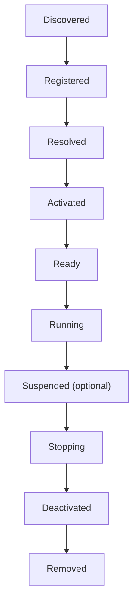
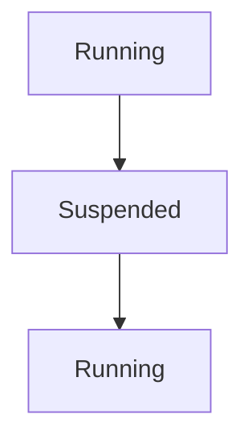
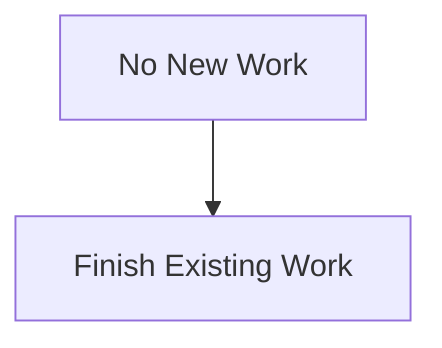
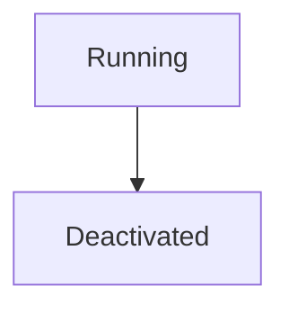
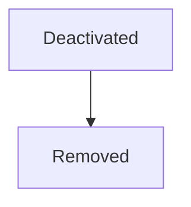
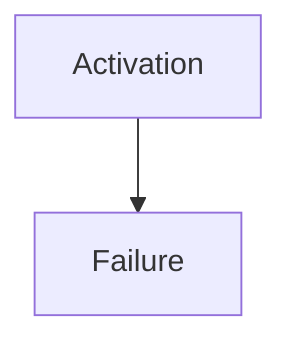
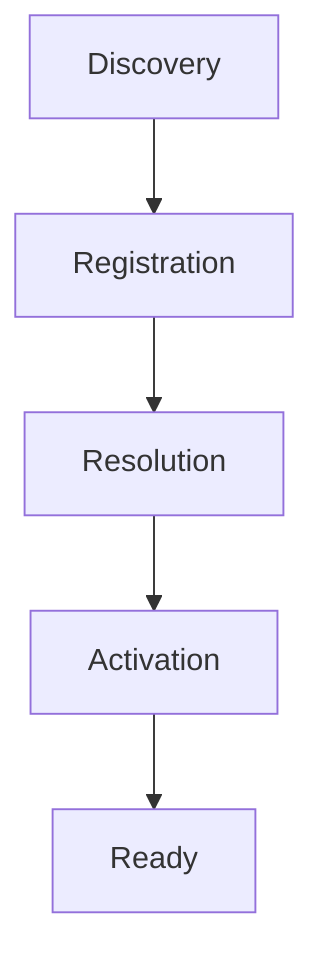
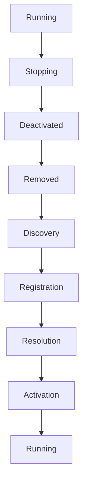
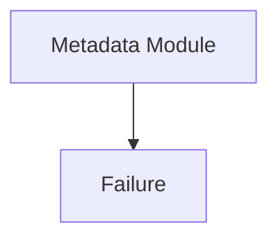
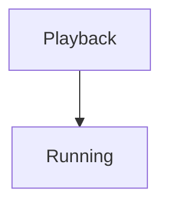

<!--
File: docs/engineering/guides/meg-006-module-platform/07-module-lifecycle.md
Document: MEG-006
Status: Draft
Version: 0.8
-->

# Module Lifecycle

> *A module is not simply linked. It participates in the lifecycle of the platform.*

---

# Purpose

A module does not merely exist.

Throughout its lifetime it is:

- discovered
- registered
- activated
- executed
- upgraded
- deactivated
- removed

The Runtime must coordinate these transitions consistently.

Every module, whether supplied by the Platform distribution or by a third party, should follow exactly the same lifecycle.

This document defines the canonical Module Lifecycle within the Mosaic platform.

---

# Philosophy

Within Mosaic:

> **Modules participate in the Runtime. They never control it.**

The Runtime owns:

- lifecycle
- ordering
- activation
- deactivation

Modules respond.

They never initiate lifecycle transitions themselves.

---

# Module Lifecycle States

Every module progresses through the same lifecycle.



Every stage has exactly one responsibility.

The Runtime should never invent module-specific lifecycle stages.

---

# Discovery

The Supervisor discovers:

- manifests
- metadata
- contracts

No executable code has been included in a Platform package.

The module remains unknown except for its manifest.

Discovery answers:

> **What exists?**

---

# Registration

Registration admits the statically linked module into the SDK registry.

The Platform now knows:

- identity
- version
- dependencies
- permissions
- contracts

The module still performs no work.

Registration answers:

> **Should this capability become part of this Runtime?**

---

# Resolution

Dependency Resolution validates:

- required capabilities
- optional capabilities
- contracts
- versions
- dependency graph

Only modules with fully satisfied requirements may proceed.

Resolution answers:

> **Can this capability execute safely?**

---

# Activation

Activation constructs the module.

Examples include:

- dependency injection
- Runtime contracts
- configuration
- lifecycle callbacks

Activation prepares the module.

It does not yet process Runtime work.

---

# Ready

A Ready module has completed:

- construction
- initialisation
- dependency injection

The Runtime may now dispatch work.

Readiness is intentionally distinct from activation.

A module may activate successfully yet still require asynchronous preparation before becoming operational.

Separating activation from readiness is a common lifecycle pattern in extensible platforms because it prevents work from being dispatched before initialisation has completed.  [Visual Studio Code](https://code.visualstudio.com/api/references/activation-events)

---

# Running

Running is the steady operational state.

The module now:

- receives Runtime Events
- executes capability operations
- participates in scheduling
- exposes health
- publishes metrics

Most modules remain in this state for the majority of their lifetime.

---

# Suspension

The Runtime MAY support suspension.

Conceptually.



Suspension differs from deactivation.

The module remains:

- registered
- activated

but temporarily receives no Runtime work.

Possible reasons include:

- administrator action
- maintenance
- resource conservation
- dependency degradation

Suspension should remain reversible.

---

# Stopping

Stopping begins graceful shutdown.

The Runtime notifies the module that:



Modules should:

- release temporary resources
- complete active work
- stop accepting new Runtime requests

Business correctness should remain the highest priority.

---

# Deactivation

Once all work has completed:



The Runtime:

- removes Runtime contracts
- unregisters handlers
- disposes internal resources

The module should no longer participate in execution.

---

# Removal

Removal occurs only after deactivation.



Removal deletes the module from the Runtime.

The Capability Registry should update accordingly.

Removed modules no longer participate in:

- discovery
- execution
- scheduling

Future participation requires rediscovery.

---

# Runtime Ownership

The Runtime owns every lifecycle transition.

Modules should never:

- activate themselves
- suspend themselves
- remove themselves
- restart themselves

The Runtime remains the sole lifecycle authority.

---

# Lifecycle Events

The Runtime MAY publish lifecycle events.

Examples include:

```

ModuleActivated
```

```

ModuleReady
```

```

ModuleSuspended
```

```

ModuleStopped
```

```

ModuleRemoved
```

These are Runtime Events.

They improve observability.

They do not represent business behaviour.

---

# Runtime Visibility

Operators should always understand:

- current lifecycle stage
- activation duration
- readiness status
- shutdown progress
- failure reason

Lifecycle should remain fully observable.

Hidden lifecycle transitions complicate platform operations.

---

# Activation Failure

Suppose activation fails.



The Runtime should:

- dispose partially constructed state
- release resources
- mark module unavailable
- report diagnostics

Partial activation must never remain inside the Runtime.

---

# Runtime Restart

Following Runtime restart:



Modules should never assume:

- previous process state
- cached objects
- surviving goroutines

Every Runtime start should produce a clean lifecycle.

---

# Upgrade Lifecycle

Capability upgrades should remain lifecycle driven.



The Runtime should never hot-swap executable capability code inside a running capability instance.

Replacing a capability should always occur through a controlled lifecycle transition.

---

# Failure Isolation

Suppose:



The Runtime should ensure:



Module lifecycle failures should never destabilise unrelated capabilities.

Isolation remains a Runtime responsibility.

---

# Resource Ownership

Modules own:

- internal resources
- temporary allocations
- internal caches

The Runtime owns:

- lifecycle
- execution
- scheduling
- workers

Ownership determines cleanup responsibility.

---

# Testing

Module lifecycle behaviour SHOULD be tested.

Examples include:

- activation
- readiness
- suspension
- shutdown
- restart
- removal

Lifecycle behaviour should remain deterministic.

Testing should verify transitions.

Not implementation.

---

# Anti-Patterns

The following practices are prohibited.

## Self Activation

Modules activating themselves.

---

## Background Startup

Beginning Runtime work before Ready.

---

## Ignoring Shutdown

Continuing execution after Stopping.

---

## Partial Removal

Leaving Runtime registrations after removal.

---

## Hidden Lifecycle

Lifecycle transitions occurring without Runtime visibility.

---

## Business Behaviour During Activation

Executing business workflows before the Runtime declares the module Ready.

---

# Mosaic Guidelines

Within Mosaic:

- Every module MUST follow the canonical lifecycle.
- The Runtime MUST own lifecycle transitions.
- Activation MUST precede readiness.
- Readiness MUST precede execution.
- Suspension SHOULD remain reversible.
- Shutdown MUST remain graceful.
- Removal MUST follow deactivation.
- Lifecycle MUST remain observable.
- Module failures MUST remain isolated.

---

# Relationship to MEG

Activation answers:

> **How does a capability become operational?**

The Module Lifecycle answers:

> **How does that capability participate throughout its lifetime?**

The next chapter introduces the **Module SDK**, defining the contracts, APIs and development model through which module authors build capabilities for the Mosaic platform.

---

# Summary

A module should never simply:

> **Load.**

It should become a recognised participant within the Runtime through a deterministic lifecycle owned entirely by the platform.

Within Mosaic, lifecycle consistency ensures that every capability, regardless of its origin, behaves predictably throughout installation, execution, upgrade and removal.

That consistency is one of the defining characteristics of a mature capability platform.
