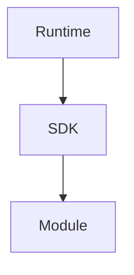
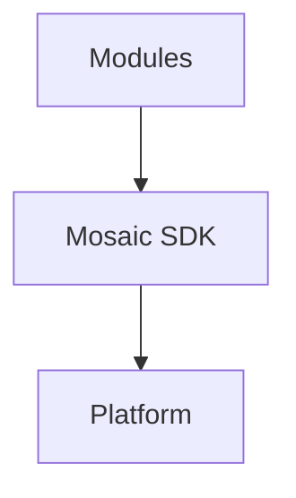
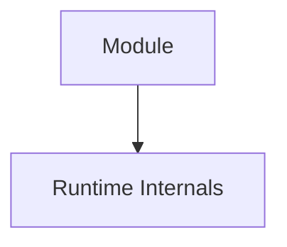
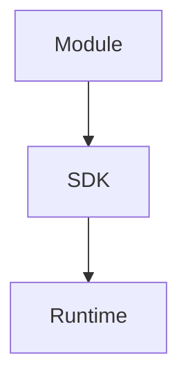
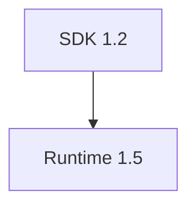

<!--
File: docs/engineering/guides/meg-006-module-platform/08-module-sdk.md
Document: MEG-006
Status: Draft
Version: 0.8
-->

# Module SDK

> *The SDK is not the platform. It is the language through which modules communicate with the platform.*

---

# Purpose

The Mosaic SDK is the public contract between the Mosaic Platform and Mosaic Modules.

It defines the language that the Platform and Modules use to communicate.

The Runtime exposes capabilities through stable contracts.

Module authors require a safe, supported mechanism for interacting with those contracts.

That mechanism is the **Module SDK**.

The SDK provides the APIs, interfaces and abstractions that allow Modules to participate in the Runtime without depending upon Runtime implementation details.

The SDK is the only supported programming interface between:

- the Runtime
- capabilities
- third-party developers

It deliberately contains almost no business logic.

The SDK should remain one of the most stable repositories in the Mosaic ecosystem.

---

# Philosophy

Within Mosaic:

> **The SDK defines contracts, not behaviour.**

The SDK is not:

- a framework,
- the Platform,
- a collection of broad helper utilities,
- a place for business logic.

Instead, the SDK defines what can exist within the Mosaic ecosystem.

The Platform implements those contracts.

Modules satisfy those contracts.

Module authors should never interact directly with:

- Runtime internals
- worker pools
- dependency graphs
- schedulers
- capability registry implementation

Instead, the SDK exposes stable contracts representing supported platform functionality.

The SDK should remain considerably more stable than the Runtime beneath it.

---

# What Is The SDK?

The Module SDK is the public programming surface of the Mosaic platform.

Conceptually.



The Platform owns implementation and orchestration.

The SDK owns contracts.

Modules consume only the SDK.

The SDK includes:

- interfaces and ports
- models
- Event Envelope
- Event Bus contracts
- registration APIs
- helper utilities
- testing framework

It is intentionally mostly definitions.

Only a small amount of executable code should exist to support registration, validation and developer ergonomics.

---

# Dependency Direction

Both Platform and Modules depend on the SDK.

Neither should depend directly on the other.

Conceptually.



The SDK is the shared contract surface.

It should not become an implementation bridge that leaks Platform internals.

---

# Why An SDK Exists

Without an SDK:



Every Runtime change becomes:

- breaking
- expensive
- risky

Instead.



The Runtime evolves.

The SDK remains stable.

Modules continue functioning.

This stable abstraction layer is a defining characteristic of mature module ecosystems.  [Visual Studio Code](https://code.visualstudio.com/api/references/module-manifest)

---

# SDK Ownership

The Platform owns SDK contract authority.

Module authors consume it.

Modules should never:

- extend the SDK
- replace SDK contracts
- depend upon internal Runtime packages

The SDK represents the official contract between the Platform and Module developers.

---

# SDK Responsibilities

The SDK has five primary responsibilities.

## Contracts

The SDK defines every public Platform capability contract.

Examples include:

- MetadataProvider
- MediaProvider
- ArtworkProvider
- SearchProvider
- AuthenticationProvider
- NotificationProvider

The SDK owns the interfaces.

The Platform owns orchestration.

Modules own implementations.

## Models

The SDK defines canonical Platform models.

Examples include:

- Metadata
- Media
- Artwork
- User
- Library
- PlaybackSession

These are Platform models.

They are not implementation-specific DTOs.

Every Module should share the same vocabulary.

## Events

The SDK owns:

- Event Envelope
- Event Bus interfaces
- core Platform events

It does not own every event.

Modules may define their own events.

Examples include:

- `platform.started`
- `anime.episode.released`
- `playback.started`

The Platform routes events.

Modules own domain event meaning.

## Registration

The SDK exposes Module registration APIs and maintains the runtime registry used during Platform startup.

Every Module exposes itself through a single registration point.

```go
func init() {
    sdk.Register(NewModule())
}
```

The Platform asks:

```go
sdk.Modules()
```

and receives every registered Module.

No reflection, runtime scanning or plugin loading is required.

## Helper Utilities

The SDK may include small utilities that improve developer experience.

Examples include:

- Module builders
- registration helpers
- validation helpers
- testing helpers
- version helpers

Helpers should support contracts.

They should not become business logic.

---

# SDK Non-Responsibilities

The SDK intentionally avoids implementation.

It should never contain:

- database logic
- storage implementation
- GraphQL implementation
- scheduler implementation
- HTTP server
- caching implementation
- business logic
- Capability Manager orchestration
- rendering
- worker implementation
- execution engine internals
- runtime kernel
- dependency graph internals
- media business policy

It may define lifecycle contracts.

It must not own lifecycle implementation.

Those belong to the Platform or Modules.

Internal Runtime architecture remains private.

---

# Stable Surface

The SDK should remain:

- documented
- versioned
- backwards compatible where practical

Breaking SDK changes should be rare.

Runtime implementation may evolve much more rapidly.

The SDK protects module authors from that evolution.

---

# Capability Context

Every capability SHOULD execute within a Capability Context supplied by the SDK.

Conceptually.

```go
type CapabilityContext struct {

    Logger

    Scheduler

    Configuration

    Events

    Health

}
```

The context provides Runtime services through stable abstractions.

Modules should never construct Runtime services themselves.

---

# Lifecycle APIs

The SDK SHOULD expose lifecycle contracts.

Examples.

```text
Initialise()

Start()

Stop()

Dispose()
```

These contracts should remain consistent for every capability.

Lifecycle semantics belong to the Runtime.

The SDK merely exposes them.

---

# Configuration APIs

Capabilities obtain configuration through the SDK.

Example.

```go
config := ctx.Configuration()
```

The SDK hides:

- configuration files
- environment variables
- storage implementation

Configuration remains a Runtime concern.

The SDK exposes only the contract.

---

# Scheduling APIs

Capabilities request scheduling through SDK abstractions.

Example.

```go
ctx.Scheduler().Schedule(...)
```

The capability expresses intent.

The Runtime determines:

- execution time
- worker allocation
- retries

The SDK exposes scheduling.

It does not expose scheduler implementation.

---

# Event APIs

Capabilities interact with Runtime Events through SDK contracts.

Examples.

```go
ctx.Events().Publish(...)
```

```go
ctx.Events().Subscribe(...)
```

The SDK should expose:

- business-oriented event APIs

It should not expose:

- event bus implementation
- transport protocols
- queue management

Messaging infrastructure remains hidden.

---

# Logging APIs

Capabilities SHOULD receive structured logging through the SDK.

Example.

```go
ctx.Logger().Info(...)
```

The SDK hides:

- log sinks
- storage
- formatting
- aggregation

Capabilities should simply express operational intent.

---

# Health APIs

Capabilities SHOULD expose Runtime health through SDK contracts.

Example.

```go
ctx.Health().Ready()
```

The Runtime determines:

- aggregation
- reporting
- monitoring

The SDK provides the abstraction.

---

# Permissions

The SDK should automatically enforce Runtime permissions.

Suppose a capability requests:

```go
ctx.BlobStore()
```

Without:

```

blob.read
```

permission.

The SDK should reject the request.

Permission enforcement belongs to the Runtime.

The SDK simply provides controlled access.

---

# Capability Discovery

Capabilities should not discover other capabilities dynamically.

Poor.

```go
ctx.Runtime().FindCapability(...)
```

Preferred.

Capabilities consume:

- declared contracts
- injected services

The Runtime resolves dependencies during startup.

The SDK should not expose Runtime discovery internals.

---

# Testing

The SDK SHOULD provide testing utilities.

Examples include:

- fake contexts
- fake schedulers
- fake configuration
- fake event publishers
- contract assertions
- provider fixtures

Module authors should be able to test capabilities without starting the full Runtime.

This dramatically improves developer productivity.

Conceptually.

```go
sdktest.NewPlatform().
    Register(provider).
    Assert(...)
```

SDK testing utilities should validate behaviour against Platform contracts.

They should not require a complete Mosaic installation.

---

# Developer Tooling Boundary

The SDK is a Go library.

The Mosaic CLI provides the developer experience around it.

Typical CLI commands include:

```text
mosaic new module
mosaic dev
mosaic build
mosaic test
mosaic doctor
mosaic validate
mosaic package
mosaic publish
mosaic docs
```

The CLI may scaffold, develop, test, diagnose, validate, build, package, publish and document Modules.

The SDK remains the developer contract.

The CLI is tooling around that contract.

Chapter 14 defines the complete Developer Platform around the SDK.

---

# Manifest Generation

SDK tooling may generate Module manifests from Go Module definitions.

For example, a Module may define:

```go
sdk.Module{
    ID: "...",
    Capabilities: ...
    Events: ...
    Permissions: ...
}
```

Tooling may generate `module.yaml` from that definition.

This reduces drift between source declarations and manifest metadata.

However, the generated manifest remains the artefact consumed by the Supervisor during discovery and dependency resolution.

The Supervisor should still validate the manifest before invoking the Build Pipeline.

Manifest generation must not allow executable code to replace manifest validation.

---

# Proposed Repository Structure

The SDK repository should be organised around contract vocabulary.

Proposed shape.

```text
mosaic-sdk/

    capabilities/
    events/
    models/
    module/
    permissions/
    registration/
    helpers/
    testing/
```

Most packages should contain definitions, interfaces, models and small support helpers.

Repository structure should reinforce that the SDK is a contract language rather than an implementation framework.

---

# SDK Versioning

The SDK SHOULD be versioned independently.

Example.



Compatibility should be explicit.

Capabilities should declare the SDK version they require.

The Runtime validates compatibility during startup.

---

# SDK Documentation

Every public SDK contract SHOULD include:

- documentation
- examples
- compatibility notes
- lifecycle expectations

The SDK should become the primary documentation surface for module developers.

Developers should rarely need to understand Runtime internals.

---

# Runtime Independence

The SDK should shield module authors from Runtime evolution.

Changing:

- Worker Manager
- Scheduler
- Execution Engine

should rarely require SDK changes.

If Runtime implementation changes require SDK changes, the abstraction should be reconsidered.

---

# Anti-Patterns

The following practices are prohibited.

## Runtime Imports

Modules importing Runtime implementation packages.

---

## Internal APIs

Using undocumented Runtime interfaces.

---

## Reflection

Inspecting Runtime internals dynamically.

---

## Service Locator

Modules resolving arbitrary Runtime services.

---

## Worker Awareness

Modules depending upon worker identity or execution environment.

---

## SDK Leakage

Exposing Runtime implementation details through SDK contracts.

---

# Mosaic Guidelines

Within Mosaic:

- The SDK MUST be the only supported programming interface between Platform and Modules.
- The SDK MUST define contracts rather than behaviour.
- Modules MUST depend only upon the SDK.
- The Platform MUST implement SDK contracts.
- Modules MUST satisfy SDK contracts.
- Runtime implementation MUST remain hidden.
- SDK contracts SHOULD remain stable.
- Permissions SHOULD be enforced through SDK abstractions.
- Configuration SHOULD be accessed only through the SDK.
- The SDK SHOULD provide testing support.
- SDK tooling MAY generate Module manifests, but generated manifests MUST still be validated by the Supervisor.
- The SDK MUST NOT contain business logic, Capability Manager orchestration or Platform implementation.
- Runtime evolution SHOULD rarely require SDK changes.

---

# Relationship to MEG

The Module Lifecycle explains:

> **How capabilities participate in the Runtime.**

The SDK explains:

> **How module authors build those capabilities.**

The next chapter introduces **Permissions**, defining how the Runtime safely controls access to Runtime services while preserving capability isolation.

---

# Summary

The Module SDK is the public contract language of the Mosaic ecosystem.

It allows module authors to build sophisticated capabilities while remaining completely insulated from Runtime implementation details.

Within Mosaic, the SDK should feel:

- stable
- expressive
- well documented
- intentionally small

The Runtime evolves.

The SDK endures.

That separation allows the platform to grow without forcing module authors to continually chase internal architectural changes.
