<!--
File: docs/engineering/guides/meg-006-module-platform/11-versioning.md
Document: MEG-006
Status: Draft
Version: 0.8
-->

# Versioning

> *The purpose of versioning is not to describe change. It is to describe compatibility.*

---

# Purpose

The Mosaic platform evolves continuously.

Over time:

- capabilities improve
- SDKs evolve
- manifests gain features
- Runtime contracts expand

Without a clear versioning strategy, module compatibility quickly becomes unpredictable.

This document defines how versioning is managed throughout the Mosaic Module Platform.

---

# Philosophy

Within Mosaic:

> **Version numbers communicate compatibility, not progress.**

A version should answer questions such as:

- Can this capability run?
- Which Runtime supports it?
- Which SDK does it require?
- Are dependencies compatible?

It should never merely answer:

> **Which release is newer?**

Semantic Versioning exists primarily to communicate compatibility between independently evolving components.  [Semantic Versioning](https://semver.org/)

---

# Versioned Components

The Module Platform versions several independent artefacts.

Examples include:

- Capability
- Manifest
- SDK
- Runtime
- Runtime Contracts

Each evolves independently.

They should not all share the same version number.

---

# Capability Version

Every capability MUST declare its own version.

Example.

```yaml
version: 2.4.1
```

Capability versions describe changes to:

- behaviour
- features
- compatibility

They do not describe Runtime versions.

---

# Manifest Version

The manifest schema evolves independently.

Example.

```yaml
manifestVersion: 2
```

The Runtime should determine:

- whether it understands the schema
- whether migration is required

Manifest versions describe metadata compatibility.

Not capability behaviour.

---

# SDK Version

Capabilities SHOULD declare the SDK version they require.

Example.

```yaml
sdk:

  version: "^2.0.0"
```

The Runtime validates SDK compatibility during startup.

Capabilities should never guess which SDK is available.

---

# Runtime Version

The Runtime itself possesses its own version.

Example.

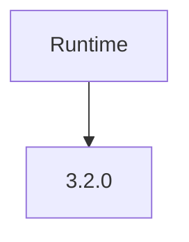

Capabilities should not depend directly upon Runtime versions.

Instead they depend upon:

- SDK version
- Runtime contracts

This reduces unnecessary compatibility constraints.

---

# Runtime Contract Version

Individual Runtime contracts MAY evolve independently.

Example.

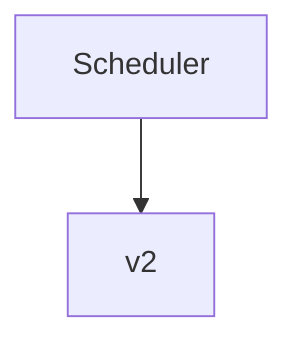

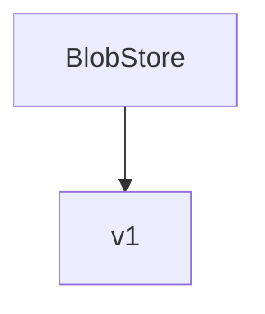

Breaking changes to one Runtime contract should not require versioning the entire Runtime.

Contract-level versioning provides finer compatibility control.

This approach is increasingly used in extensible platforms to reduce unnecessary ecosystem breakage.  [Microsoft Learn](https://learn.microsoft.com/en-us/visualstudio/extensibility/migration/module-compatibility?view=visualstudio)

---

# Semantic Versioning

Capability versions SHOULD follow Semantic Versioning.

```

MAJOR.MINOR.PATCH
```

Meaning.

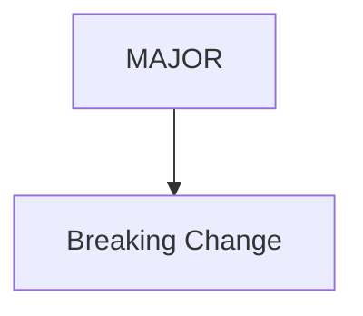

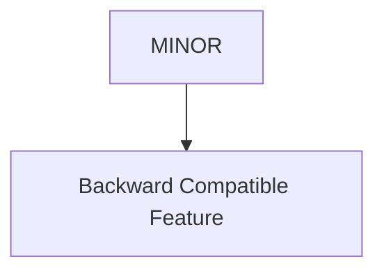

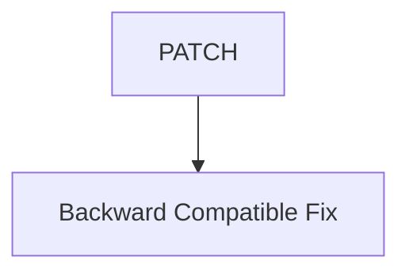

This provides predictable upgrade behaviour for module authors.

 [Semantic Versioning](https://semver.org/)

---

# Compatibility

Compatibility should be explicit.

Example.

```yaml
runtime:

  sdk: "^2.0.0"

  manifest: 3
```

The Runtime determines compatibility before activation.

Capabilities should never attempt compatibility negotiation during execution.

---

# Dependency Versioning

Dependencies SHOULD include version constraints.

Example.

```yaml
dependencies:

  playback: "^2.4.0"

  metadata: ">=1.8.0"
```

The Runtime validates these constraints during dependency resolution.

Execution begins only after compatibility has been established.

---

# Breaking Changes

Breaking changes SHOULD require a major version increment.

Examples include:

- removed Runtime contract
- incompatible configuration schema
- changed public SDK behaviour

Breaking changes should remain deliberate.

They should never occur accidentally.

---

# Non-Breaking Changes

The following generally warrant a minor version increment.

Examples include:

- new optional capability
- additional Runtime contract
- new optional configuration
- new events

Existing capabilities should continue functioning without modification.

---

# Patch Releases

Patch releases should contain:

- bug fixes
- documentation improvements
- performance improvements

Patch releases should not change Runtime contracts.

Capabilities should upgrade safely without behavioural surprises.

---

# Manifest Evolution

Manifest schemas SHOULD remain backwards compatible where practical.

Example.

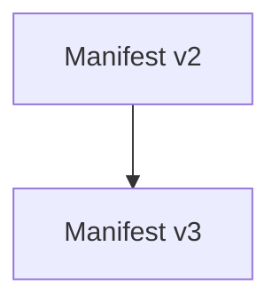

The Runtime MAY support multiple manifest versions simultaneously during migration.

Schema evolution should remain deliberate.

---

# SDK Compatibility

The Runtime SHOULD support multiple SDK versions where practical.

Example.

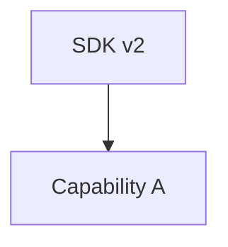

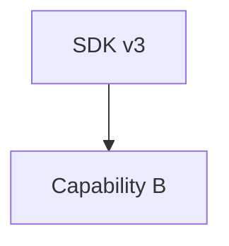

The SDK compatibility matrix should remain explicit.

Capabilities should not require simultaneous upgrades merely because the Runtime evolved.

---

# Deprecation

Features SHOULD be deprecated before removal.

Lifecycle.

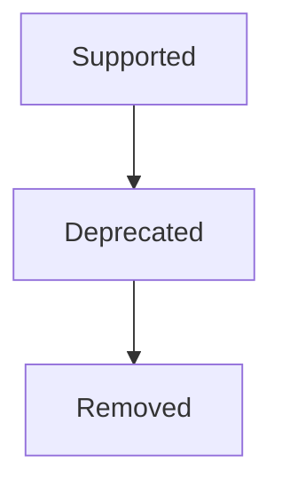

Deprecation warnings should appear:

- documentation
- diagnostics
- tooling

Capability authors should receive adequate migration time.

---

# Upgrade Path

Capability upgrades SHOULD remain predictable.

Conceptually.

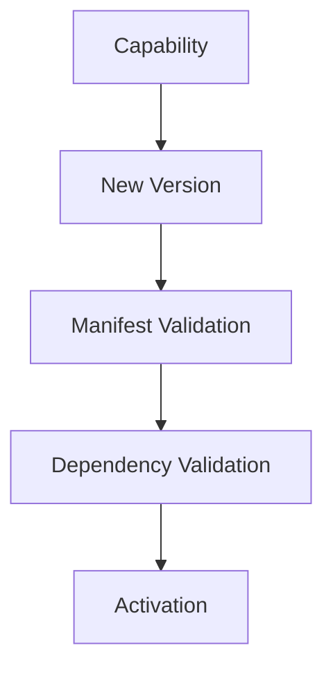

Upgrade should reuse the same Runtime lifecycle as installation.

There should be no "special" upgrade path.

---

# Compatibility Matrix

The Runtime SHOULD expose a compatibility matrix.

Example.

| Runtime | SDK | Manifest |
|----------|-----|----------|
| 3.x | 2.x | 3 |
| 4.x | 3.x | 4 |

Module authors should immediately understand:

> **Will this capability execute on this Runtime?**

Compatibility should not require experimentation.

---

# Marketplace

Marketplace tooling SHOULD display:

- capability version
- SDK requirement
- Runtime compatibility
- manifest version

Operators should understand compatibility before installation.

Installation should never become trial and error.

---

# Diagnostics

The Runtime SHOULD expose:

- incompatible capabilities
- deprecated SDK usage
- manifest migration requirements
- unsupported Runtime contracts

Version-related failures should remain explicit.

---

# Anti-Patterns

The following practices are prohibited.

## Runtime Guessing

Attempting to execute incompatible capabilities.

---

## Hidden Breaking Changes

Changing SDK behaviour without incrementing major version.

---

## Manifest Drift

Changing manifest semantics without changing manifest version.

---

## Runtime Coupling

Capabilities depending directly upon Runtime implementation versions.

---

## Forced Ecosystem Upgrades

Requiring every capability to upgrade because one Runtime Service changed.

---

## Silent Compatibility Failure

Ignoring version mismatches during activation.

---

# Mosaic Guidelines

Within Mosaic:

- Capabilities SHOULD follow Semantic Versioning.
- Manifest schemas MUST be versioned independently.
- SDK versions MUST remain explicit.
- Runtime contracts MAY evolve independently.
- Compatibility MUST be validated before activation.
- Breaking changes SHOULD require major versions.
- Deprecation SHOULD precede removal.
- Version compatibility MUST remain observable.
- Marketplace tooling SHOULD expose compatibility information.

---

# Relationship to MEG

Configuration defines:

> **How a capability operates.**

Versioning defines:

> **Whether a capability can operate.**

The next chapter introduces **Isolation**, describing how the Runtime ensures independently developed capabilities remain operationally isolated while sharing one execution platform.

---

# Summary

Versioning exists to communicate compatibility.

Not chronology.

Within Mosaic:

- manifests version metadata
- SDKs version contracts
- capabilities version behaviour
- the Runtime validates compatibility

By separating these concerns, the platform can evolve continuously without forcing unnecessary upgrades across the entire ecosystem.
