<!--
File: docs/engineering/guides/meg-006-module-platform/12-isolation.md
Document: MEG-006
Status: Draft
Version: 0.8
-->

# Isolation

> *Capabilities should collaborate. They should never become dependent upon one another's implementation.*

---

# Purpose

The Mosaic Runtime is designed to execute many independent capabilities.

Examples include:

- Playback
- Library
- Metadata
- Recommendations
- Books
- Music
- Anime
- IPTV

Each capability should remain independently:

- developed
- deployed
- upgraded
- tested
- replaced

Without effective isolation:

- failures propagate
- upgrades become risky
- Runtime stability degrades
- platform evolution slows

Isolation is therefore one of the defining architectural principles of the Module Platform.

---

# Philosophy

Within Mosaic:

> **Capabilities may communicate. They must never become coupled.**

Isolation does **not** mean capabilities never interact.

It means:

Interactions occur only through Runtime contracts.

Implementation remains private.

---

# Isolation Layers

Capability isolation exists across several dimensions.

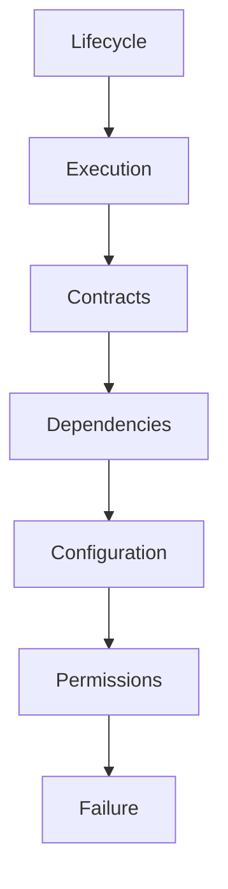

Each layer protects one aspect of platform independence.

---

# Lifecycle Isolation

Every capability owns its own lifecycle.

Example.

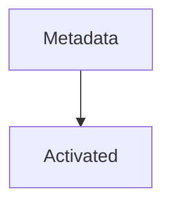

does not imply:

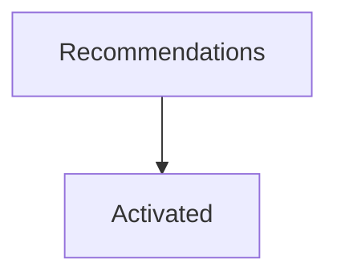

The Runtime coordinates lifecycle.

Capabilities participate independently.

One capability should never activate another.

---

# Execution Isolation

Every capability executes independently.

Example.

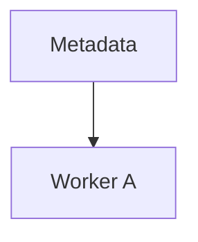

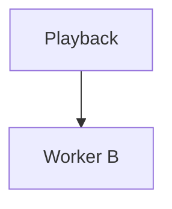

Execution failure within one capability should not directly affect unrelated capability execution.

The Worker Manager and Execution Engine cooperate to preserve this separation.

---

# Failure Isolation

Suppose:

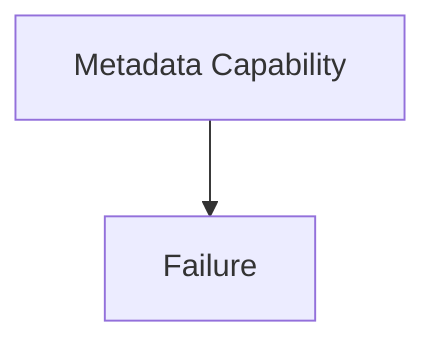

The Runtime should ensure:

- Playback continues.
- Library continues.
- Authentication continues.

Failure should remain local.

System-wide failure should be exceptional.

This principle of fault isolation is a cornerstone of resilient module and microkernel architectures. ([docs.aws.amazon.com](https://docs.aws.amazon.com/prescriptive-guidance/latest/cloud-design-patterns/bulkhead.html))

---

# Dependency Isolation

Capabilities should depend only upon:

- Runtime contracts
- declared capability contracts
- SDK contracts

They should never depend upon:

- implementation packages
- internal data structures
- private APIs
- other Module packages

Dependencies should remain explicit and manifest-driven.

Modules never communicate directly with one another.

They register capabilities.

The Platform owns capability orchestration.

---

# Contract Isolation

Capabilities communicate through contracts.

Example.

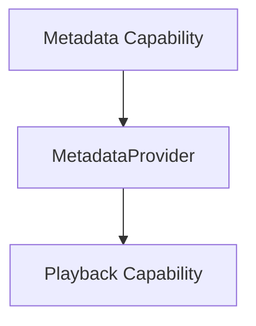

Playback depends upon:

```

MetadataProvider
```

It does not depend upon:

```

TMDB Implementation
```

Contract isolation allows implementations to evolve independently.

---

# Event Isolation

Events reinforce capability isolation.

Example.

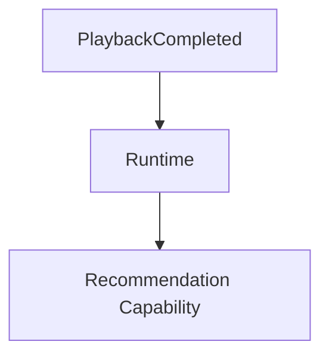

Playback does not know:

- who subscribed
- what happened afterwards

Events communicate business facts.

The Runtime provides delivery.

Capabilities remain autonomous.

---

# State Isolation

Each capability owns its own business state.

Example.

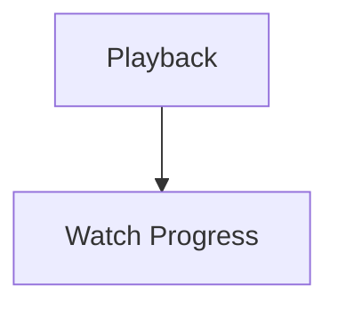

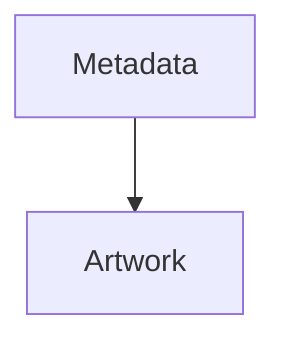

Playback should never modify Metadata storage directly.

Communication occurs through:

- contracts
- events

Never shared persistence.

This aligns with the ownership principles established in [MEG-003](../meg-003-domain-driven-design/index.md).

---

# Storage Isolation

Capabilities should not share persistence implementation.

Poor.

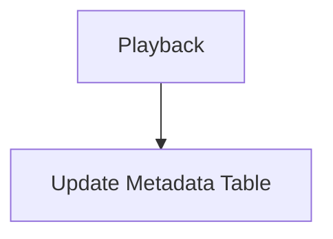

Preferred.

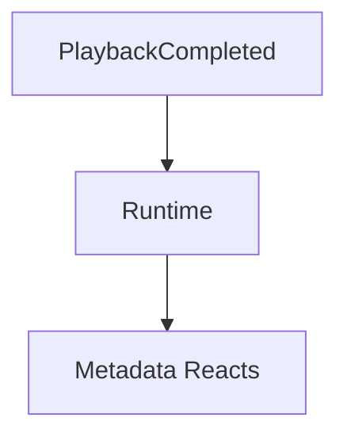

Storage ownership follows capability ownership.

---

# Configuration Isolation

Capabilities consume only their own configuration.

Poor.

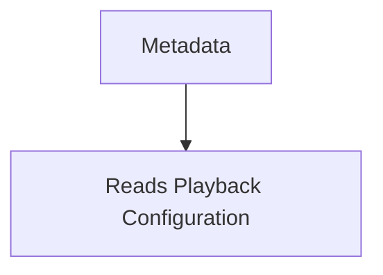

Preferred.

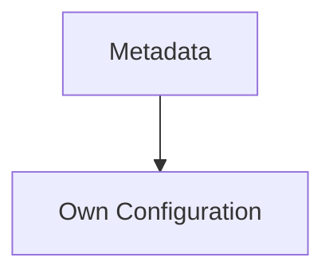

Shared configuration creates hidden dependencies.

The Runtime should inject configuration independently.

---

# Permission Isolation

Permissions are capability specific.

Example.

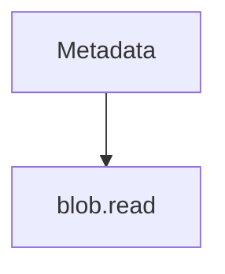

does not imply:

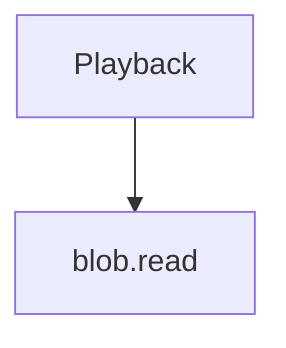

Authority should remain local to the capability requesting it.

Permission isolation complements execution isolation.

---

# Runtime Isolation

Capabilities should remain unaware of:

- worker identity
- scheduler implementation
- queue topology
- execution engine

The Runtime remains infrastructure.

Capabilities consume Runtime services.

They never manage them.

---

# SDK Isolation

Modules interact only with the SDK.

They should never import:

- Runtime internals
- Kernel implementation
- Runtime Services

The SDK forms the isolation boundary between Runtime evolution and module stability.

---

# Resource Isolation

Capabilities consume Runtime resources.

They do not own them.

Examples include:

- workers
- memory
- scheduling
- connections

The Runtime may:

- limit
- prioritise
- reclaim

resources independently of capability implementation.

No capability should monopolise shared Runtime resources.

---

# Upgrade Isolation

Capabilities should upgrade independently.

Example.

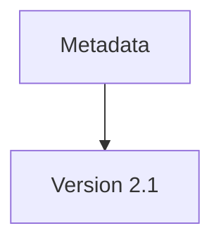

should not require:

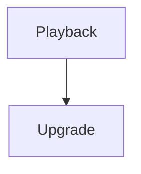

unless an explicit dependency requires it.

Version coupling should remain intentional.

Not accidental.

---

# Module Isolation

Third-party modules should remain isolated from:

- Platform implementation
- other modules
- Runtime internals

Architecturally.

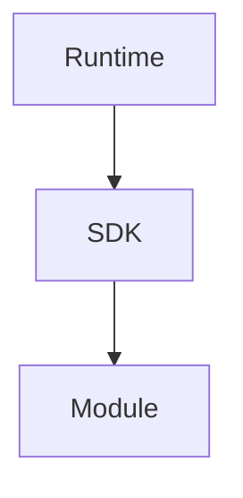

Modules communicate with the platform.

Never with one another's private implementation.

---

# Security Isolation

Isolation contributes directly to Runtime security.

Even if a module behaves incorrectly:

It should remain constrained by:

- permissions
- contracts
- Runtime boundaries

Isolation reduces both accidental and malicious platform impact.

---

# Operational Isolation

Operational behaviour should also remain isolated.

Examples include:

- logging
- metrics
- tracing
- health

Each capability reports independently.

The Runtime aggregates operational information without coupling implementations.

---

# Marketplace Isolation

Marketplace installation should preserve isolation.

Installing:

```

Books Capability
```

should not modify:

```

Playback Capability
```

Existing capabilities remain unchanged.

The platform simply gains additional functionality.

This is one of the defining characteristics of a capability-oriented platform.

---

# Diagnostics

The Runtime SHOULD expose:

- capability dependencies
- resource consumption
- failure boundaries
- permission grants
- execution isolation

Operators should understand:

> **Which capability affected which part of the platform?**

Isolation should remain observable.

---

# Anti-Patterns

The following practices are prohibited.

## Shared Business State

Multiple capabilities directly modifying the same business data.

---

## Private API Usage

Capabilities importing implementation packages from other capabilities.

---

## Runtime Bypass

Capabilities communicating directly without Runtime contracts.

---

## Shared Configuration

Capabilities reading one another's configuration.

---

## Shared Permissions

Granting one capability authority because another requires it.

---

## Cross-Capability Lifecycle

Capabilities activating, stopping or restarting one another.

---

# Mosaic Guidelines

Within Mosaic:

- Capabilities MUST remain operationally isolated.
- Business state MUST remain capability owned.
- Communication MUST occur through Runtime contracts or events.
- Runtime Services MUST preserve execution isolation.
- Permissions MUST remain capability specific.
- Configuration MUST remain capability specific.
- Modules MUST remain independent of Runtime implementation.
- Failure SHOULD remain local wherever practical.

---

# Relationship to MEG

Versioning defines:

> **Whether capabilities are compatible.**

Isolation defines:

> **How compatible capabilities safely coexist inside one Runtime.**

The next chapter introduces **Platform Guidelines**, bringing together the principles of the Module Platform into practical guidance for engineers designing new capabilities.

---

# Summary

Isolation is one of the defining architectural properties of the Mosaic platform.

It allows:

- Platform capabilities
- first-party modules
- third-party modules

to coexist within one Runtime while remaining independently evolvable.

By isolating:

- lifecycle
- execution
- state
- permissions
- configuration
- failures

the Runtime becomes a stable platform rather than a tightly coupled application.
