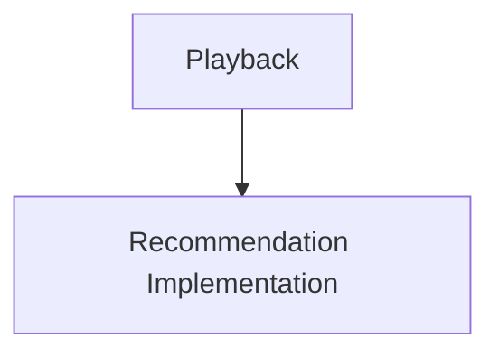
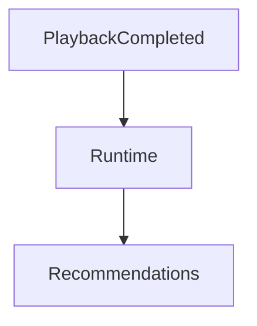
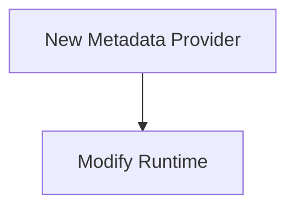
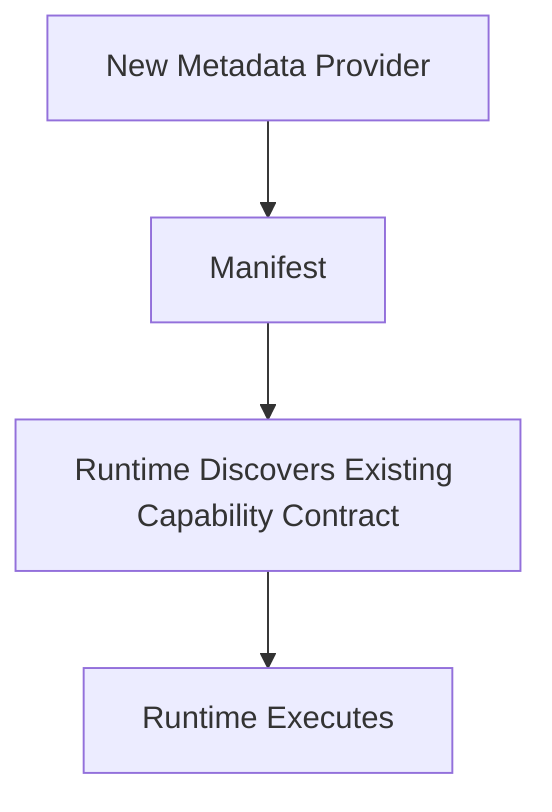

<!--
File: docs/engineering/guides/meg-006-module-platform/13-platform-guidelines.md
Document: MEG-006
Status: Draft
Version: 0.8
-->

# Platform Guidelines

> *The platform should become larger by adding capabilities, not by increasing the complexity of the Runtime.*

---

# Purpose

The previous chapters introduced the building blocks of the Module Platform:

- Capability Manifests
- Discovery
- Registration
- Dependency Resolution
- Activation
- Lifecycle
- SDK
- Permissions
- Configuration
- Versioning
- Isolation

This document brings those concepts together into practical engineering guidance.

Its purpose is to answer one question.

> **"How should I design a new capability for the Mosaic platform?"**

---

# Philosophy

Within Mosaic:

> **Think like a platform engineer, not an application developer.**

Capabilities should be designed as:

- independent
- replaceable
- discoverable
- observable

The Runtime should require no modification to support them.

---

# Start With The Capability

Before writing code ask:

- What business capability exists?
- What problem does it solve?
- Does this belong in an existing capability?
- Should this become a new capability?

Avoid creating capabilities around:

- technical implementation
- frameworks
- storage technologies

Capabilities should model business value.

Not infrastructure.

---

# Design Around Contracts

Every capability should expose:

- contracts
- events
- configuration
- permissions

before implementation begins.

The Runtime should understand:

> **What the capability is**

before understanding:

> **How it is implemented**

---

# Manifest First

Every capability begins with:

```

capability.yaml
```

Before implementation ask:

- What permissions are required?
- Which contracts are provided?
- Which contracts are consumed?
- Which Runtime services are needed?

If the manifest cannot describe the capability clearly:

The design probably requires refinement.

---

# Prefer Small Capabilities

Good.

```

Metadata
```

```

Books
```

```

Playback
```

Poor.

```

MediaEverythingCapability
```

Capabilities should own one coherent business concern.

Large capabilities become miniature monoliths.

---

# Avoid Runtime Knowledge

Capabilities should never know:

- worker count
- scheduler implementation
- dependency graph
- execution engine
- Runtime Kernel

They should know only:

- SDK
- contracts
- business behaviour

The Runtime exists to hide operational complexity.

---

# Runtime Contracts

When consuming Runtime functionality ask:

> **Does a Runtime contract already exist?**

Avoid introducing new Runtime APIs unnecessarily.

The SDK should remain:

- small
- stable
- expressive

The Runtime should evolve underneath it.

---

# Events Before Coupling

Suppose one capability needs another.

Poor.



Preferred.



Capabilities should collaborate through:

- contracts
- events

Never implementation.

---

# Configuration

Capabilities should declare:

- configuration schema
- defaults
- validation requirements

They should never:

- read files
- parse YAML
- inspect environment variables

Configuration belongs to the Runtime.

---

# Permissions

Capabilities should request:

only

the permissions they require.

Avoid.

```yaml
permissions:

  - runtime.*
```

Prefer.

```yaml
permissions:

  - scheduler.use

  - blob.read
```

The principle of least privilege should guide every capability.

---

# Versioning

Before releasing a capability ask:

- Has a Runtime contract changed?
- Has configuration changed?
- Has behaviour changed?
- Is this backwards compatible?

Version numbers communicate compatibility.

Not development effort.

---

# Dependencies

Declare every dependency explicitly.

Never assume:

- Platform capability exists
- SDK feature exists
- Runtime contract exists

The Runtime validates dependency graphs.

Capabilities should not discover missing dependencies during execution.

---

# Build For Replacement

Ask:

> **Could another capability replace this one?**

Examples.

```

TMDB Metadata
```

↓

```

AniList Metadata
```

The Runtime should require only:

- different manifest
- different capability

Everything else should remain unchanged.

Replaceability is one of the defining characteristics of a healthy capability platform.

---

# Build For Discovery

Capabilities should be understandable through their manifest.

Operators should be able to answer:

- What does this capability provide?
- Which permissions does it require?
- Which contracts does it expose?
- Which events does it publish?

without reading source code.

Discovery should become a platform feature.

Not a documentation exercise.

---

# Design For Tooling

Remember:

The Runtime is not the only consumer of manifests.

Tooling may use manifests for:

- marketplace listings
- dependency graphs
- architecture diagrams
- configuration UIs
- compatibility reports

The manifest should remain sufficiently rich to support these tools.

---

# Design For Testing

Every capability should be testable using:

- fake Runtime context
- fake contracts
- fake configuration

The full Runtime should not be required.

Capabilities should remain independently testable.

Development tooling should also support testing against a real development Platform.

The Development Supervisor may orchestrate automatic compilation of a local Module into a temporary development Platform through the Build Pipeline.

This gives Module authors integration feedback without changing the production build model.

---

# Development Workflow

The Mosaic CLI should make Module development routine.

Typical workflow.

```text
mosaic new module anilist

mosaic dev

mosaic test

mosaic build

mosaic publish
```

During development, the CLI and Development Supervisor should:

- create or locate the Module manifest,
- validate SDK compatibility,
- generate manifests from SDK Module definitions when requested,
- prepare a temporary build workspace,
- compile the local Module into a development Platform,
- expose diagnostics from discovery, registration and activation.

Development convenience must not introduce a separate runtime plugin model.

Local development should exercise the same static composition architecture used by production builds.

The CLI owns workflow.

The SDK owns contracts.

Chapter 14 defines the authoritative Developer Platform architecture for this workflow.

---

# Test Harness Modules

Development environments may install Test Harness Modules automatically.

Test Harness Modules provide fake implementations of common capabilities.

Examples include:

- Metadata
- Media
- Artwork
- Authentication
- Events

Module tests should prefer a real Platform with test providers over bespoke mocking frameworks.

The test harness should remain explicit and replaceable.

It should not become hidden production behaviour.

---

# Design For Isolation

Ask:

> **If this capability fails, what else fails?**

The ideal answer is:

```

Nothing
```

Failures should remain local.

Capability isolation should always outweigh implementation convenience.

---

# Platform Evolution Boundary

New providers should not require Runtime modification.

A genuinely new capability may require Platform and SDK evolution because the Platform owns capability contracts.

Poor.



Preferred.



Provider growth should occur through Module addition.

Capability growth should occur deliberately through Platform and SDK design.

Do not hide a new architectural capability inside a Module-specific contract.

---

# Marketplace Readiness

A capability should be installable by someone who has never seen its source code.

That requires:

- good manifest
- documentation
- configuration schema
- permissions
- compatibility information

Marketplace readiness should become a natural consequence of good platform design.

---

# Platform Review Checklist

Before implementing a capability confirm:

- [ ] The capability models one business concern.
- [ ] A manifest exists before implementation.
- [ ] Runtime contracts are explicit.
- [ ] Permissions follow least privilege.
- [ ] Configuration schema is complete.
- [ ] Dependencies are declared.
- [ ] Events reinforce loose coupling.
- [ ] New providers use existing Platform contracts.
- [ ] New capabilities are proposed as Platform and SDK changes.
- [ ] Local development uses the Development Supervisor rather than runtime plugin loading.
- [ ] Tests can run against Test Harness Modules where integration behaviour matters.
- [ ] The capability is independently testable.
- [ ] The Runtime requires no modification for provider-only additions.

---

# Common Platform Mistakes

Avoid:

- extending the Runtime for business features
- hidden dependencies
- Runtime implementation imports
- oversized capabilities
- broad permissions
- undocumented contracts
- implicit configuration

These decisions usually weaken the platform long before they become visible.

---

# Mosaic Guidelines

Within Mosaic:

- Every new feature SHOULD begin as a capability.
- New providers SHOULD NOT require Runtime modification.
- New capability contracts SHOULD require deliberate Platform and SDK review.
- Development tooling SHOULD compile local Modules through the same static composition model as production.
- Test Harness Modules SHOULD provide fake providers for integration testing.
- Capabilities MUST remain independently deployable.
- Runtime contracts SHOULD remain explicit.
- Platform growth SHOULD occur through composition.
- Manifests SHOULD remain the primary architectural contract.
- Capability isolation SHOULD remain a design priority.
- Platform simplicity SHOULD always outweigh convenience.

---

# Relationship to MEG

This chapter completes the practical implementation guidance of MEG-006.

The remaining documents describe:

- architectural reasoning (ADRs)
- contributor expectations
- terminology
- references

Together, [MEG-001](../meg-001-go-engineering-standards/index.md) through MEG-006 now define:

- engineering
- execution
- business modelling
- architecture
- runtime
- platform evolution

The remaining MEGs build upon these foundations rather than redefining them.

---

# Summary

The Module Platform succeeds when new capabilities feel ordinary.

Installing:

- Books
- Music
- Anime
- Comics
- IPTV

should require no Runtime redesign.

Only:

- discovery
- registration
- activation

Within Mosaic, the Runtime should remain stable for years while capabilities continue to evolve indefinitely.

That is the defining characteristic of a true platform.
