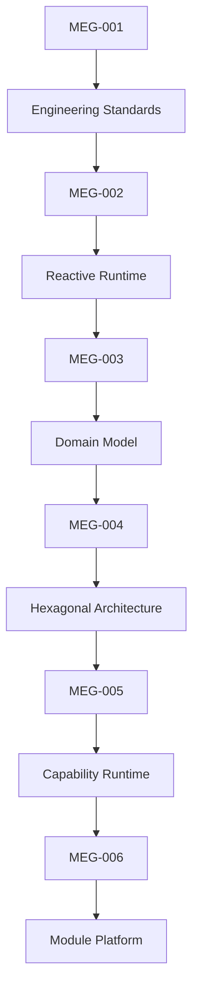
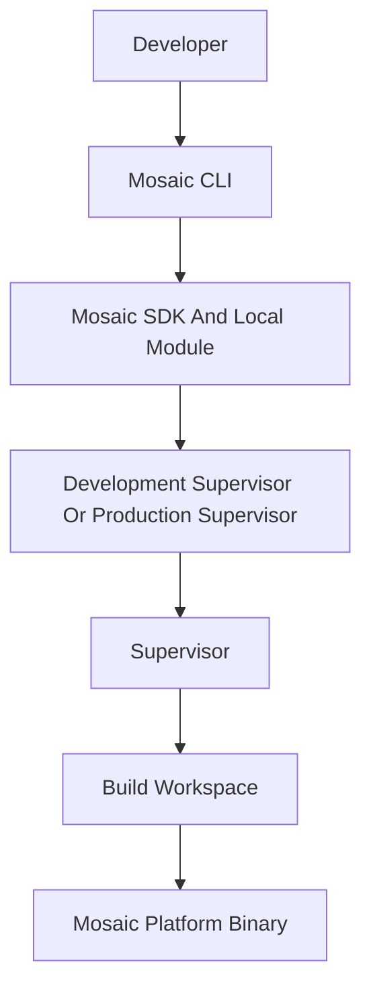
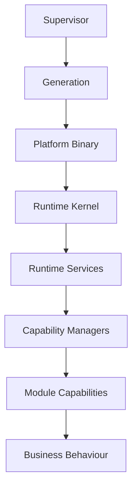

<!--
File: docs/engineering/guides/meg-006-module-platform/index.md
Document: MEG-006
Status: Draft
-->

# MEG-006 — Module Platform

> *The Runtime provides execution. Modules provide evolution.*

---

# Purpose

The previous engineering specifications established everything a capability needs in order to exist:

- how software is written
- how the Runtime executes
- how the business is modelled
- how the Domain is protected
- how the Runtime itself is structured

None of them explain how a capability written later joins a platform that already exists, and MEG-006 answers that final architectural question.

> **How does the Platform evolve without modifying the Runtime?**

The Mosaic Module Platform allows new capabilities to be:

- discovered
- validated
- composed
- statically linked
- executed
- upgraded
- removed

without changing the Runtime itself. That last clause is the whole of it, because a platform that must be modified in order to accept a new capability is simply an application being extended.

Unlike traditional module systems, modules are not an afterthought bolted onto a finished application; they are a first-class architectural concept, and the Runtime is intentionally designed to grow through build-time Module composition rather than through continual modification of the Platform foundation.

---

# Relationship to MEG



[MEG-005](../meg-005-runtime-architecture/index.md) is the closest relative in that chain, because the two guides divide one subject between them. It defines:

> **How the Runtime executes capabilities.**

MEG-006 defines:

> **How new capabilities become part of that Runtime.**

---

# Scope

This specification defines the whole path from a capability's description to its presence in a running binary: Module philosophy, Module lifecycle, the Module manifest, Capability manifests, Discovery, Registration, Activation, Dependency resolution, Module contracts, Module permissions, Configuration, Versioning, Compatibility, Isolation, SDK architecture, Build-time composition, Generated imports, Developer Platform architecture, Mosaic CLI workflow ownership, Development Supervisor and Development Platform boundaries, Test Harness Modules, deterministic Test Harness data and event simulation, and local Module composition.

It intentionally does **not** define business domains, runtime internals, storage architecture, deployment topology or Supervisor generation activation. Those concerns belong to previous or future MEG specifications, and MEG-006 depends on their answers without restating them.

---

# Guiding Question

MEG-006 exists to answer one question.

> **How should Mosaic evolve through independently developed capabilities while preserving Runtime stability?**

---

# Module Statement

Within Mosaic:

> **Everything beyond the Runtime is a capability. Every capability may be delivered as a module.**

Platform capabilities, third-party capabilities, enterprise capabilities and experimental capabilities are all the same kind of thing to the Runtime, which should treat them identically. The only distinction should be **how they are delivered**, not **how they execute**.

Mosaic Modules are therefore compile-time composition units rather than runtime plugins, and the finished product is always one statically linked Go executable.

---

# Module Architecture

Mosaic Module Architecture follows this shape, which traces one capability from the developer who writes it through to the binary that runs it.



Responsibility is divided along that path. The Supervisor assembles the runtime from declarative manifests and Go modules while the Build Pipeline performs build mechanics, and the Platform discovers registered Modules through the SDK registry at startup.

---

# Platform Hierarchy

The Mosaic platform intentionally separates concerns into architectural layers, so that a change to business behaviour and a change to execution machinery land in different places.



Notice that the Platform does not load runtime plugins. It grows instead by composing selected Modules into a statically linked Platform Binary, which is why the composition decision belongs to the Supervisor at the top of this hierarchy rather than to the Runtime Kernel beneath it.

---

# Expected Outcome

After reading MEG-006 contributors should understand how modules are discovered, how capabilities register, how manifests define platform contracts, how dependencies are validated, how Modules are composed into a Platform Binary, how generated imports trigger registration, why `imports.go` is the only generated integration source, how local development compiles Modules through the Development Supervisor, how Test Harness Modules support integration testing, how permissions are enforced, how modules evolve safely, and how built-in and third-party capabilities coexist — all without modifying the Runtime itself. Each of those mechanisms is the subject of a later chapter, and the chapters are ordered to follow a capability's own progress from manifest through to execution.

---

# Repository Structure

```text
docs/
└── engineering/guides/
    └── meg-006-module-platform/
        index.md
        00-document-control.md
        01-module-philosophy.md
        02-module-manifest.md
        03-discovery.md
        04-registration.md
        05-dependency-resolution.md
        06-activation.md
        07-module-lifecycle.md
        08-module-sdk.md
        09-permissions.md
        10-configuration.md
        11-versioning.md
        12-isolation.md
        13-platform-guidelines.md
        14-developer-platform.md
        15-test-harness.md
        16-adrs.md
        17-contributor-guidance.md
        references.md
        glossary.md
```

---

# Dependencies

Required reading:

- [MEG-001 — Go Engineering Standards](../meg-001-go-engineering-standards/index.md)
- [MEG-002 — Event-Driven Runtime](../meg-002-event-driven-runtime/index.md)
- [MEG-003 — Domain-Driven Design](../meg-003-domain-driven-design/index.md)
- [MEG-004 — Hexagonal Architecture](../meg-004-hexagonal-architecture/index.md)
- [MEG-005 — Runtime Architecture](../meg-005-runtime-architecture/index.md)

Companion specifications:

- [MEG-007 — Storage Architecture](../meg-007-storage-architecture/index.md)
- [MEG-008 — Observability](../meg-008-observability/index.md)
- [MEG-009 — Security Architecture](../meg-009-security-architecture/index.md)

---

# Design Goals

The Module Platform is intended to produce a platform that is:

- Extensible
- Discoverable
- Manifest driven
- Capability oriented
- Version aware
- Secure
- Replaceable
- Operationally predictable

Taken together these goals describe a single quality: every module should feel like a natural part of the platform rather than an external add-on. Manifest-driven discovery and registration are what make that possible, because they allow capabilities to be discovered and validated before a Platform package is produced.  [zylos.ai](https://zylos.ai/research/2026-02-21-ai-agent-plugin-extension-architecture/)
