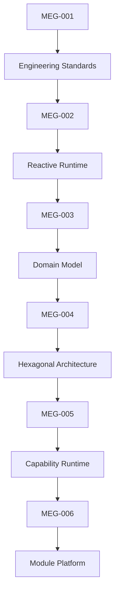
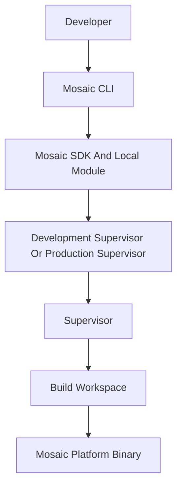
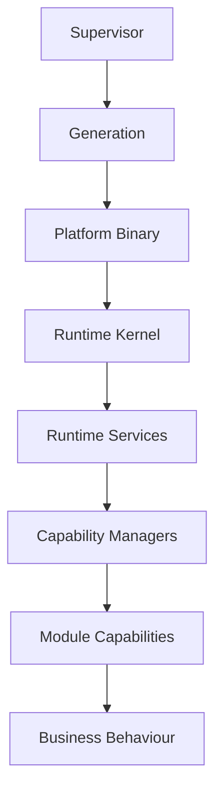

<!--
File: docs/engineering/guides/meg-006-module-platform/index.md
Document: MEG-006
Status: Draft
Version: 0.8
-->

# MEG-006 — Module Platform

> *The Runtime provides execution. Modules provide evolution.*

---

# Purpose

The previous engineering specifications established:

- how software is written
- how the Runtime executes
- how the business is modelled
- how the Domain is protected
- how the Runtime itself is structured

MEG-006 answers the final architectural question.

> **How does the Platform evolve without modifying the Runtime?**

The Mosaic Module Platform allows new capabilities to be:

- discovered
- validated
- composed
- statically linked
- executed
- upgraded
- removed

without changing the Runtime itself.

Unlike traditional module systems, modules are not an afterthought.

They are a first-class architectural concept.

The Runtime is intentionally designed to grow through build-time Module composition rather than through continual modification of the Platform foundation.

---

# Relationship to MEG



[MEG-005](../meg-005-runtime-architecture/index.md) defines:

> **How the Runtime executes capabilities.**

MEG-006 defines:

> **How new capabilities become part of that Runtime.**

---

# Scope

This specification defines:

- Module philosophy
- Module lifecycle
- Module manifest
- Capability manifests
- Discovery
- Registration
- Activation
- Dependency resolution
- Module contracts
- Module permissions
- Configuration
- Versioning
- Compatibility
- Isolation
- SDK architecture
- Build-time composition
- Generated imports
- Developer Platform architecture
- Mosaic CLI workflow ownership
- Development Supervisor and Development Platform boundaries
- Test Harness Modules
- deterministic Test Harness data and event simulation
- local Module composition

This specification intentionally does **not** define:

- business domains
- runtime internals
- storage architecture
- deployment topology
- Supervisor generation activation

Those concerns belong to previous or future MEG specifications.

---

# Guiding Question

MEG-006 exists to answer one question.

> **How should Mosaic evolve through independently developed capabilities while preserving Runtime stability?**

---

# Module Statement

Within Mosaic:

> **Everything beyond the Runtime is a capability. Every capability may be delivered as a module.**

Platform capabilities.

Third-party capabilities.

Enterprise capabilities.

Experimental capabilities.

The Runtime should treat them identically.

The only distinction should be **how they are delivered**, not **how they execute**.

Mosaic Modules are compile-time composition units.

They are not runtime plugins.

The finished product is always one statically linked Go executable.

---

# Module Architecture

Mosaic Module Architecture follows this shape.



The Supervisor assembles the runtime from declarative manifests and Go modules.

The Build Pipeline performs build mechanics.

The Platform discovers registered Modules through the SDK registry at startup.

---

# Platform Hierarchy

The Mosaic platform intentionally separates concerns into architectural layers.



Notice:

The Platform does not load runtime plugins.

It grows by composing selected Modules into a statically linked Platform Binary.

---

# Expected Outcome

After reading MEG-006 contributors should understand:

- how modules are discovered
- how capabilities register
- how manifests define platform contracts
- how dependencies are validated
- how Modules are composed into a Platform Binary
- how generated imports trigger registration
- why `imports.go` is the only generated integration source
- how local development compiles Modules through the Development Supervisor
- how Test Harness Modules support integration testing
- how permissions are enforced
- how modules evolve safely
- how built-in and third-party capabilities coexist

without modifying the Runtime itself.

---

# Repository Structure

```

engineering/

└── meg/

    └── MEG-006 Module Platform/

        README.md

        00-document-control.md

        01-module-philosophy.md

        02-module-manifest.md

        03-discovery.md

        04-registration.md

        05-dependency-resolution.md

        06-activation.md

        07-module-lifecycle.md

        08-module-sdk.md

        09-permissions.md

        10-configuration.md

        11-versioning.md

        12-isolation.md

        13-platform-guidelines.md

        14-developer-platform.md

        15-test-harness.md

        16-adrs.md

        17-contributor-guidance.md

        references.md

        glossary.md
```

---

# Dependencies

Required reading:

- [MEG-001 — Go Engineering Standards](../meg-001-go-engineering-standards/index.md)
- [MEG-002 — Event-Driven Runtime](../meg-002-event-driven-runtime/index.md)
- [MEG-003 — Domain-Driven Design](../meg-003-domain-driven-design/index.md)
- [MEG-004 — Hexagonal Architecture](../meg-004-hexagonal-architecture/index.md)
- [MEG-005 — Runtime Architecture](../meg-005-runtime-architecture/index.md)

Future companion specifications:

- [MEG-007 — Storage Architecture](../meg-007-storage-architecture/index.md)
- [MEG-008 — Observability](../meg-008-observability/index.md)
- [MEG-009 — Security Architecture](../meg-009-security-architecture/index.md)

---

# Design Goals

The Module Platform is intended to produce a platform that is:

- Extensible
- Discoverable
- Manifest driven
- Capability oriented
- Version aware
- Secure
- Replaceable
- Operationally predictable

Every module should feel like a natural part of the platform rather than an external add-on.

Manifest-driven discovery and registration allow capabilities to be discovered and validated before a Platform package is produced.  [zylos.ai](https://zylos.ai/research/2026-02-21-ai-agent-plugin-extension-architecture/)
