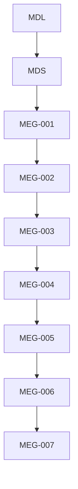
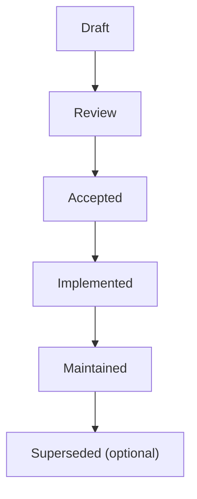

<!--
File: docs/engineering/guides/meg-007-storage-architecture/00-document-control.md
Document: MEG-007
Status: Draft
Version: 0.4
-->

# Document Control

---

# Document Information

| Field | Value |
|---------|--------|
| Document ID | MEG-007 |
| Title | Storage Architecture |
| File | 00-document-control.md |
| Status | Draft |
| Version | 0.4 |
| Owner | AdamNi-7080 |
| Classification | Internal Architecture Specification |

---

# Purpose

This document establishes the governance, authority and lifecycle of the Mosaic Storage Architecture specification.

MEG-007 defines the architectural principles governing how information is persisted throughout the Mosaic platform.

Unlike previous specifications, which define:

- behaviour
- execution
- modelling
- architecture

this specification defines:

> **Where information lives throughout its lifetime.**

Storage Architecture exists to ensure that every category of information has an intentional home with clearly defined ownership.

---

# Authority

MEG-007 is the authoritative specification governing persistence throughout the Mosaic platform.

This specification applies to:

- PostgreSQL
- DuckDB
- Blob Storage
- MOS archives
- MOS cache
- Repository implementations
- Capability persistence
- Runtime persistence

Every storage implementation SHOULD conform to the architectural boundaries established by this specification.

---

# Relationship to Other Specifications

MEG specifications intentionally build upon one another.

Specifically:

- **[MEG-001](../meg-001-go-engineering-standards/index.md)** defines engineering.
- **[MEG-002](../meg-002-event-driven-runtime/index.md)** defines Runtime behaviour.
- **[MEG-003](../meg-003-domain-driven-design/index.md)** defines business modelling.
- **[MEG-004](../meg-004-hexagonal-architecture/index.md)** defines dependency boundaries.
- **[MEG-005](../meg-005-runtime-architecture/index.md)** defines Runtime Architecture.
- **[MEG-006](../meg-006-module-platform/index.md)** defines the Module Platform.
- **MEG-007** defines Storage Architecture.

Together they establish both how the platform behaves and how that behaviour is persisted.

---

# Normative Language

Unless explicitly stated otherwise, the following keywords are interpreted according to RFC 2119.

| Keyword | Meaning |
|----------|---------|
| **MUST** | Mandatory requirement. |
| **MUST NOT** | Prohibited behaviour. |
| **SHOULD** | Strong recommendation. Deviation requires architectural justification. |
| **SHOULD NOT** | Discouraged except where clearly justified. |
| **MAY** | Optional behaviour based upon engineering judgement. |

Examples and diagrams are informative unless explicitly identified as normative.

---

# Storage Principles

The Mosaic Storage Architecture is built upon several foundational principles.

- Storage follows information ownership.
- Storage technologies remain replaceable.
- No storage engine owns every concern.
- Business state and Runtime state remain separate.
- Storage is selected according to access patterns.
- Repositories protect the Domain from persistence.
- Derived data remains reproducible.
- Storage architecture should remain observable.

Every subsequent chapter expands one or more of these principles.

---

# Document Lifecycle

MEG specifications evolve alongside the platform.

Each document progresses through the following lifecycle.

Accepted specifications become part of the canonical Mosaic architecture.

Historical revisions SHOULD remain available for future reference.

---

# Storage Evolution

Storage Architecture is expected to evolve.

However, changes affecting:

- storage taxonomy
- persistence boundaries
- repository ownership
- storage engines
- archive formats
- migration strategy
- backup strategy

SHOULD be accompanied by an Architectural Decision Record (ADR).

Storage evolution should remain deliberate rather than reactive.

---

# Compliance

All persistence implementations SHOULD comply with MEG-007.

Where deviation becomes necessary, contributors SHOULD document:

- architectural reason
- affected storage systems
- migration strategy
- operational impact

Temporary deviations should eventually be removed.

Permanent deviations should generally result in updates to this specification.

---

# Design Philosophy

MEG-007 intentionally favours:

- purpose-built storage
- explicit ownership
- technology independence
- observable persistence
- recoverability
- long-term maintainability

No storage engine should become a general-purpose solution simply because it already exists.

Instead, every storage technology should exist because it is the most appropriate solution for one clearly defined category of information.

This philosophy continues the separation of concerns established throughout the previous MEG specifications and builds upon the move towards embedded transactional and analytical storage first explored in the earlier Remux architecture. NullAnimeException_ Master Specification & Roadmap....pdf

---

# Scope of Authority

MEG-007 governs storage architecture.

It does **not** define:

- business behaviour
- runtime execution
- module lifecycle
- deployment topology

Those concerns belong to other engineering specifications.

Keeping persistence independent from execution allows each architectural layer to evolve without unnecessary coupling.
