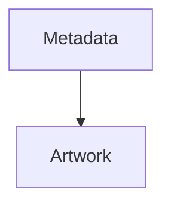
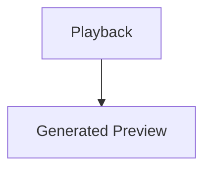
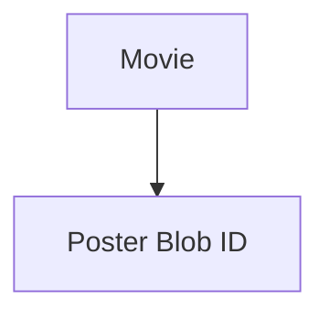
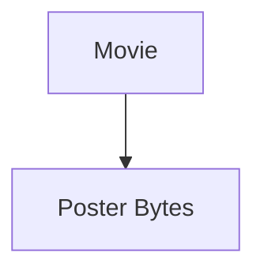
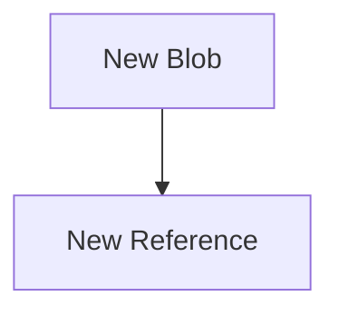
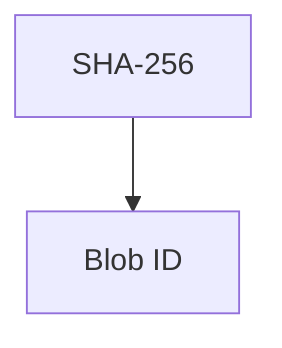
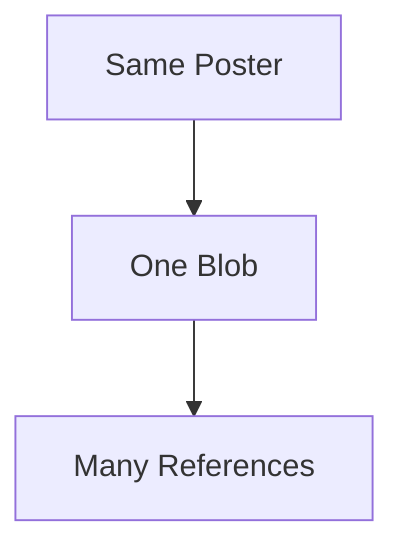
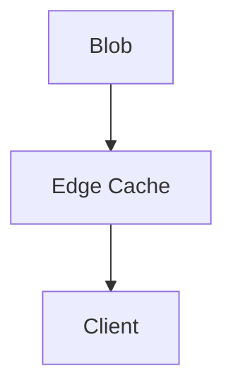
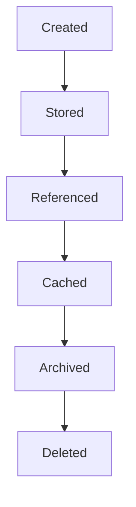
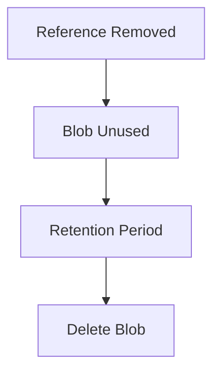

<!--
File: docs/engineering/guides/meg-007-storage-architecture/05-blob-storage.md
Document: MEG-007
Status: Draft
Version: 0.4
-->

# Blob Storage

> *Structured information belongs in databases. Binary information belongs in object storage.*

---

# Purpose

Not every piece of information fits naturally inside a relational database.

Examples include:

- posters
- fan art
- banners
- subtitles
- screenshots
- preview images
- generated thumbnails

These assets are:

- large
- immutable
- streamed
- cacheable

They require storage characteristics fundamentally different from transactional databases.

Within Mosaic, these assets are stored using **Blob Storage**.

Blob Storage exists to preserve binary assets while remaining independent of business persistence.

---

# Philosophy

Within Mosaic:

> **Blob Storage stores assets. Databases store knowledge about those assets.**

Business state references assets.

It does not contain them.

This separation preserves:

- performance
- scalability
- architectural clarity

---

# Why Blob Storage?

Blob Storage is optimised for:

- large binary objects
- sequential reads
- immutable assets
- streaming
- caching
- efficient storage utilisation

It is intentionally **not** optimised for:

- transactions
- joins
- aggregation
- business relationships

Every storage engine should embrace the workloads it performs best.

---

# Storage Responsibility

Blob Storage owns:

- posters
- artwork
- fan art
- subtitles
- preview images
- generated thumbnails
- capability assets

It intentionally does **not** own:

- metadata
- users
- libraries
- playback state
- configuration

Those remain structured information.

---

# Asset Ownership

Every binary asset has exactly one owning capability.

Example.





Ownership determines:

- lifecycle
- cleanup
- regeneration
- references

Blob Storage merely stores the asset.

The capability owns its meaning.

---

# Blob Identity

Every blob SHOULD possess a stable identifier.

Example.

```

blob://artwork/6c3d9f...
```

The identifier becomes the permanent reference.

Capabilities should never reference:

- filesystem paths
- storage locations
- bucket names

The Runtime resolves blob identifiers into storage implementation.

---

# Asset References

Business State should reference blobs.

Example.



Rather than:



Relational storage references assets.

Blob Storage contains assets.

The two remain separate.

---

# Immutable Assets

Blob Storage SHOULD treat assets as immutable.

Suppose artwork changes.

Preferred.



Rather than:

```

Overwrite Existing Blob
```

Immutability simplifies:

- caching
- replication
- rollback
- integrity

---

# Storage Layout

The Runtime should remain free to organise blobs internally.

Examples include:

```text
artwork/

subtitles/

thumbnails/

previews/
```

or

```

Content Addressable Storage
```

Capabilities should never depend upon storage layout.

Storage organisation remains an implementation concern.

---

# Content Addressing

Where practical, blobs SHOULD be content-addressed.

Example.



Benefits include:

- deduplication
- integrity verification
- cache reuse

The blob identifier should remain stable regardless of physical location.

---

# Deduplication

Duplicate assets SHOULD exist only once.

Example.



Capabilities reference the same blob.

Storage usage remains efficient.

Deduplication should remain transparent to capability authors.

---

# Streaming

Blob Storage should optimise for streaming.

Examples include:

- artwork delivery
- subtitle download
- preview playback

Large assets should not require loading entirely into memory before delivery.

Streaming should remain the default access pattern.

---

# Caching

Blob Storage naturally supports caching.

Example.



Caching should improve:

- latency
- bandwidth
- responsiveness

Cached blobs remain copies.

The authoritative blob remains unchanged.

---

# Binary Lifecycle

Binary assets generally follow this lifecycle.



Blob Storage owns:

- storage
- retrieval
- deletion

Capabilities own:

- creation
- references
- lifecycle policy

---

# Derived Assets

Many blobs are derived.

Examples include:

- resized artwork
- thumbnails
- previews
- collages

Derived blobs SHOULD remain reproducible.

Loss should trigger regeneration rather than backup restoration.

This follows the Storage Taxonomy established earlier.

---

# Remote Assets

Not every asset requires local storage.

Some assets may remain remote.

Example.

```

TMDB Artwork URL
```

↓

```

Blob Reference
```

The Runtime may:

- proxy
- cache
- mirror

remote assets according to platform policy.

The capability should not care whether the blob is:

- local
- remote
- cached

This aligns closely with the artwork pointer strategy explored during the evolution from the earlier Remux architecture, where stable references became more important than downloading every remote asset. NullAnimeException_ Master Specification & Roadmap....pdf

---

# Garbage Collection

Unreferenced blobs SHOULD eventually be removed.

Example.



Garbage collection should remain:

- deterministic
- observable
- safe

Shared blobs should never be deleted while references remain.

---

# Integrity

Blob Storage SHOULD verify asset integrity.

Examples include:

- checksums
- hashes
- corruption detection

Corrupted assets should be:

- reported
- recoverable
- replaceable

Integrity verification should occur independently of business behaviour.

---

# Replication

Blob replication MAY occur independently of Business State.

Replication policies may differ according to:

- artwork
- subtitles
- previews
- archives

Replication should optimise durability without affecting business correctness.

---

# Performance

Blob Storage should optimise for:

- high-throughput reads
- streaming
- cache efficiency
- sequential access

Random transactional workloads belong elsewhere.

Blob Storage exists for binary assets.

Not structured information.

---

# Observability

Blob Storage SHOULD expose:

- storage utilisation
- object count
- cache hit ratio
- retrieval latency
- corruption events
- garbage collection activity

Operators should understand asset storage independently from databases.

---

# Anti-Patterns

The following practices are prohibited.

## Binary Assets In PostgreSQL

Storing artwork directly inside relational tables.

---

## Filesystem Paths

Capabilities referencing physical storage paths.

---

## Mutable Blobs

Overwriting existing blob contents.

---

## Shared Ownership

Multiple capabilities claiming ownership of the same blob lifecycle.

---

## Business Metadata

Persisting structured business information inside Blob Storage.

---

## Permanent Derived Assets

Treating reproducible binary assets as irreplaceable.

---

# Mosaic Guidelines

Within Mosaic:

- Blob Storage MUST own binary assets.
- Business State MUST reference blobs rather than embed them.
- Blob identifiers SHOULD remain stable.
- Binary assets SHOULD remain immutable.
- Duplicate assets SHOULD be deduplicated.
- Blob Storage SHOULD optimise for streaming.
- Derived assets SHOULD remain reproducible.
- Blob lifecycle MUST remain observable.

---

# Relationship to MEG

DuckDB stores:

> **Analytical understanding.**

Blob Storage stores:

> **Binary assets.**

The next chapter introduces **MOS Archives**, defining Mosaic's portable archival format for preserving media, metadata and platform information independently of the Runtime.

---

# Summary

Blob Storage is the platform's binary memory.

It preserves:

- artwork
- subtitles
- previews
- media assets

while remaining completely independent from business persistence.

By separating binary assets from structured information, Mosaic gains:

- better scalability
- improved streaming
- simpler backups
- cleaner architecture

Databases describe the platform.

Blob Storage preserves what the platform sees.
