<!--
File: docs/engineering/guides/meg-007-storage-architecture/08-repositories.md
Document: MEG-007
Status: Draft
Version: 0.4
-->

# Repositories

> *Repositories protect the Domain from storage. They should never expose where information is persisted.*

---

# Purpose

The previous chapters defined the storage technologies used throughout Mosaic.

However:

The Domain should never know whether information resides in:

- PostgreSQL
- DuckDB
- Blob Storage
- MOS Archives
- MOS Cache

That separation is achieved through **Repositories**.

Repositories are the architectural boundary between:

- business behaviour
- persistence implementation

They translate Domain concepts into storage operations while preserving complete storage independence.

---

# Philosophy

Within Mosaic:

> **Repositories expose business concepts. They hide storage technologies.**

The Domain should ask:

> **Load Library**

Not:

> **Query PostgreSQL**

Storage is infrastructure.

Repositories protect the Domain from infrastructure.

---

# Repository Responsibilities

Repositories are responsible for:

- loading Aggregates
- saving Aggregates
- retrieving business entities
- persisting business state
- translating storage models

Repositories are **not** responsible for:

- business rules
- validation
- recommendations
- analytics
- scheduling

Business behaviour remains inside the Domain.

---

# Repository Boundary

Conceptually.

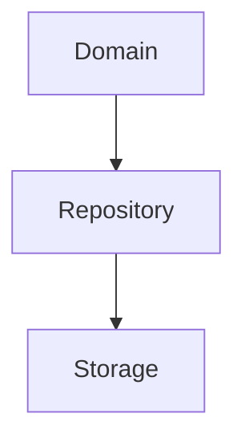

Every persistence operation crosses this boundary.

The Domain never crosses it directly.

---

# Storage Independence

Repositories should remain storage agnostic.

Poor.

```go
PostgresPlaybackRepository
```

inside the Domain.

Preferred.

```go
PlaybackRepository
```

The Domain owns:

```

PlaybackRepository
```

Infrastructure implements it.

This follows the Repository pattern established earlier in [MEG-003](../meg-003-domain-driven-design/index.md) and the dependency rules established in [MEG-004](../meg-004-hexagonal-architecture/index.md).

---

# Repository Ownership

Every Aggregate Root SHOULD own one Repository.

Examples.

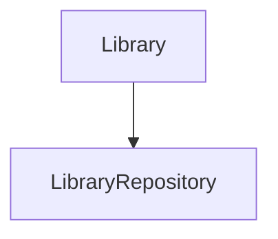

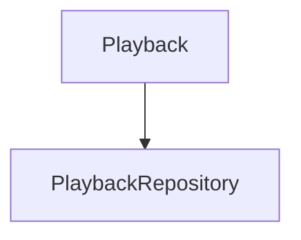

Repositories follow business ownership.

Not database ownership.

---

# Multiple Storage Engines

One Repository MAY coordinate multiple storage engines.

Example.

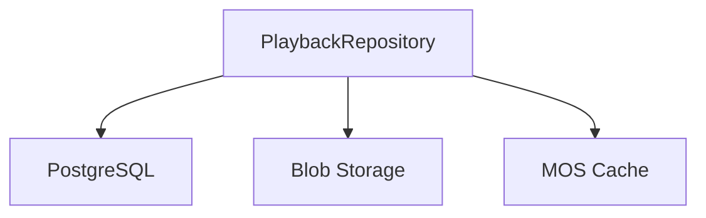

The Domain remains unaware.

The Repository decides where information belongs.

Storage implementation remains hidden.

---

# Business State

Repositories persist Business State.

Example.

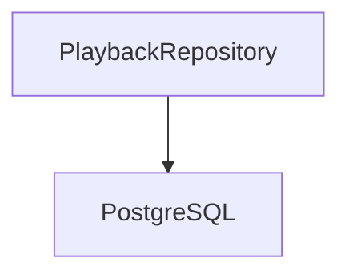

Business entities should never be stored directly by:

- Runtime
- SDK
- capabilities

Repositories remain the sole persistence boundary.

---

# Derived Data

Repositories generally SHOULD NOT persist derived information.

Examples include:

- recommendation vectors
- search indexes
- artwork metadata cache

Derived information belongs to:

- DuckDB
- MOS Cache

Capabilities responsible for those storage systems should expose their own repositories or services where appropriate.

---

# Blob References

Repositories should persist blob references.

Example.

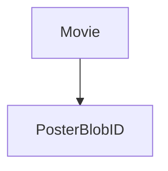

They should not persist:

```

Poster Bytes
```

Blob Storage owns binary assets.

Repositories simply maintain references.

---

# MOS Integration

Repositories MAY import and export MOS archives.

Example.

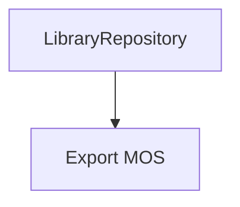

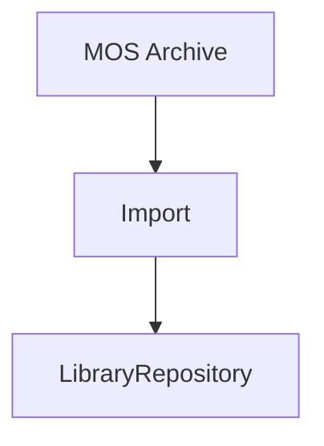

MOS remains a transport format.

Repositories translate between archives and business entities.

---

# Cache Interaction

Repositories MAY consult MOS Cache.

Typical flow.

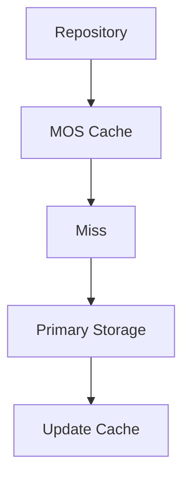

Cache usage should remain transparent.

Business behaviour should never depend upon cache availability.

---

# Repository Contracts

Repository interfaces belong to the Domain.

Implementations belong to Infrastructure.

Example.

```go
type LibraryRepository interface {

    FindByID(...)

    Save(...)

}
```

Infrastructure may provide:

```text
PostgreSQL Library Repository
```

or

```text
Hybrid Library Repository
```

The Domain remains unchanged.

---

# Transactions

Repositories participate in transactions.

Typical flow.

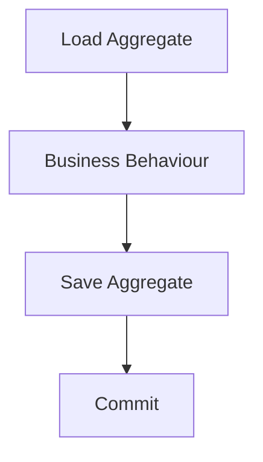

Repositories persist completed business state.

They do not coordinate business behaviour.

---

# Event Publication

Repositories SHOULD NOT publish Runtime Events.

Typical flow.

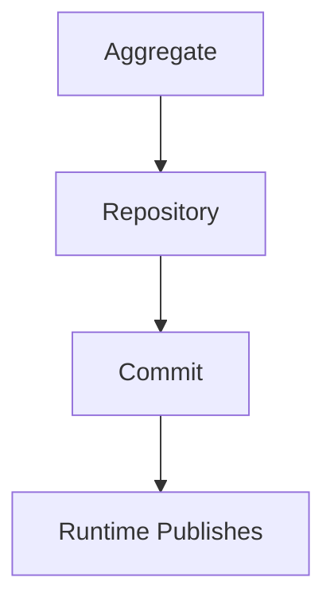

Persistence and Runtime coordination remain separate architectural concerns.

---

# Repository Composition

Repositories MAY compose specialised storage providers.

Example.

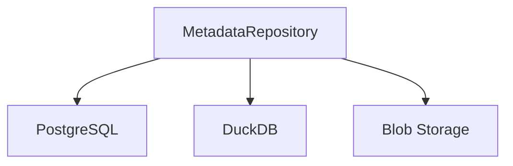

Each storage provider owns one responsibility.

The Repository coordinates them into one business abstraction.

---

# Repository Performance

Repositories should optimise:

- correctness
- clarity
- transactional integrity

They should not expose implementation-specific optimisation techniques to the Domain.

Performance remains an infrastructure concern.

---

# Repository Evolution

Storage implementations may evolve.

Example.

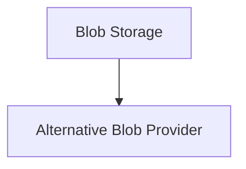

The Repository changes.

The Domain does not.

Repository contracts should therefore evolve considerably more slowly than storage implementations.

---

# Testing

Repositories SHOULD be replaceable.

Example.

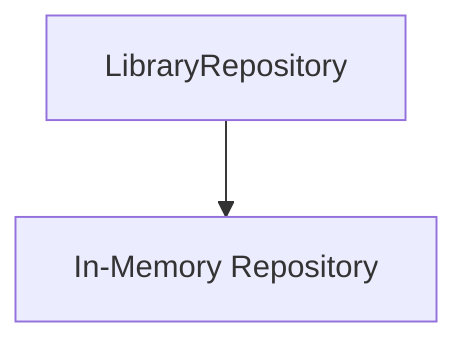

Domain tests should require no:

- PostgreSQL
- Blob Storage
- DuckDB

Storage independence naturally improves testing.

---

# Observability

Repository implementations SHOULD expose:

- query latency
- storage utilisation
- transaction failures
- cache effectiveness

Repositories should remain operationally observable without leaking infrastructure concerns into the Domain.

---

# Anti-Patterns

The following practices are prohibited.

## SQL In The Domain

Business objects executing SQL directly.

---

## Blob Storage In The Domain

Capabilities storing binary assets directly.

---

## Storage Technology In Contracts

Repository interfaces mentioning:

- PostgreSQL
- DuckDB
- Blob Storage

---

## Shared Persistence

Multiple capabilities modifying another capability's business persistence directly.

---

## Cache As Source Of Truth

Repositories relying upon MOS Cache for authoritative business information.

---

## Runtime-Owned Persistence

Runtime Services persisting business entities.

---

# Mosaic Guidelines

Within Mosaic:

- Repositories MUST protect the Domain from storage implementation.
- Repository interfaces MUST belong to the Domain.
- Storage technologies MUST remain infrastructure concerns.
- Repositories MAY coordinate multiple storage engines.
- Business State MUST remain authoritative.
- Derived data SHOULD remain outside transactional repositories.
- Blob references SHOULD be persisted rather than binary assets.
- Repository implementations SHOULD remain independently replaceable.

---

# Relationship to MEG

The previous chapters defined:

- PostgreSQL
- DuckDB
- Blob Storage
- MOS Archives
- MOS Cache

Repositories now provide the architectural bridge between those storage technologies and the Domain Model.

The next chapter introduces **Storage Lifecycle**, describing how information moves between these storage systems throughout its lifetime while preserving ownership and consistency.

---

# Summary

Repositories are the architectural translators of the Storage Architecture.

They allow the Domain to think only in terms of:

- Libraries
- Playback
- Metadata
- Collections

while quietly coordinating:

- PostgreSQL
- DuckDB
- Blob Storage
- MOS Archives
- MOS Cache

This separation allows storage technologies to evolve continuously while the business model remains completely unchanged.
