<!--
File: docs/engineering/guides/meg-007-storage-architecture/09-storage-lifecycle.md
Document: MEG-007
Status: Draft
Version: 0.4
-->

# Storage Lifecycle

> *Information changes throughout its lifetime. Storage should evolve with it rather than treating every piece of data as permanent.*

---

# Purpose

Information within Mosaic is not static.

Media is:

- discovered
- imported
- enriched
- consumed
- archived
- eventually removed

During that lifecycle, information naturally moves between storage systems.

Examples include:

- PostgreSQL
- DuckDB
- Blob Storage
- MOS Cache
- MOS Archives

The Storage Lifecycle defines how information flows between these systems while preserving:

- ownership
- consistency
- recoverability

---

# Philosophy

Within Mosaic:

> **Information should move because its lifecycle changes, not because its storage technology changes.**

Every storage transition should represent a meaningful change in the information itself.

Storage should follow information.

Never dictate it.

---

# Information Lifecycle

Every piece of information progresses through a common lifecycle.

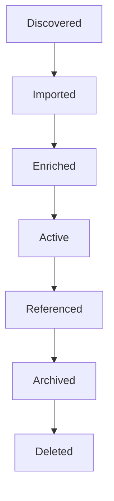

Different storage systems participate at different stages.

---

# Discovery

Initially.

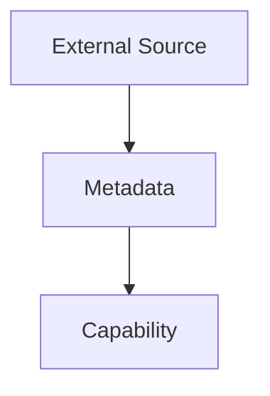

At this stage:

Information may exist only:

- remotely
- temporarily
- in memory

No permanent persistence has yet occurred.

---

# Import

Import creates Business State.

Typical flow.

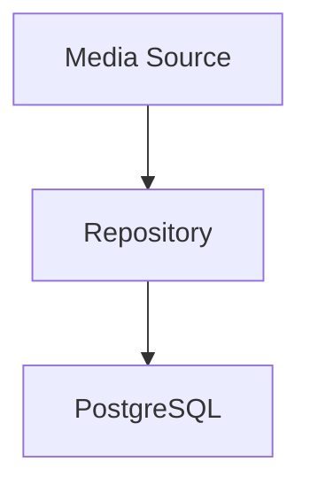

Business information now becomes durable.

Import should establish:

- ownership
- identity
- relationships

Everything afterwards builds upon this foundation.

---

# Enrichment

Following import:

Additional information may be collected.

Examples include:

- metadata
- artwork
- provider mappings
- recommendations

Typical flow.

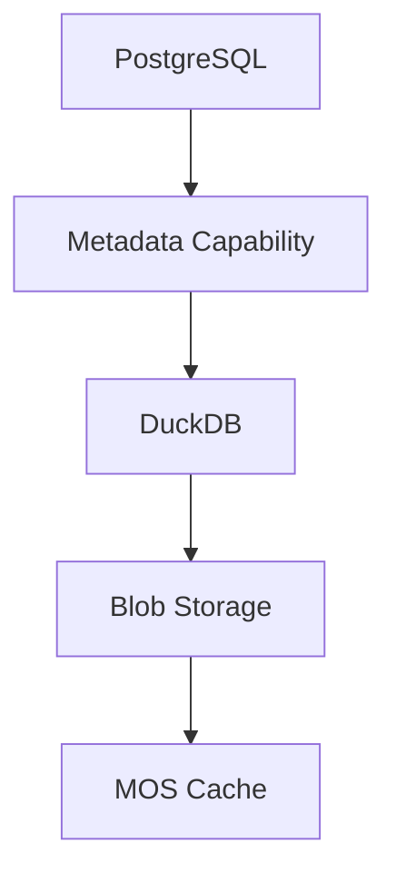

Business State remains authoritative.

Enrichment produces supporting information.

---

# Active State

During normal operation:

Information exists simultaneously across multiple storage systems.

Example.

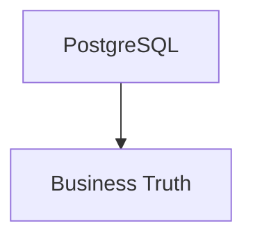

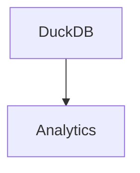

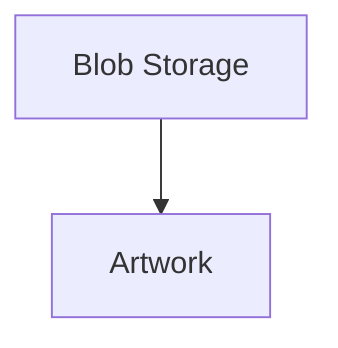

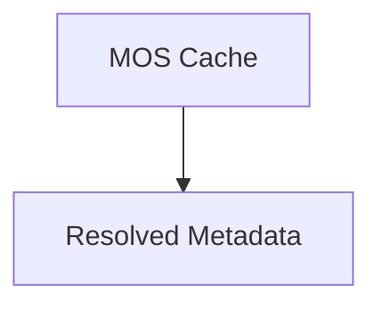

Every storage system owns its own responsibility.

No duplication of authority occurs.

---

# Runtime Consumption

Capabilities consume information through repositories.

Typical flow.

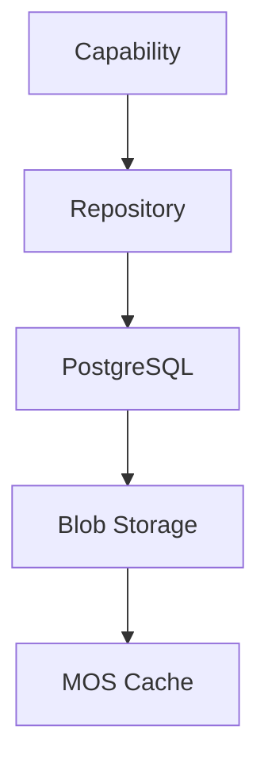

Storage remains invisible.

Capabilities consume business concepts.

Not storage technologies.

---

# Derived Information

Derived information appears after business information exists.

Examples include:

- search indexes
- recommendation vectors
- artwork manifests
- provider mappings

These datasets are created.

Never authored.

Their lifecycle depends entirely upon the authoritative information from which they originate.

---

# Cache Lifecycle

Cache follows its own lifecycle.

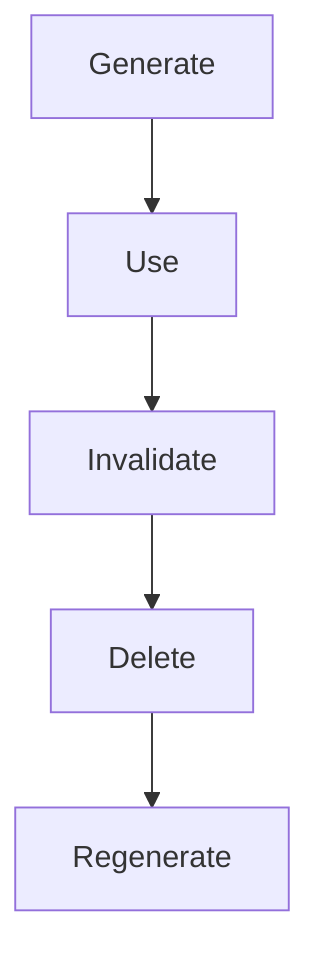

Notice:

Deletion is expected.

Business correctness should never depend upon cache persistence.

---

# Binary Lifecycle

Binary assets follow a distinct lifecycle.

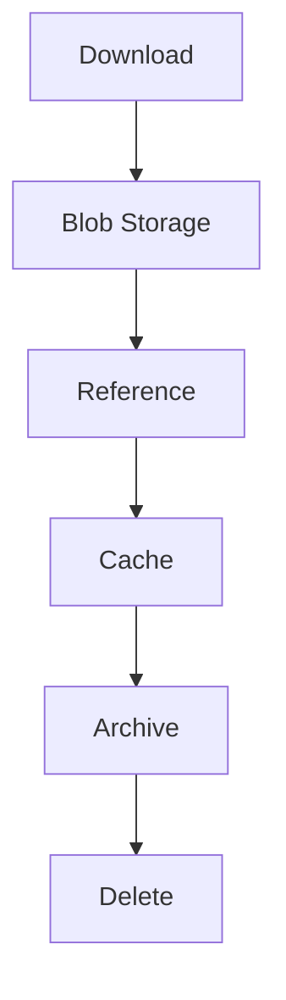

Binary assets remain independent of:

- Runtime execution
- analytical processing

They simply become referenced resources.

---

# Analytical Lifecycle

Analytical information progresses differently.

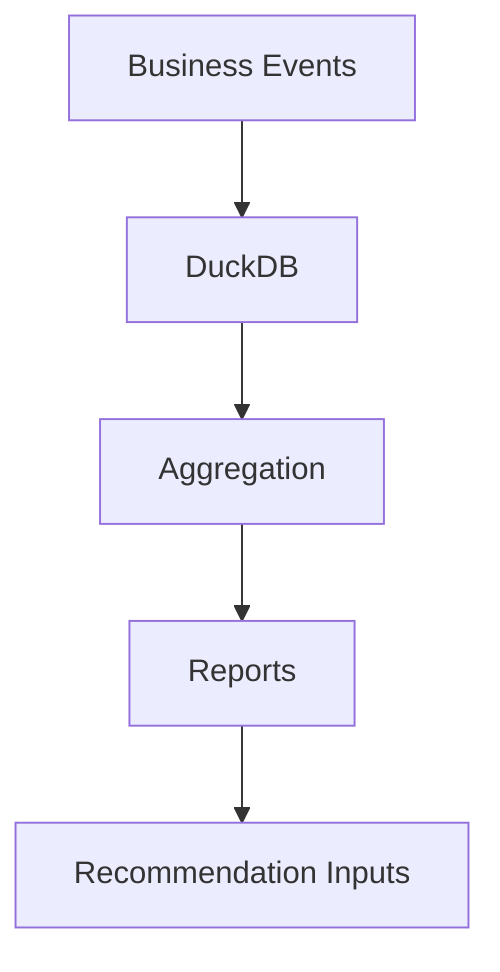

Analytics evolve continuously.

They should never become authoritative.

---

# Archive Lifecycle

MOS Archives exist for long-term portability.

Typical lifecycle.

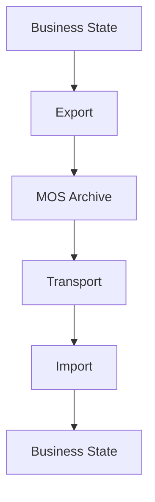

The archive remains independent of:

- Runtime
- deployment
- storage implementation

Its purpose is preservation.

---

# Deletion

Deletion should follow ownership.

Examples.

Business entity deleted.

↓

Blob references removed.

↓

Derived caches invalidated.

↓

Analytical datasets rebuilt.

↓

Unused blobs collected.

Deletion should proceed from:

Authoritative.

↓

Derived.

Never the reverse.

---

# Garbage Collection

Derived information SHOULD be collected automatically.

Examples include:

- orphaned blobs
- expired caches
- obsolete search indexes
- unused previews

Business information should never be removed by garbage collection.

Only information that is safely reproducible.

---

# Migration

Storage migration should preserve lifecycle.

Example.

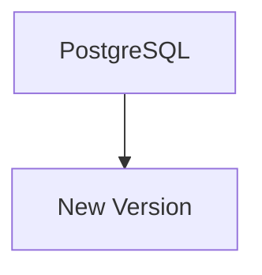

Business State survives.

Likewise.

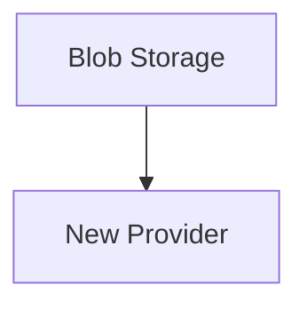

Blob identity remains unchanged.

Lifecycle remains stable.

Implementation evolves.

---

# Backup

Backup priorities follow storage classes.

Highest priority.

- Business State
- Archive Data

Lower priority.

- Binary Assets (depending upon regeneration policy)

Lowest priority.

- Derived Assets
- MOS Cache

The platform should avoid backing up information that is cheaper to rebuild.

---

# Recovery

Recovery should mirror lifecycle.

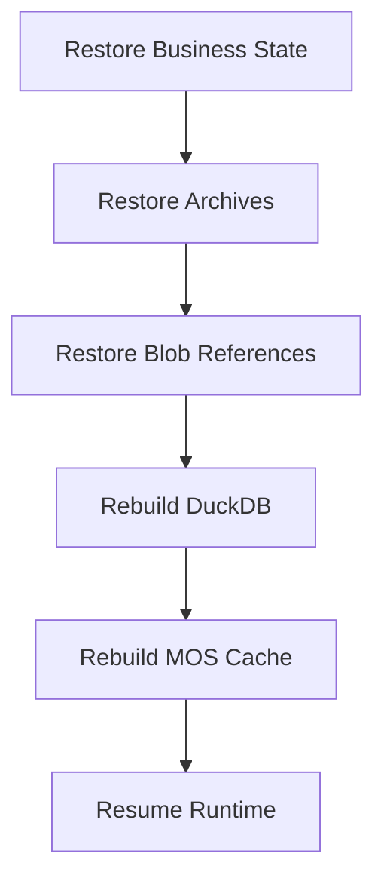

Recovery should never require restoring analytical or cached datasets.

The Runtime should regenerate them automatically.

---

# Storage Transitions

Transitions between storage systems should always be explicit.

Example.

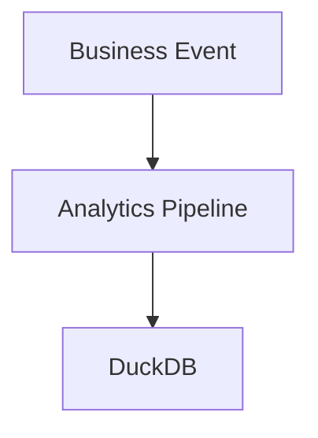

Rather than.

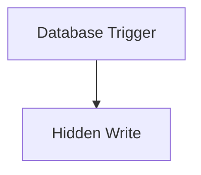

Storage transitions should remain:

- observable
- deterministic
- reviewable

---

# Lifecycle Ownership

Every lifecycle transition has exactly one owner.

Examples.

Import.

↓

Repository.

Enrichment.

↓

Capability.

Analytics.

↓

Analytics Capability.

Archive.

↓

Export Service.

Ownership prevents duplicated persistence behaviour.

---

# Event-Driven Storage

Storage transitions SHOULD be event driven.

Example.

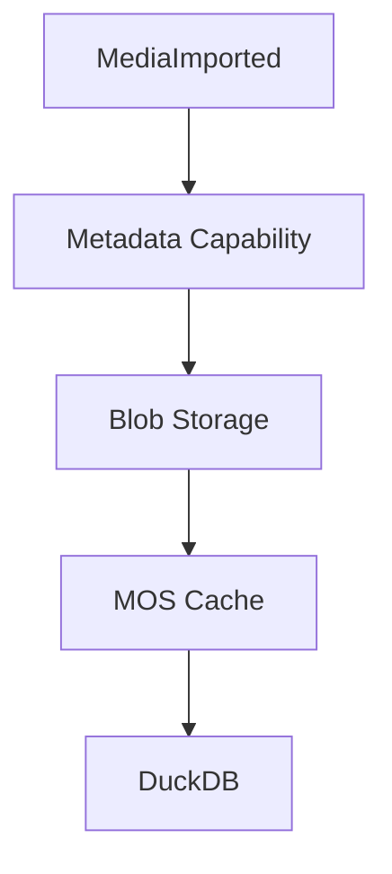

Each capability reacts independently.

The Storage Architecture naturally complements the Runtime Architecture established in [MEG-002](../meg-002-event-driven-runtime/index.md) and [MEG-005](../meg-005-runtime-architecture/index.md).

---

# Observability

The Storage Lifecycle SHOULD expose:

- imports
- enrichments
- cache rebuilds
- archive exports
- garbage collection
- recovery

Operators should always understand:

> **Where is this information within its lifecycle?**

---

# Anti-Patterns

The following practices are prohibited.

## Cache Before Business

Generating derived information before Business State exists.

---

## Shared Lifecycle Ownership

Multiple capabilities managing the same storage transition.

---

## Permanent Cache

Treating MOS Cache as authoritative.

---

## Hidden Storage Writes

Storage transitions occurring without Runtime visibility.

---

## Analytics Before Import

Generating analytical datasets before business information exists.

---

## Archive As Database

Using MOS Archives as primary Runtime persistence.

---

# Mosaic Guidelines

Within Mosaic:

- Storage transitions MUST follow information lifecycle.
- Business State MUST precede derived information.
- Cache SHOULD remain disposable.
- Archives MUST remain portable.
- Analytics SHOULD remain reproducible.
- Storage transitions SHOULD remain event driven.
- Every lifecycle transition MUST have one owner.
- Recovery SHOULD rebuild derived storage automatically.

---

# Relationship to MEG

Repositories explain:

> **How the Domain persists information.**

The Storage Lifecycle explains:

> **How that information evolves across storage systems over time.**

The next chapter introduces **Migrations**, defining how storage schemas, archive formats and persistence technologies evolve while preserving long-term compatibility.

---

# Summary

Storage is not static.

Information moves.

It matures.

It becomes enriched.

It is archived.

Eventually it disappears.

Within Mosaic, every storage transition should reflect a genuine change in the information itself while preserving one constant principle:

> **Authoritative information leads. Derived information follows.**

That simple rule keeps the entire Storage Architecture predictable, recoverable and easy to evolve.
