<!--
File: docs/engineering/guides/meg-007-storage-architecture/10-migrations.md
Document: MEG-007
Status: Draft
Version: 0.4
-->

# Migrations

> *Storage evolves. Information should survive that evolution unchanged.*

---

# Purpose

The Mosaic platform will evolve continuously.

Over time:

- schemas change
- storage engines improve
- archive formats evolve
- capabilities expand
- Runtime contracts mature

These changes should never require users to:

- rebuild libraries
- lose playback history
- re-import media
- recreate configuration

This document defines the migration strategy governing every storage technology used by Mosaic.

---

# Philosophy

Within Mosaic:

> **Information is permanent. Storage implementations are temporary.**

Migrations exist to preserve information while allowing storage architecture to evolve.

Users should experience:

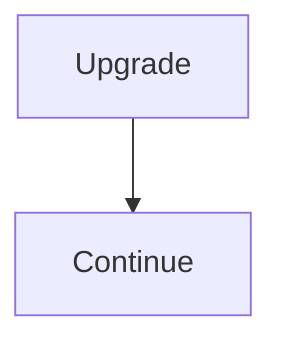

Not:

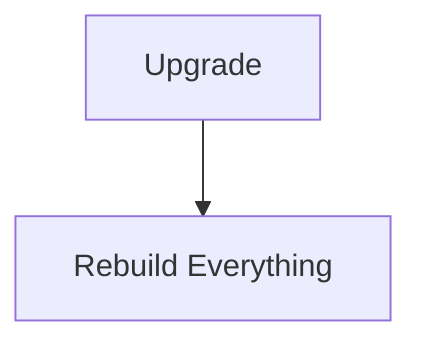

---

# Migration Goals

Every migration should preserve:

- business correctness
- data integrity
- capability compatibility
- archive compatibility
- Runtime stability

A migration should change:

> **Storage implementation**

Never:

> **Business meaning**

---

# Migration Scope

Migration applies to:

- PostgreSQL schemas
- DuckDB schemas
- Blob Storage layouts
- MOS archives
- MOS cache
- capability configuration

Each storage system evolves independently.

Each follows the same migration philosophy.

---

# Migration Principles

Every migration SHOULD be:

- deterministic
- repeatable
- observable
- reversible where practical
- versioned

The same source should always produce the same destination.

Migration behaviour should never depend upon execution history.

---

# Schema Versioning

Every persistent storage system SHOULD expose a schema version.

Examples.

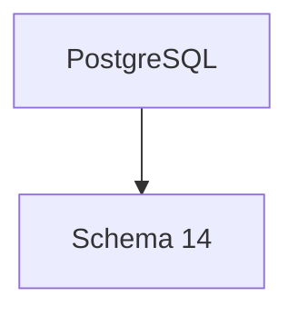

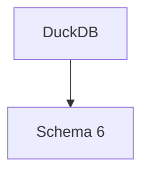

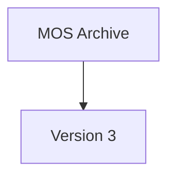

Version identifiers allow the Runtime to determine which migrations must execute.

---

# Migration Pipeline

Every migration follows the same high-level lifecycle.

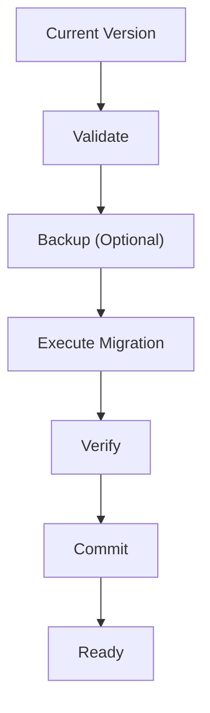

Migration should never become partially complete.

Either:

```

Old Version
```

or

```

New Version
```

Intermediate states should not remain visible.

---

# PostgreSQL Migrations

PostgreSQL migrations evolve Business State.

Examples include:

- new tables
- renamed columns
- indexes
- constraints

Business semantics should remain unchanged.

Schema evolution should preserve:

- Aggregate identity
- business relationships
- historical information

---

# DuckDB Migrations

DuckDB migrations evolve analytical structures.

Examples include:

- analytical views
- recommendation datasets
- aggregation pipelines

Because analytical information is reproducible:

Rebuilding is often preferable to complex migration.

Where practical:

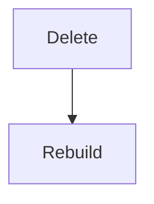

should be preferred over:

```

Complex Transformation
```

---

# Blob Storage Migration

Blob migration should preserve:

- blob identity
- blob integrity
- references

Changing:

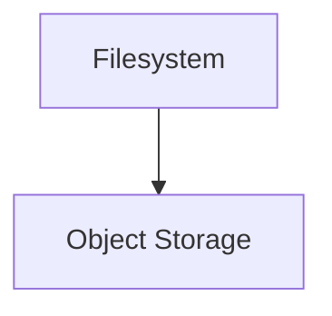

should not require changing:

```

PosterBlobID
```

Identifiers remain stable.

Only storage implementation evolves.

---

# MOS Archive Migration

MOS archives are intentionally long-lived.

Migration strategy should prioritise:

- backwards compatibility
- forward readability
- deterministic conversion

Older archives should remain importable for as long as practical.

When conversion becomes necessary:

The Runtime should migrate archives during import rather than modifying the archive itself.

Archives remain immutable historical artefacts.

---

# MOS Cache Migration

MOS Cache generally SHOULD NOT be migrated.

Preferred.

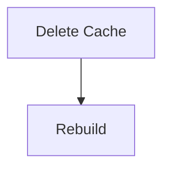

Migration effort should never exceed regeneration effort.

Caches remain disposable.

---

# Capability Configuration

Capability configuration may require migration.

Example.

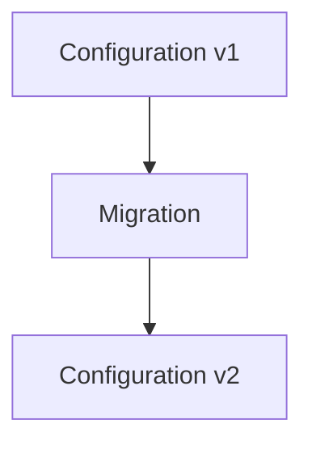

Capabilities SHOULD provide configuration migration logic where schema evolution requires it.

The Runtime coordinates execution.

Capabilities own business meaning.

---

# Runtime Coordination

The Runtime Kernel coordinates migrations during startup.

Conceptually.

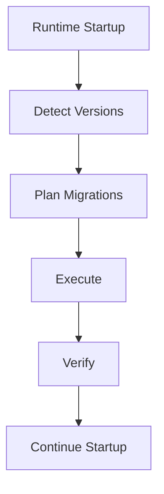

Capabilities should not independently execute migrations.

Migration remains a platform responsibility.

---

# Dependency Ordering

Migration order follows dependency order.

Example.

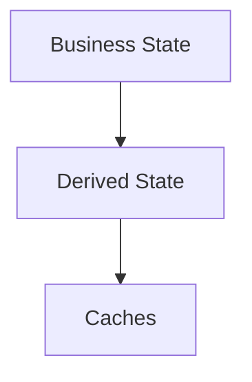

Never the reverse.

Derived information depends upon authoritative information.

Migration ordering should preserve this relationship.

---

# Failure Handling

Migration failures MUST stop startup.

Example.

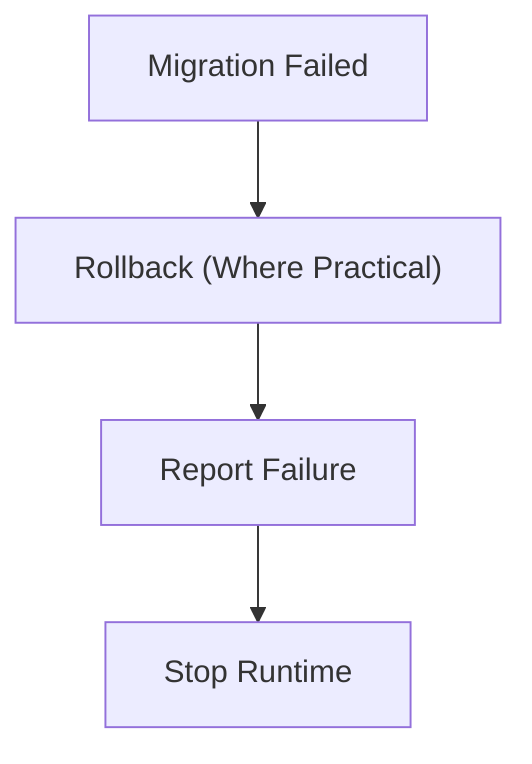

Continuing execution against partially migrated storage is prohibited.

Fail fast.

Protect information.

---

# Rollback

Rollback SHOULD be supported where practical.

Especially for:

- PostgreSQL
- configuration

Rollback is generally unnecessary for:

- MOS Cache
- analytical datasets

These systems should simply rebuild.

Rollback effort should be proportional to business value.

---

# Backwards Compatibility

Migration should preserve compatibility wherever practical.

Examples include:

- reading older MOS archives
- supporting previous manifest versions
- gradual schema evolution

Breaking storage compatibility should remain exceptional.

Not routine.

---

# Idempotency

Every migration SHOULD be idempotent.

Executing the same migration twice should produce the same final state.

Idempotency simplifies:

- recovery
- retry
- deployment
- testing

Migration correctness should never depend upon execution count.

---

# Observability

Every migration SHOULD expose:

- source version
- destination version
- execution duration
- migrated records
- verification status
- failures

Operators should always understand:

> **What changed?**

Migration should never become invisible.

---

# Testing

Every migration SHOULD be tested.

Typical tests verify:

- forward migration
- repeated execution
- failure recovery
- compatibility
- data preservation

Business information deserves explicit migration verification.

---

# Performance

Migration should prioritise correctness over speed.

Large migrations MAY execute incrementally.

Examples include:

- artwork relocation
- archive conversion
- analytical rebuild

Business correctness should never be sacrificed for shorter upgrade time.

---

# Anti-Patterns

The following practices are prohibited.

## Manual SQL

Requiring operators to execute undocumented migration scripts.

---

## Destructive Upgrade

Deleting business information before successful migration.

---

## Cache Migration

Migrating rebuildable caches unnecessarily.

---

## Runtime Execution During Migration

Executing capabilities before migration completes.

---

## Hidden Schema Changes

Changing storage format without version updates.

---

## Breaking Archive Compatibility

Invalidating historical MOS archives without documented migration paths.

---

# Mosaic Guidelines

Within Mosaic:

- Every persistent storage system MUST be versioned.
- Migrations MUST remain deterministic.
- Startup MUST validate storage versions before execution.
- Business information MUST be preserved.
- Derived information SHOULD be rebuilt rather than migrated where practical.
- Migration failures MUST prevent Runtime startup.
- Migration SHOULD remain observable.
- Archive compatibility SHOULD remain a long-term platform commitment.

---

# Relationship to MEG

The Storage Lifecycle explains:

> **How information evolves.**

Migrations explain:

> **How storage evolves while preserving that information.**

The next chapter introduces **Backup and Restore**, defining how Mosaic protects authoritative information against hardware failure, operator error and disaster recovery scenarios.

---

# Summary

Storage technologies will change.

Schemas will evolve.

Archive formats will mature.

None of these changes should require users to sacrifice their information.

Within Mosaic, migrations exist for one purpose:

> **Allow the platform to evolve while ensuring that the information users care about remains intact.**

Information should outlive every implementation that stores it.
