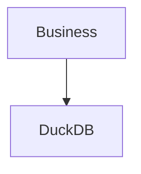
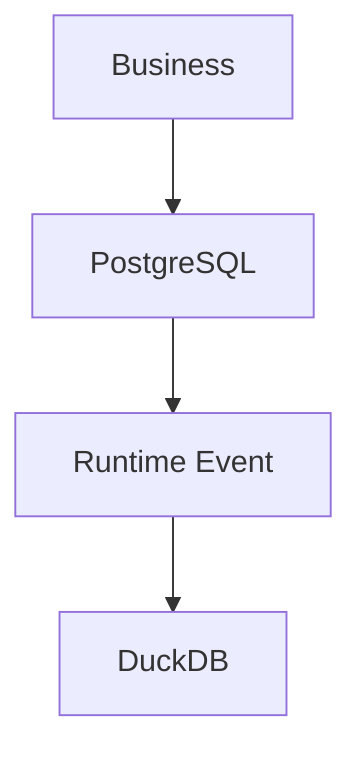
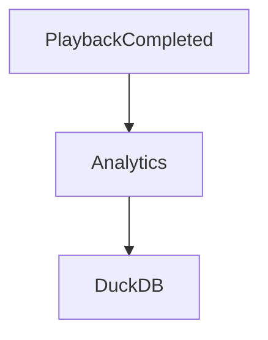
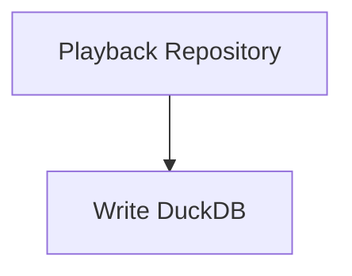

<!--
File: docs/engineering/guides/meg-007-storage-architecture/12-storage-guidelines.md
Document: MEG-007
Status: Draft
Version: 0.4
-->

# Storage Guidelines

> *Choose storage deliberately. Every persistence decision becomes part of the architecture for years.*

---

# Purpose

The previous chapters established the Storage Architecture of the Mosaic platform:

- Storage Philosophy
- Storage Taxonomy
- PostgreSQL
- DuckDB
- Blob Storage
- MOS Archives
- MOS Cache
- Repositories
- Storage Lifecycle
- Migrations
- Backup and Restore

This document combines those principles into practical engineering guidance.

Its purpose is to answer one question.

> **"Where should this information live?"**

---

# Philosophy

Within Mosaic:

> **Design information first. Choose storage second.**

Every persistence decision should begin with understanding:

- ownership
- lifecycle
- consistency
- mutability
- access patterns

Storage technology is the final decision.

Not the first.

---

# Start With Information

Before introducing persistence ask:

- What information is being stored?
- Who owns it?
- How long does it live?
- Can it be regenerated?
- Who consumes it?

Do **not** begin with:

- PostgreSQL
- DuckDB
- Blob Storage
- filesystem

Technology should follow information.

---

# Identify The Storage Class

Every piece of information belongs to one storage class.

Examples.

```

Business State
```

```

Operational State
```

```

Analytical State
```

```

Binary Assets
```

```

Derived Assets
```

```

Archive Data
```

If classification is unclear:

Continue modelling.

Do not implement storage.

---

# Choose The Right Engine

After identifying the storage class:

Choose the storage engine naturally.

| Information | Storage |
|-------------|---------|
| Business State | PostgreSQL |
| Operational State | Runtime |
| Analytics | DuckDB |
| Binary Assets | Blob Storage |
| Derived Assets | MOS Cache |
| Archive Data | MOS Archive |

Storage engines should never compete for the same responsibility.

---

# Protect The Domain

The Domain should never know:

- SQL
- Blob Storage
- DuckDB
- Archive formats

Repositories remain the only persistence boundary.

If storage technology appears inside:

- Aggregates
- Entities
- Value Objects

the architecture has already drifted.

---

# Protect Ownership

Before persisting information ask:

> **Which capability owns this?**

Ownership determines:

- storage
- migrations
- backup
- lifecycle
- deletion

No information should have multiple authoritative owners.

---

# Business Before Analytics

Suppose new analytical data is required.

Poor.



Preferred.



Analytics should always derive from Business State.

Never replace it.

---

# Binary Assets

Ask:

> **Is this information structured?**

If no:

Blob Storage is probably appropriate.

Examples include:

- posters
- fan art
- subtitles
- previews

Business databases should reference binary assets.

Not contain them.

---

# Derived Information

A useful question is:

> **Can this always be regenerated?**

If yes:

Consider:

```

MOS Cache
```

or

```

DuckDB
```

Do not treat derived information as authoritative.

Rebuildability is a feature.

Not a weakness.

---

# Archive Design

Archives should preserve:

- business meaning
- portability
- compatibility

They should never preserve:

- Runtime state
- caches
- worker information
- temporary execution state

MOS Archives represent media knowledge.

Not Runtime implementation.

---

# Repository Design

Repositories should expose business language.

Good.

```go
PlaybackRepository
```

Poor.

```go
PostgresPlaybackRepository
```

Technology belongs behind the Repository.

The Domain owns the contract.

---

# Storage Independence

Before introducing new persistence ask:

> **Could this storage implementation change without affecting the Domain?**

If the answer is:

```

No
```

The storage boundary probably needs refinement.

Storage technologies should remain replaceable.

---

# Event-Driven Persistence

Derived storage should generally be updated through Runtime Events.

Example.



Avoid:



Storage responsibilities should remain separated.

---

# Design For Recovery

Ask:

> **If this storage disappears tomorrow, what happens?**

Possible answers.

```

Restore Backup
```

```

Rebuild
```

```

Re-import
```

Every storage system should possess a documented recovery strategy before implementation begins.

---

# Design For Observability

Storage should expose:

- latency
- utilisation
- failures
- rebuild activity
- migration progress

Operators should understand storage behaviour without reading source code.

Observability should emerge naturally from good architecture.

---

# Design For Migrations

Storage evolves.

Ask:

- Can this schema migrate?
- Can identifiers remain stable?
- Can compatibility be preserved?

Migration should influence storage design from the beginning.

Not after deployment.

---

# Prefer Rebuilding

Whenever possible ask:

> **Could rebuilding be simpler than backing up?**

Examples.

Good.

- search indexes
- recommendation vectors
- MOS Cache

Poor candidates.

- users
- playback history
- libraries

Business information should be protected.

Derived information should be recreated.

---

# Storage Checklist

Before implementing persistence confirm:

- [ ] Storage class identified.
- [ ] Ownership explicit.
- [ ] Repository boundary preserved.
- [ ] Business State authoritative.
- [ ] Derived information rebuildable.
- [ ] Binary assets separated.
- [ ] Backup strategy defined.
- [ ] Migration strategy defined.
- [ ] Recovery strategy documented.

---

# Common Storage Mistakes

Avoid:

- using PostgreSQL for everything
- persisting Runtime state
- storing binary assets in relational tables
- treating caches as authoritative
- duplicating business truth
- sharing persistence between capabilities
- introducing storage technology into the Domain

These decisions often appear convenient initially.

They become architectural liabilities later.

---

# Mosaic Guidelines

Within Mosaic:

- Storage MUST follow information ownership.
- Business State MUST remain authoritative.
- Derived information SHOULD remain rebuildable.
- Binary assets MUST remain separate from structured data.
- Repositories MUST protect the Domain.
- Storage technologies SHOULD remain replaceable.
- Storage SHOULD remain observable.
- Simplicity SHOULD outweigh unnecessary optimisation.

---

# Relationship to MEG

This chapter completes the practical implementation guidance of MEG-007.

The remaining documents describe:

- architectural reasoning (ADRs)
- contributor expectations
- terminology
- references

Together, [MEG-001](../meg-001-go-engineering-standards/index.md) through MEG-007 now define:

- engineering
- execution
- business modelling
- architectural boundaries
- runtime
- platform evolution
- persistence

Every subsequent engineering specification builds upon these foundations rather than redefining them.

---

# Summary

Good storage architecture is rarely about databases.

It is about understanding information.

Within Mosaic, every persistence decision should answer one question:

> **What kind of information is this?**

Once that answer is known, almost every other storage decision follows naturally.

That is why the Storage Taxonomy, not PostgreSQL or DuckDB, sits at the centre of the Storage Architecture.
