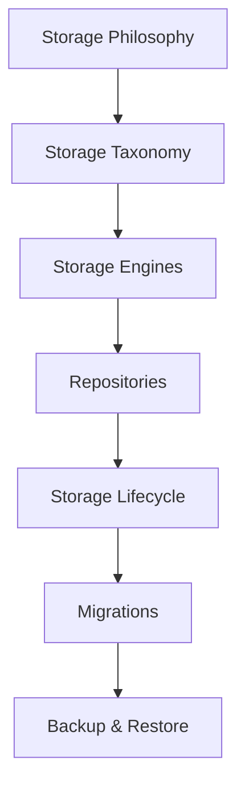

<!--
File: docs/engineering/guides/meg-007-storage-architecture/14-contributor-guidance.md
Document: MEG-007
Status: Draft
Version: 0.4
-->

# Contributor Guidance

> *Every storage decision either strengthens or weakens the architecture. Information is far more difficult to move than code.*

---

# Purpose

The Storage Architecture protects one of the platform's most valuable assets:

> **Information.**

Every contributor therefore shares responsibility for preserving:

- storage ownership
- repository boundaries
- data integrity
- recoverability
- storage independence

This document provides practical guidance for engineers implementing new persistence within the Mosaic platform.

---

# Philosophy

Within Mosaic:

> **Protect information before optimising storage.**

Information should remain:

- correct
- durable
- recoverable

Performance improvements should never compromise these properties.

---

# Before Writing Storage Code

Before persisting information ask:

- What kind of information is this?
- Who owns it?
- Is it authoritative?
- Can it be regenerated?
- Which capability owns it?

If these questions cannot be answered clearly:

Continue modelling.

Do not implement persistence.

---

# Before Choosing A Storage Engine

Never begin with:

> "Should this go into PostgreSQL?"

Instead ask:

> **Which storage class does this belong to?**

Only after classification should storage technology be selected.

The Storage Taxonomy should make the choice obvious.

---

# Before Creating A Table

Ask:

- Which capability owns this?
- Is this Business State?
- Will another capability need to mutate it?

Every table should have exactly one owner.

Shared ownership almost always indicates an architectural boundary has become unclear.

---

# Before Creating A Repository

Repositories exist to protect the Domain.

Ask:

- Does this represent a business concept?
- Is this Aggregate owned?
- Does the Domain already expose this Repository?

Avoid creating repositories around:

- databases
- schemas
- storage technologies

Repositories should reinforce business language.

Not infrastructure.

---

# Before Adding A Cache

Ask one question.

> **Can this information always be rebuilt?**

If the answer is:

```

No
```

It does not belong in MOS Cache.

Caches should never become authoritative.

Business correctness must remain independent of cache availability.

---

# Before Using DuckDB

DuckDB exists for analytical workloads.

Before persisting information ask:

> **Is this analytical?**

Examples.

Good.

- recommendations
- reporting
- statistics
- metadata correlation

Poor.

- users
- playback progress
- configuration

Business information belongs elsewhere.

---

# Before Using Blob Storage

Blob Storage should contain:

- artwork
- subtitles
- previews
- binary assets

It should not contain:

- metadata
- business entities
- Runtime information

If the information is naturally queried with SQL:

It probably does not belong in Blob Storage.

---

# Before Modifying MOS Archives

MOS Archives represent long-term compatibility.

Before changing the archive format ask:

- Will existing archives still import?
- Is migration possible?
- Is portability preserved?

Breaking archive compatibility should require architectural review.

MOS Archives are platform commitments.

Not implementation details.

---

# Before Introducing Runtime State

Runtime State should not enter persistent storage without justification.

Ask:

- Is this operational?
- Does it survive restart?
- Can it be reconstructed?

Most Runtime State should remain ephemeral.

Persistent Runtime State should remain the exception.

---

# Before Creating Relationships

Business relationships belong inside the Domain.

Storage relationships should reinforce:

- Aggregate ownership
- capability boundaries
- repository contracts

Avoid creating cross-capability foreign keys simply because SQL allows it.

Events and contracts are usually the better architectural choice.

---

# Before Writing A Migration

Every migration should answer:

- Is information preserved?
- Is rollback possible?
- Is compatibility maintained?
- Can operators understand this change?

Migration should prioritise:

Correctness.

Not convenience.

---

# Before Changing Backup Strategy

Backup should follow information value.

Ask:

- Is this authoritative?
- Can it be rebuilt?
- Does losing it permanently harm the user?

If information is reproducible:

Rebuilding is generally preferable to backing it up.

---

# Before Requesting Review

Every storage contribution SHOULD satisfy the following checklist.

## Ownership

- Storage owner identified.
- Repository ownership explicit.
- Capability boundaries preserved.

---

## Storage

- Correct storage class selected.
- Technology chosen after modelling.
- Storage remains replaceable.

---

## Integrity

- Business information preserved.
- Derived information rebuildable.
- Cache remains non-authoritative.

---

## Recovery

- Backup strategy defined.
- Recovery strategy documented.
- Migration strategy considered.

---

## Documentation

- MEG updated where required.
- ADR created where appropriate.
- Diagrams remain accurate.
- Repository documentation updated.

Architecture should evolve alongside implementation.

---

# Recognising Storage Drift

The following symptoms usually indicate architectural drift.

- PostgreSQL storing analytical datasets.
- DuckDB storing business entities.
- Blob Storage containing metadata.
- MOS Cache becoming authoritative.
- Runtime State becoming permanent.
- Shared tables between capabilities.
- Business logic inside repositories.

Storage drift should be corrected early.

Information architecture becomes increasingly difficult to change over time.

---

# Refactoring Storage

When improving persistence ask:

- Can ownership become clearer?
- Can repositories become simpler?
- Can derived information move into MOS Cache?
- Can analytics move into DuckDB?
- Can storage dependencies move behind repositories?

Storage refactoring should generally make ownership more explicit.

Not merely reorganise tables.

---

# Review Mindset

Storage reviews should focus upon:

- ownership
- information lifecycle
- recoverability
- consistency
- replaceability
- operational simplicity

Questions such as:

> **Does this strengthen the information architecture?**

are generally more valuable than:

> **Is this query slightly faster?**

Correct architecture produces sustainable performance.

Poor architecture eventually destroys it.

---

# Learning The Storage Architecture

New contributors SHOULD study MEG-007 in the following order.



Understanding the taxonomy first makes almost every later storage decision considerably easier.

---

# Engineering Culture

Storage contributors should strive to:

- simplify ownership
- reduce duplication
- improve recoverability
- clarify lifecycle
- preserve storage independence
- question unnecessary persistence

The Storage Architecture should become easier to reason about over time.

Not more complicated.

---

# Contributor Checklist

Before requesting review, confirm:

- [ ] Information ownership is explicit.
- [ ] Storage class is correct.
- [ ] Repository boundaries remain intact.
- [ ] Business State remains authoritative.
- [ ] Derived information remains rebuildable.
- [ ] Runtime State has not leaked into persistence.
- [ ] Backup and recovery have been considered.
- [ ] Documentation has been updated.
- [ ] The Storage Architecture is clearer than before.

---

# Relationship to MEG

This document explains how contributors should evolve the Storage Architecture established throughout MEG-007.

The previous chapters define:

> **How information should be stored.**

This chapter defines:

> **How engineers should preserve that architecture over time.**

Information often outlives every implementation written to manage it.

Storage decisions should therefore be made with unusual care.

---

# Summary

Storage is one of the few architectural decisions that becomes increasingly expensive to change as a platform matures.

Within Mosaic, every persistence decision should strengthen:

- ownership
- durability
- recoverability
- architectural clarity

Because ultimately:

The platform exists to protect the user's information.

The Storage Architecture exists to ensure that protection continues for decades.
