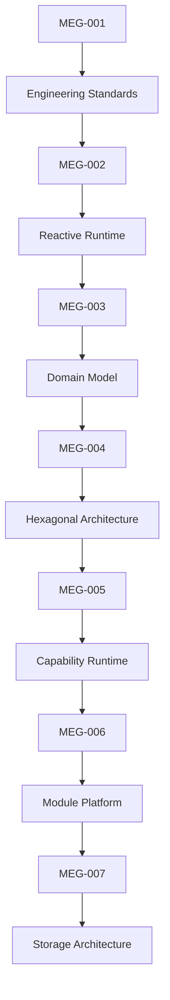
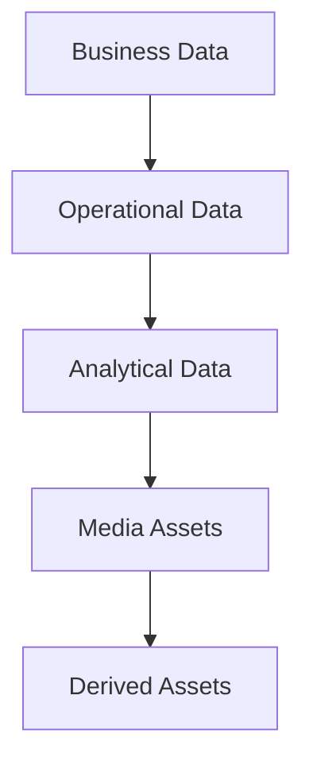
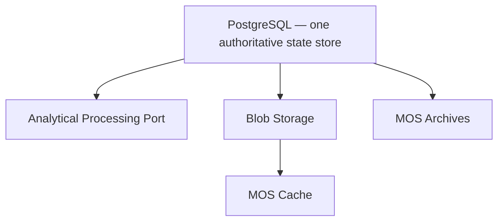

<!--
File: docs/engineering/guides/meg-007-storage-architecture/index.md
Document: MEG-007
Status: Draft
-->

# MEG-007 — Storage Architecture

> *Storage should preserve information. It should never dictate architecture.*

> **Current v2 direction:** Mosaic uses one Platform-owned PostgreSQL state store. Modules use scoped storage contracts and logical bounded contexts; they do not own independent databases. See [15 — v2 Storage Architecture](15-v2-storage-architecture.md).

---

# Purpose

The previous engineering specifications established:

- how software is written
- how work executes
- how the business is modelled
- how the Domain is protected
- how the Runtime operates
- how the platform evolves

MEG-007 answers the next foundational question.

> **How should information be stored throughout the Mosaic platform?**

Unlike traditional media servers, Mosaic does not treat storage as a single filesystem.

Instead, it separates storage according to the nature of the information being stored.

Business state.

Operational state.

Metadata.

Media.

Artwork.

Search indexes.

Analytics.

Each has different performance characteristics, lifecycle requirements and consistency guarantees.

The Storage Architecture defines where those responsibilities belong.

---

# Relationship to MEG



Previous specifications define:

> **How the platform behaves.**

MEG-007 defines:

> **Where the platform remembers.**

---

# Scope

This specification defines:

- Storage philosophy
- Storage taxonomy
- Persistence boundaries
- PostgreSQL architecture
- content object model (Node, Part, Relation)
- analytical export guidance
- Blob Storage architecture
- MOS archive format
- MOS cache format
- Repository implementations
- Search indexes
- Metadata persistence
- Artwork persistence
- Migration strategy
- Backup and restore
- Storage lifecycle

This specification intentionally does **not** define:

- Business behaviour
- Runtime execution
- Module SDKs
- Deployment topology

Those concerns belong to previous or future MEG specifications.

---

# Guiding Question

MEG-007 exists to answer one question.

> **How should Mosaic persist information while remaining scalable, observable and independent of storage technology?**

---

# Storage Statement

Within Mosaic:

> **Storage is an implementation detail. Information architecture is not.**

Every storage technology exists because it is the best fit for a particular category of information.

No single database should become responsible for every problem.

The platform should choose storage according to:

- access patterns
- consistency requirements
- query characteristics
- lifecycle
- operational cost

rather than familiarity or convenience.

---

# Storage Hierarchy

The Mosaic platform intentionally separates storage into distinct layers.



Implemented as:



The Platform owns one authoritative state boundary, with specialised blob and derived-asset planes where justified. Analytical processing is a port satisfied by that store today; a dedicated analytical engine may be added later as an essential Module behind the same port without changing the contract. See [15 — v2 Storage Architecture](15-v2-storage-architecture.md).

---

# Expected Outcome

After reading MEG-007 contributors should understand:

- why the Platform owns one shared storage authority
- which information belongs in each storage system
- where repositories persist data
- how storage integrates with the Runtime
- how media and metadata remain independent
- how storage evolves without affecting the Domain

without discussing any specific business capability.

---

# Repository Structure

```text
engineering/

└── meg/

    └── meg-007-storage-architecture/

        index.md

        00-document-control.md

        01-storage-philosophy.md

        02-storage-taxonomy.md

        03-postgresql.md

        04-duckdb.md

        05-blob-storage.md

        06-mos-archives.md

        07-mos-cache.md

        08-repositories.md

        09-storage-lifecycle.md

        10-migrations.md

        11-backup-and-restore.md

        12-storage-guidelines.md

        13-adrs.md

        14-contributor-guidance.md

        references.md

        glossary.md
```

---

# Dependencies

Required reading:

- [MEG-001 — Go Engineering Standards](../meg-001-go-engineering-standards/index.md)
- [MEG-002 — Event-Driven Runtime](../meg-002-event-driven-runtime/index.md)
- [MEG-003 — Domain-Driven Design](../meg-003-domain-driven-design/index.md)
- [MEG-004 — Hexagonal Architecture](../meg-004-hexagonal-architecture/index.md)
- [MEG-005 — Runtime Architecture](../meg-005-runtime-architecture/index.md)
- [MEG-006 — Module Platform](../meg-006-module-platform/index.md)

---

# Design Goals

The Storage Architecture is intended to produce a platform that is:

- Purpose-built
- Observable
- Performant
- Replaceable
- Scalable
- Recoverable
- Technology independent
- Operationally predictable

Every storage engine should own one clear responsibility and evolve independently of the others.
