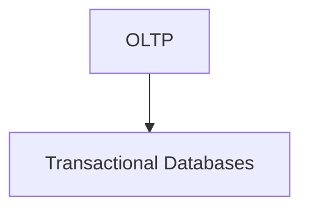
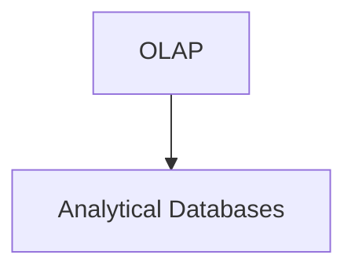
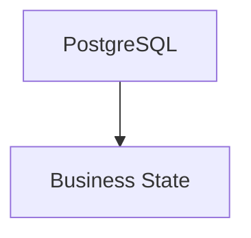
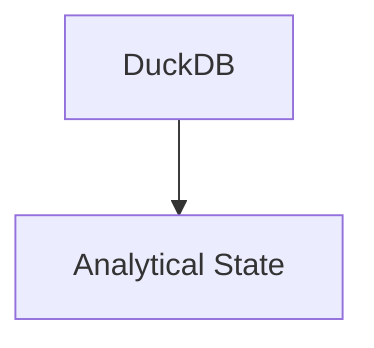

<!--
File: docs/engineering/guides/meg-007-storage-architecture/references.md
Document: MEG-007
Status: Draft
Version: 0.4
-->

# References

> *The Storage Architecture is built upon the principle that information should determine storage, not the other way around.*

---

# Purpose

This document records the primary references that informed the Storage Architecture established throughout MEG-007.

Unlike many storage architectures that begin with selecting a database, the Mosaic Storage Architecture begins by classifying information according to:

- ownership
- lifecycle
- access patterns
- consistency
- recoverability

Only then are storage technologies selected.

The purpose of these references is to document the architectural influences behind that philosophy.

---

# Primary References

## PostgreSQL

**Purpose**

PostgreSQL provides the transactional foundation for authoritative Business State.

Relevant characteristics include:

- ACID transactions
- strong consistency
- mature indexing
- long-term durability
- replication
- backup support

Within Mosaic, PostgreSQL is intentionally limited to transactional business information.

It is **not** the analytical engine.

---

## DuckDB

**Purpose**

DuckDB provides embedded analytical processing.

Relevant characteristics include:

- columnar storage
- vectorised execution
- embedded deployment
- analytical SQL
- persistent or in-memory operation

DuckDB is intentionally used for:

- recommendation generation
- metadata correlation
- reporting
- analytical processing

rather than transactional persistence.  [DuckDB](https://duckdb.org/docs/current/connect/overview)

---

# Polyglot Persistence

The Storage Architecture intentionally adopts **polyglot persistence**.

Relevant concepts include:

- workload-specific databases
- specialised storage engines
- explicit ownership
- separation of transactional and analytical workloads

The guiding architectural principle is:

> Use multiple specialised storage systems only when each solves a clearly different problem.

This is one of the defining architectural characteristics of Mosaic.

Research consistently identifies domain alignment and workload optimisation as the principal benefits of polyglot persistence, while also recognising the additional operational complexity it introduces.  [arXiv](https://arxiv.org/abs/2204.05779)

---

# Storage Engine Separation

A major influence upon this specification is the distinction between:

and

Within Mosaic this becomes:

Keeping these workloads independent allows each engine to optimise for its own responsibilities. DuckDB itself recommends persistent embedded storage for read-write workloads while focusing on analytical processing rather than replacing an OLTP database.  [DuckDB](https://duckdb.org/faq)

---

# Blob Storage

Blob Storage principles were influenced by long-established object storage concepts.

Relevant characteristics include:

- immutable objects
- streaming
- content addressing
- deduplication
- binary asset separation

Within Mosaic:

Binary assets remain separate from structured business information.

---

# Repository Pattern

The Repository guidance builds directly upon:

- Domain-Driven Design
- Hexagonal Architecture

Repositories protect:

- the Domain
- storage independence
- business language

Storage technologies remain infrastructure.

Repositories remain the architectural boundary.

---

# Information Lifecycle

MEG-007 intentionally models information rather than databases.

Relevant concepts include:

- information ownership
- lifecycle
- mutability
- recoverability
- derivation

The Storage Taxonomy forms the foundation of every later storage decision.

This philosophy intentionally precedes technology selection.

---

# Derived Information

The distinction between:

- authoritative information
- derived information

is central to the Storage Architecture.

Examples include:

Authoritative.

- users
- libraries
- playback progress

Derived.

- search indexes
- recommendations
- metadata caches

Derived information should remain reproducible.

Business information should remain protected.

---

# Backup Philosophy

Backup guidance follows established operational principles.

Information should be classified according to:

- business value
- recoverability
- regeneration cost

Rather than:

- storage engine

This allows:

- PostgreSQL backups
- archive preservation

while rebuilding:

- DuckDB
- MOS Cache

after recovery.

---

# DuckDB Integration

DuckDB is increasingly designed to integrate with transactional databases rather than replace them.

Relevant capabilities include:

- direct PostgreSQL integration
- analytical copies
- SQL interoperability

This architectural direction closely aligns with the separation adopted by Mosaic.  [DuckDB](https://duckdb.org/docs/current/core_modules/postgres/overview)

---

# Go References

The Storage Architecture intentionally embraces idiomatic Go.

Recommended references include:

## Effective Go

Topics include:

- interfaces
- package ownership
- composition
- error handling

https://go.dev/doc/effective_go

---

## Go Code Review Comments

Topics include:

- interface ownership
- dependency management
- package boundaries

https://go.dev/wiki/CodeReviewComments

---

# Internal Mosaic Specifications

The following specifications complement MEG-007.

## Engineering

- [MEG-001 — Go Engineering Standards](../meg-001-go-engineering-standards/index.md)
- [MEG-002 — Event-Driven Runtime](../meg-002-event-driven-runtime/index.md)
- [MEG-003 — Domain-Driven Design](../meg-003-domain-driven-design/index.md)
- [MEG-004 — Hexagonal Architecture](../meg-004-hexagonal-architecture/index.md)
- [MEG-005 — Runtime Architecture](../meg-005-runtime-architecture/index.md)
- [MEG-006 — Module Platform](../meg-006-module-platform/index.md)

---

## Planned Engineering Specifications

- [MEG-008 — Observability](../meg-008-observability/index.md)
- [MEG-009 — Security Architecture](../meg-009-security-architecture/index.md)
- [MEG-010 — Performance Engineering](../meg-010-performance-engineering/index.md)
- MEG-011 Deployment Architecture *(planned; not yet published)*
- MEG-012 API Architecture *(planned; not yet published)*

---

## Mosaic Design Language

- [MDL-001 — Mosaic Design Language Vision](../../../design/language/mdl-001-vision/index.md)
- [MDL-002 — Principles](../../../design/language/mdl-002-principles/index.md)
- [MDL-003 — Mental Model](../../../design/language/mdl-003-mental-model/index.md)
- [MDL-004 — Interaction Model](../../../design/language/mdl-004-interaction-model/index.md)
- [MDL-005 — Composition Model](../../../design/language/mdl-005-composition-model/index.md)

---

## Mosaic Design Specifications

- [MDS-001 — Design Token Architecture](../../../design/system/mds-001-design-token-architecture/index.md)
- [MDS-002 — Colour System](../../../design/system/mds-002-colour-system/index.md)
- [MDS-003 — Material System](../../../design/system/mds-003-material-system/index.md)
- [MDS-004 — Typography System](../../../design/system/mds-004-typography-system/index.md)
- [MDS-005 — Motion System](../../../design/system/mds-005-motion-system/index.md)
- [MDS-006 — Composition Engine](../../../design/system/mds-006-composition-engine/index.md)
- [MDS-007 — Tile Framework](../../../design/system/mds-007-tile-framework/index.md)
- [MDS-008 — Component Library](../../../design/system/mds-008-component-library/index.md)

---

# Storage Principles

The Storage Architecture established throughout MEG-007 intentionally builds upon several enduring principles.

These include:

- Information determines storage.
- Business State remains authoritative.
- Derived information remains reproducible.
- Binary assets remain independent.
- Storage ownership remains explicit.
- Repositories protect the Domain.
- Storage technologies remain replaceable.
- Polyglot persistence exists only where workloads genuinely differ.
- Recovery restores business information before rebuilding derived information.

These principles should remain considerably more stable than the storage technologies implementing them.

---

# Keeping References Current

Storage technologies continue to evolve.

Analytical databases improve.

Object storage changes.

Operational practices mature.

This reference list SHOULD therefore be reviewed periodically to ensure:

- storage guidance remains relevant
- obsolete practices are removed
- improved architectural patterns are incorporated

The philosophy of information ownership should remain stable even as storage implementation evolves.

---

# Closing Statement

MEG-007 intentionally does not prescribe a single database architecture.

Instead, it classifies information first and assigns specialised storage technologies second.

The resulting Storage Architecture intentionally emphasises:

- explicit ownership
- transactional correctness
- analytical independence
- binary separation
- reproducible derived information
- long-term recoverability

Within Mosaic, storage exists to preserve information.

Everything else, databases, caches, object stores and archive formats, exists solely to serve that purpose.
