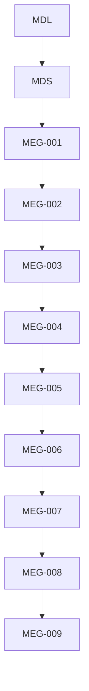
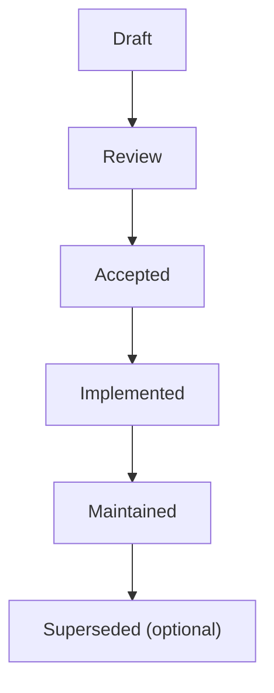

<!--
File: docs/engineering/guides/meg-009-security-architecture/00-document-control.md
Document: MEG-009
Status: Draft
Version: 0.4
-->

# Document Control

---

# Document Information

| Field | Value |
|---------|--------|
| Document ID | MEG-009 |
| Title | Security Architecture |
| File | 00-document-control.md |
| Status | Draft |
| Version | 0.4 |
| Owner | AdamNi-7080 |
| Classification | Internal Architecture Specification |

---

# Purpose

This document establishes the governance, authority and lifecycle of the Mosaic Security Architecture specification.

MEG-009 defines the architectural principles governing trust throughout the Mosaic platform.

Unlike previous specifications, which define:

- execution
- storage
- observability
- platform evolution

this specification defines:

> **How the platform decides what can be trusted.**

Security is treated as an architectural concern rather than an implementation feature.

Every Runtime decision should reinforce explicit trust boundaries.

---

# Authority

MEG-009 is the authoritative specification governing security throughout the Mosaic platform.

This specification applies to:

- Runtime Kernel
- Runtime Services
- Capabilities
- Module Platform
- Storage Systems
- SDK
- Administrative APIs
- Marketplace Integration

Every architectural component SHOULD conform to the trust model defined within this specification.

---

# Relationship to Other Specifications

MEG specifications intentionally build upon one another.

Specifically:

- **[MEG-001](../meg-001-go-engineering-standards/index.md)** defines engineering.
- **[MEG-002](../meg-002-event-driven-runtime/index.md)** defines Runtime behaviour.
- **[MEG-003](../meg-003-domain-driven-design/index.md)** defines business modelling.
- **[MEG-004](../meg-004-hexagonal-architecture/index.md)** defines architectural boundaries.
- **[MEG-005](../meg-005-runtime-architecture/index.md)** defines Runtime Architecture.
- **[MEG-006](../meg-006-module-platform/index.md)** defines the Module Platform.
- **[MEG-007](../meg-007-storage-architecture/index.md)** defines Storage Architecture.
- **[MEG-008](../meg-008-observability/index.md)** defines Observability.
- **MEG-009** defines trust, authority and protection.

Together they establish not only how the platform operates, but how it protects that operation.

---

# Normative Language

Unless explicitly stated otherwise, the following keywords are interpreted according to RFC 2119.

| Keyword | Meaning |
|----------|---------|
| **MUST** | Mandatory requirement. |
| **MUST NOT** | Prohibited behaviour. |
| **SHOULD** | Strong recommendation. Deviation requires architectural justification. |
| **SHOULD NOT** | Discouraged except where clearly justified. |
| **MAY** | Optional behaviour based upon engineering judgement. |

Examples and diagrams are informative unless explicitly identified as normative.

---

# Security Principles

The Mosaic Security Architecture is built upon several foundational principles.

- Trust is explicit.
- Authority is least privilege.
- Capabilities begin untrusted.
- Runtime boundaries enforce security.
- Identity precedes authority.
- Permissions describe capability.
- Secrets remain Runtime owned.
- Observability supports security.
- Security follows architecture.

Every subsequent chapter expands one or more of these principles.

---

# Document Lifecycle

MEG specifications evolve alongside the platform.

Each document progresses through the following lifecycle.

Accepted specifications become part of the canonical Mosaic architecture.

Historical revisions SHOULD remain available for future reference.

---

# Security Evolution

Security Architecture is expected to evolve.

However, changes affecting:

- trust boundaries
- authentication
- authorisation
- permission model
- module trust
- secret handling
- cryptographic policy

SHOULD be accompanied by an Architectural Decision Record (ADR).

Security changes should remain deliberate.

Never opportunistic.

---

# Compliance

All Runtime components SHOULD comply with MEG-009.

Where deviation becomes necessary, contributors SHOULD document:

- architectural reason
- affected trust boundaries
- operational impact
- migration strategy

Security exceptions should remain temporary wherever practical.

---

# Design Philosophy

MEG-009 intentionally favours:

- explicit trust
- least privilege
- defence in depth
- architectural isolation
- deterministic security
- operational transparency

Security should emerge naturally from the architecture already established throughout the previous MEGs.

It should not become a parallel system competing with Runtime ownership.

---

# Scope of Authority

MEG-009 governs:

- trust
- identity
- authority
- permissions
- secrets
- cryptographic protection

It does **not** define:

- Runtime execution
- storage implementation
- deployment infrastructure
- business behaviour

Those concerns belong to other engineering specifications.

Security protects those systems.

It does not replace them.
