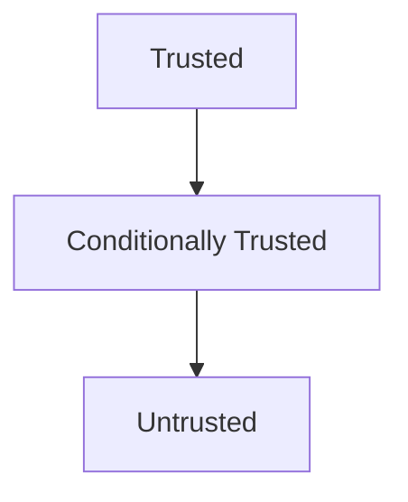
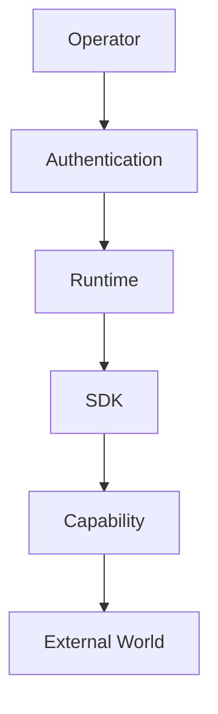
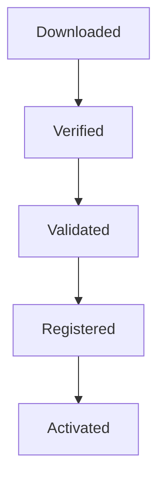
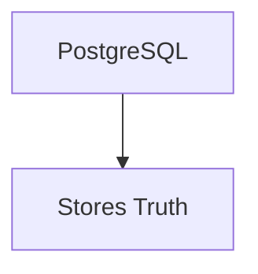
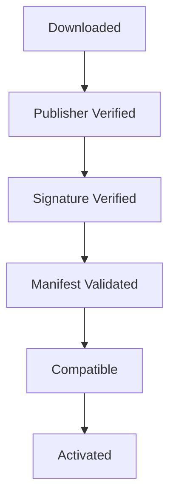
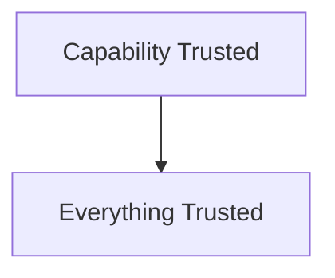
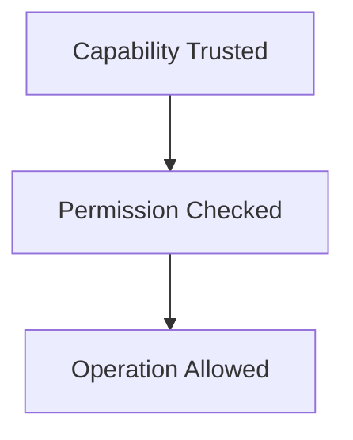

<!--
File: docs/engineering/guides/meg-009-security-architecture/02-trust-model.md
Document: MEG-009
Status: Draft
Version: 0.4
-->

# Trust Model

> *Security begins by deciding what the platform trusts. Everything else follows from that decision.*

---

# Purpose

Every secure platform distinguishes between:

- trusted components
- conditionally trusted components
- untrusted components

Without explicit trust boundaries:

- permissions become inconsistent
- security becomes implicit
- reviews become difficult
- isolation breaks down

This document defines the Mosaic Trust Model.

Every subsequent security mechanism derives from these trust boundaries.

---

# Philosophy

Within Mosaic:

> **Trust is an architectural property, not a runtime assumption.**

The Runtime should never assume:

- code is safe
- data is valid
- capabilities are honest
- networks are reliable

Trust must always be:

- established
- verified
- maintained
- revocable

---

# Trust Hierarchy

The platform intentionally classifies components into trust tiers.



Every architectural component belongs to exactly one trust tier.

---

# Trusted Components

The following components are trusted by the Runtime.

```text
Runtime Kernel
```

```text
Runtime Services
```

```text
Capability Registry
```

```text
SDK
```

```text
Repository Implementations
```

```text
Storage Layer
```

These components collectively form the trusted computing base of the Mosaic platform.

Compromise of these components compromises the platform itself.

They therefore require the highest engineering standards.

---

# Conditionally Trusted Components

Some components become trusted only after Runtime validation.

Examples include:

- Platform capabilities
- signed first-party modules
- verified marketplace packages
- validated manifests

Trust is conditional upon:

- signature validation
- compatibility
- permission approval
- Runtime activation

Conditional trust may be revoked at any time.

---

# Untrusted Components

The Runtime intentionally treats the following as untrusted.

Examples include:

- third-party modules
- user input
- remote APIs
- network traffic
- imported archives
- uploaded files
- external metadata

These components should never receive implicit authority.

Validation always precedes trust.

---

# Trust Boundaries

The platform contains explicit trust boundaries.



Every transition between trust levels requires:

- validation
- authorisation
- Runtime enforcement

Trust should never "flow" automatically across boundaries.

---

# Runtime Trust

The Runtime trusts itself.

Examples include:

- lifecycle management
- scheduling
- worker allocation
- dependency resolution

Capabilities should not verify Runtime behaviour.

The Runtime is the root of trust inside the platform.

---

# Capability Trust

Capabilities are never trusted simply because they exist.

Before execution the Runtime verifies:

- manifest
- version
- dependencies
- permissions
- compatibility

Only then does activation occur.

Activation represents:

Conditional trust.

Not permanent trust.

---

# Module Trust

Third-party modules should always begin as untrusted.

Lifecycle.



Trust increases progressively.

It should never be granted immediately.

---

# User Trust

Users possess identity.

They do not automatically possess authority.

Authentication proves:

```text
Who?
```

Authorisation determines:

```text
What?
```

User trust remains contextual.

Not global.

---

# Operator Trust

Operators possess elevated authority.

However:

Administrative actions should remain:

- authenticated
- authorised
- audited
- observable

Administrative access should never bypass Runtime architecture.

Privilege should remain accountable.

---

# Storage Trust

Storage systems are trusted to preserve information.

They are not trusted to define business meaning.

Examples.



Not.

```text
Defines Truth
```

Business meaning remains inside capabilities.

Storage preserves it.

---

# SDK Trust

Capabilities trust the SDK.

They should not trust Runtime implementation.

The SDK forms the security boundary between:

- Runtime internals
- module code

Maintaining SDK stability therefore contributes directly to platform security.

---

# Network Trust

Networks are always untrusted.

Examples include:

- HTTP requests
- remote metadata
- third-party APIs
- marketplace downloads

Every network interaction requires:

- validation
- timeout handling
- error handling
- permission enforcement

Trust should never originate from the network.

---

# Marketplace Trust

Marketplace trust is progressive.

Example.



The marketplace distributes capabilities.

The Runtime decides whether they execute.

Distribution should never imply trust.

---

# Secrets Trust

Capabilities should never own secrets.

The Runtime owns:

- retrieval
- storage
- rotation
- injection

Capabilities consume secrets.

They do not manage them.

This significantly reduces the trusted surface area.

---

# Event Trust

Runtime Events originate from trusted Runtime components.

External events should remain untrusted until:

- validated
- normalised
- converted

Business events become trusted only after entering Runtime boundaries.

---

# Trust Propagation

Trust should not propagate automatically.

Poor.



Preferred.



Every operation should continue respecting trust boundaries.

Trust is continually enforced.

Not permanently granted.

---

# Revocation

Trust must remain revocable.

Examples include:

- revoke module
- revoke publisher
- revoke user
- revoke permission
- revoke token

Revocation should immediately reduce authority.

Trust should never become irreversible.

---

# Observability

Trust decisions SHOULD be observable.

Examples include:

- capability verified
- signature invalid
- permission denied
- trust revoked

Operators should understand:

> **Why was this component trusted?**

Trust should never become opaque.

---

# Anti-Patterns

The following practices are prohibited.

## Implicit Trust

Trusting components because they are installed.

---

## Permanent Trust

Granting authority without revocation.

---

## Network Trust

Assuming external information is valid.

---

## Module Trust

Executing modules before validation.

---

## Shared Authority

Allowing trusted components to delegate unrestricted authority.

---

## Runtime Bypass

Capabilities bypassing Runtime trust enforcement.

---

# Mosaic Guidelines

Within Mosaic:

- Every component MUST belong to one trust tier.
- Trust MUST remain explicit.
- Modules MUST begin untrusted.
- Runtime Services MUST remain trusted.
- Trust MUST precede authority.
- Revocation MUST remain possible.
- Trust decisions SHOULD remain observable.
- Trust MUST be re-evaluated continuously rather than assumed permanently.

---

# Relationship to MEG

Security Philosophy established:

> **How the platform thinks about security.**

The Trust Model now defines:

> **Exactly which architectural components the platform trusts and why.**

The next chapter introduces **Authentication**, defining how users, operators, services and capabilities establish identity before any authority is granted.

---

# Summary

The Trust Model is the foundation of every security decision within Mosaic.

Authentication.

Permissions.

Secrets.

Modules.

Marketplace verification.

All ultimately answer one question:

> **Should the Runtime trust this component right now?**

By making trust explicit rather than assumed, Mosaic transforms security from a collection of defensive techniques into a coherent architectural property shared by every layer of the platform.
