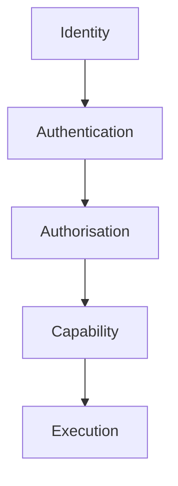
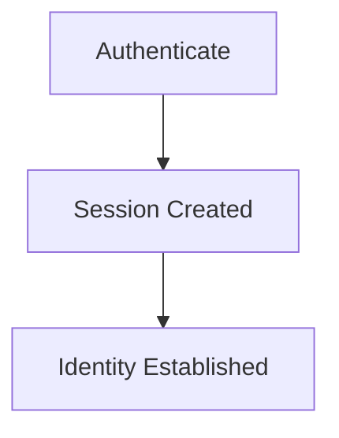
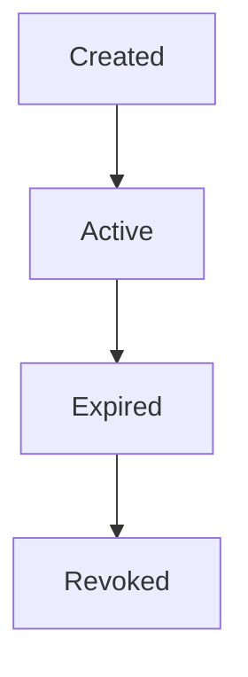
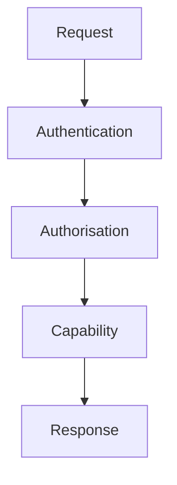
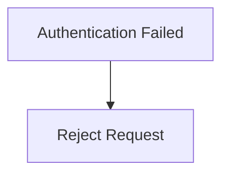

<!--
File: docs/engineering/guides/meg-009-security-architecture/03-authentication.md
Document: MEG-009
Status: Draft
Version: 0.4
-->

# Authentication

> *Authentication answers one question. Who is requesting this operation? It answers nothing about whether they should be allowed to perform it.*

---

# Purpose

Before the Runtime grants authority, it must establish identity.

Identity exists for many different actors within Mosaic.

Examples include:

- users
- administrators
- service accounts
- API clients
- external identity providers

Authentication establishes:

> **Who is making this request?**

It intentionally does **not** determine:

> **What that identity may do?**

Authorisation answers that question.

---

# Philosophy

Within Mosaic:

> **Identity precedes authority. Identity never implies authority.**

A successfully authenticated identity possesses:

```

Identity
```

It does **not** automatically possess:

```

Permissions
```

Authentication and authorisation remain independent architectural responsibilities.

---

# Authentication Hierarchy

Authentication occurs before every protected Runtime interaction.



Each stage owns exactly one concern.

The Runtime should never merge these responsibilities.

---

# Authentication Scope

Authentication applies to:

- users
- administrators
- API clients
- service accounts

Authentication does **not** apply to:

- Runtime Services
- Worker Manager
- Scheduler
- Execution Engine

The Runtime trusts itself.

External actors require authentication.

---

# Identity Types

The platform recognises several identity categories.

```text
User
```

Consumes platform functionality.

```text
Administrator
```

Manages the platform.

```text
Service Account
```

Represents automated systems.

```text
API Client
```

Represents external integrations.

Each identity type possesses different authorisation.

Authentication remains identical.

---

# Identity Providers

The Runtime SHOULD support multiple identity providers.

Examples include:

- Local Accounts
- OpenID Connect (OIDC)
- OAuth 2.0
- LDAP
- Active Directory

Authentication providers establish identity.

The Runtime establishes authority.

Authentication should remain provider-independent.

---

# Local Authentication

The Runtime MAY provide native authentication.

Examples include:

- username
- password
- passkeys
- recovery codes

Credential validation belongs to the authentication subsystem.

Capabilities should never authenticate users directly.

---

# Federated Authentication

External identity providers SHOULD integrate through standard protocols.

Examples include:

```text
OpenID Connect
```

```text
OAuth 2.0
```

The Runtime should consume verified identity claims.

Business capabilities should remain unaware of federation details.

---

# Session Management

Following successful authentication:



The session represents:

Authenticated identity.

Not authorisation.

Session lifecycle remains independent from capability execution.

---

# Registered Devices And Session Revocation

Successful device registration or first sign-in SHOULD establish a durable Registered Device record associated with the authenticated user.

The record SHOULD provide:

- stable device identity
- display name and platform metadata suitable for user recognition
- application version
- creation and last-seen timestamps
- revocation state
- associations to active revocable sessions
- optional last-reported compatibility capabilities

One registered device MAY own several sessions. One physical device MAY also present several simultaneous windows or displays with different live Presentation constraints.

Remote sign-out MUST revoke the selected sessions or device credential. Deleting cached capability metadata or Presentation state is not sufficient revocation.

A device-level sign-out SHOULD prevent session refresh for that registered device and terminate or reject its associated sessions according to the active revocation policy.

Compatibility metadata is advisory and MUST NOT become trusted identity evidence, an authorisation grant or final UI geometry.

Live Presentation resolution is governed by [MDP-001 — Adaptive Composition Runtime](../../architecture/mdp-001-adaptive-composition-runtime/10-multi-device-composition.md).

---

# Session Lifetime

Sessions SHOULD possess explicit lifetimes.

Typical stages include:



Sessions should never remain valid indefinitely.

Expiration should occur automatically.

---

# Token Authentication

API access MAY use bearer tokens.

Examples include:

- personal access tokens
- service tokens
- OAuth access tokens

Tokens identify:

The caller.

They do not define capability permissions.

Permission evaluation occurs separately.

---

# Service Accounts

Service accounts represent non-human identities.

Examples include:

- automation
- scheduled jobs
- integrations

Service accounts SHOULD authenticate exactly like users.

Only authorisation differs.

---

# Multi-Factor Authentication

The Runtime SHOULD support multi-factor authentication (MFA) for privileged identities.

Examples include:

- administrators
- platform owners

MFA strengthens identity verification.

It should remain configurable rather than universally mandatory.

---

# Password Handling

Passwords MUST never be stored in plaintext.

The Runtime SHOULD use modern password hashing algorithms designed for password storage, such as Argon2id, with parameters appropriate for the deployment environment.

Passwords should exist only:

- during authentication
- in protected memory
- for the minimum time necessary

Credential storage belongs entirely to the Runtime.

---

# Credential Storage

Authentication credentials belong to Business State.

They SHOULD be stored within PostgreSQL through Runtime-managed identity services.

Capabilities should never:

- access credentials
- validate passwords
- inspect authentication tokens

Identity remains a platform concern.

---

# Authentication Events

Successful and failed authentication SHOULD generate Runtime Events.

Examples include:

```text
AuthenticationSucceeded
```

```text
AuthenticationFailed
```

```text
SessionCreated
```

```text
SessionRevoked
```

These are operational events.

Not business events.

---

# Authentication Logging

Authentication activity SHOULD produce structured logs.

Examples include:

- successful authentication
- failed authentication
- session creation
- session expiry
- token revocation

Logs MUST avoid:

- passwords
- tokens
- secrets

Authentication logs describe identity events.

Not credential contents.

---

# Authentication Metrics

The Runtime SHOULD expose:

- successful authentications
- failed authentications
- active sessions
- revoked sessions
- token usage

Authentication metrics describe operational behaviour.

Not user behaviour.

---

# Authentication Tracing

Authentication SHOULD participate in distributed tracing.

Typical flow.



Authentication spans should describe:

- provider
- duration
- result

They should never include credentials.

---

# Failure Behaviour

Authentication failure SHOULD terminate request processing immediately.

Example.



Authorisation should never execute.

Capabilities should never become aware of unauthenticated requests.

---

# Account Lockout

The Runtime MAY support configurable protection against repeated authentication failures.

Examples include:

- temporary lockout
- exponential delay
- rate limiting

Protection should reduce automated attacks while avoiding unnecessary denial of service for legitimate users.

---

# Privacy

Authentication systems MUST protect:

- credentials
- identity tokens
- recovery information

Authentication telemetry should identify:

The authentication event.

Not expose sensitive authentication material.

---

# Anti-Patterns

The following practices are prohibited.

## Capability Authentication

Capabilities authenticating users directly.

---

## Plaintext Passwords

Persisting passwords in reversible form.

---

## Long-Lived Sessions

Sessions without explicit expiry or revocation.

---

## Shared Accounts

Multiple users sharing one administrative identity.

---

## Credential Logging

Recording passwords or tokens in logs or traces.

---

## Authentication Equals Authority

Granting permissions merely because authentication succeeded.

---

# Mosaic Guidelines

Within Mosaic:

- Authentication MUST establish identity only.
- Identity MUST precede authorisation.
- Capabilities MUST remain independent of authentication.
- Sessions MUST possess explicit lifecycles.
- Passwords MUST be securely hashed.
- Authentication events SHOULD remain observable.
- Credentials MUST remain protected.
- Authentication MUST remain provider-independent.

---

# Relationship to MEG

The Trust Model defines:

> **Who the Runtime may trust.**

Authentication defines:

> **How identities establish that trust.**

The next chapter introduces **Authorisation**, defining how authenticated identities receive only the authority explicitly granted to them.

---

# Summary

Authentication establishes identity.

Nothing more.

Within Mosaic, successful authentication does not imply permission, capability access or administrative authority.

It simply allows the Runtime to answer one architectural question with confidence:

> **Who is requesting this operation?**

Only after that question has been answered can the platform safely decide what should happen next.
