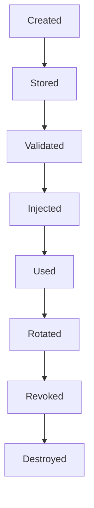
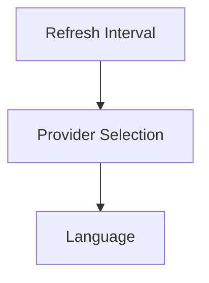
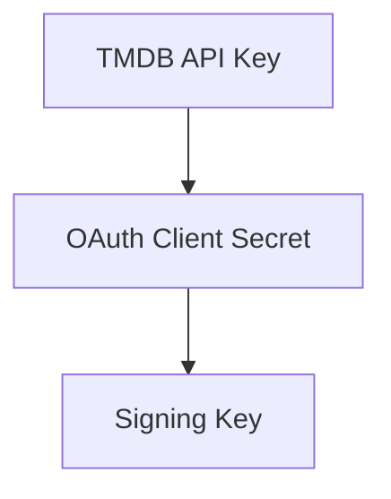
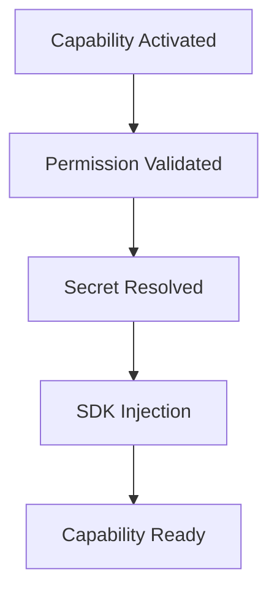
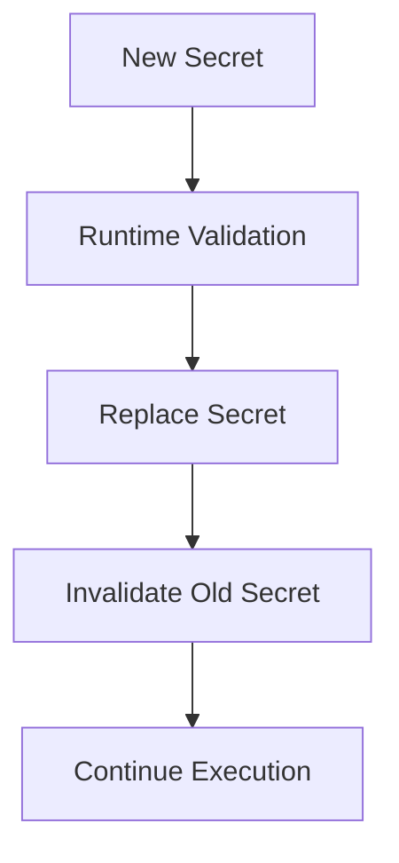
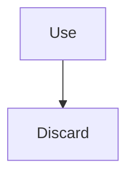
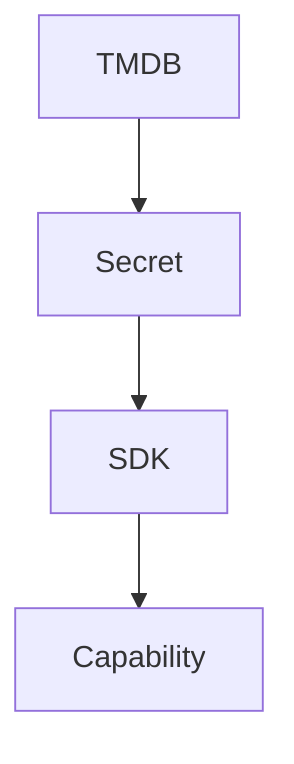

<!--
File: docs/engineering/guides/meg-009-security-architecture/06-secrets-management.md
Document: MEG-009
Status: Draft
Version: 0.4
-->

# Secrets Management

> *Capabilities should use secrets. They should never own them.*

---

# Purpose

Every modern platform depends upon confidential information.

Examples include:

- API keys
- OAuth credentials
- database passwords
- encryption keys
- signing keys
- webhook secrets

These values are fundamentally different from ordinary configuration.

Configuration describes behaviour.

Secrets establish trust.

This document defines how the Mosaic Runtime securely stores, manages and provides secrets while preventing capabilities from becoming responsible for secret handling.

---

# Philosophy

Within Mosaic:

> **The Runtime owns secrets. Capabilities borrow them.**

Secrets should never become part of:

- capability source code
- manifests
- configuration files
- repositories
- Runtime Events

Capabilities consume secrets only through secure Runtime contracts.

Ownership always remains with the Runtime.

---

# Secret Lifecycle

Every secret follows the same lifecycle.



Every stage has one responsibility.

Secrets should never skip lifecycle stages.

---

# Secret Ownership

Secrets belong to the Runtime.

Examples include:

- provider credentials
- signing keys
- OAuth client secrets
- encryption keys

Capabilities should never:

- create
- store
- rotate
- revoke

shared platform secrets.

Capabilities consume secret values.

The Runtime manages their lifecycle.

---

# Secrets Versus Configuration

Configuration and secrets are intentionally different.

Configuration.



Secrets.



Configuration may be visible.

Secrets must remain confidential.

The Runtime should manage these independently.

---

# Secret Sources

The Runtime MAY obtain secrets from multiple sources.

Examples include:

- environment variables
- encrypted configuration
- operating system keychains
- cloud secret managers
- hardware security modules (HSMs)

Capabilities should never know the origin of a secret.

The SDK exposes only the required value.

---

# Secret Injection

Secrets SHOULD be injected during capability activation.

Typical flow.



Capabilities should never resolve secrets dynamically.

Secret resolution belongs entirely to the Runtime.

---

# SDK Access

Capabilities SHOULD receive secrets through explicit SDK contracts.

Example.

```go
token := ctx.Secrets().Get("tmdb")
```

The SDK should:

- enforce permissions
- hide storage
- support rotation
- prevent accidental disclosure

Capabilities should never access:

- environment variables
- vault APIs
- filesystem secrets

directly.

---

# Permission Enforcement

Secret access MUST remain permission protected.

Example.

```text
metadata.fetch
```

↓

```text
TMDB Secret Available
```

Without the required permission:

```text
Secret Unavailable
```

Capabilities should not receive secrets they cannot legitimately use.

Least privilege continues to apply.

---

# Secret Rotation

Secrets SHOULD support rotation without Runtime restart where practical.

Typical flow.



Capabilities should remain unaware that rotation occurred.

Rotation is a Runtime responsibility.

---

# Secret Revocation

Secrets MUST support immediate revocation.

Examples include:

- compromised API key
- revoked OAuth credential
- leaked signing key

Revocation SHOULD prevent future use immediately.

Capabilities should gracefully handle unavailable secrets after revocation.

---

# Secret Lifetime

Capabilities SHOULD retain secrets only for the minimum time required.

Preferred.



Avoid:

```text
Cache Forever
```

The Runtime should minimise the exposure window for confidential information.

---

# Secret Caching

The Runtime MAY cache secrets internally.

Such caching should remain:

- encrypted where appropriate
- short-lived
- centrally managed

Capabilities should never implement independent secret caches.

---

# Secret Storage

Secrets SHOULD never be stored in:

- manifests
- repositories
- Runtime snapshots
- MOS archives
- MOS cache

These artefacts are intentionally portable or observable.

Secrets are neither.

---

# Logging

Secrets MUST never appear in:

- logs
- traces
- metrics
- diagnostics
- support bundles

Example.

Poor.

```text
TMDB Key:

123abc...
```

Preferred.

```text
TMDB Credential Retrieved
```

Security events should describe secret usage.

Not secret values.

---

# Tracing

Distributed traces SHOULD identify:

- secret retrieval
- secret rotation
- permission denial

They MUST NOT include:

- secret contents
- credentials
- tokens

Tracing should explain behaviour.

Not reveal confidential information.

---

# Diagnostics

Diagnostic interfaces SHOULD expose only secret metadata.

Examples include:

- provider name
- availability
- last rotation
- expiry status

Diagnostics should answer:

> **Is the secret available?**

Not:

> **What is the secret?**

---

# External Providers

Capabilities frequently use external services.

Example.



The capability should receive:

Only the credential required for execution.

It should never manage:

- renewal
- storage
- revocation

The Runtime remains the trust boundary.

---

# Cryptographic Keys

Cryptographic keys deserve additional protection.

Examples include:

- archive signing
- token signing
- encryption

These keys SHOULD remain inaccessible to ordinary capabilities.

Dedicated Runtime services should perform cryptographic operations on their behalf.

Capabilities request:

```

Sign This
```

Not:

```

Give Me The Private Key
```

---

# Secret Expiry

Secrets MAY possess explicit expiry.

Examples include:

- OAuth tokens
- temporary credentials
- short-lived certificates

The Runtime SHOULD monitor expiry proactively.

Capabilities should not discover expired secrets through failure alone.

---

# Backup

Secrets SHOULD NOT be included in ordinary Runtime backups unless encrypted and explicitly required.

Where possible:

Secret sources should remain independent of backup strategy.

Restoring the platform should not automatically expose confidential material.

---

# Observability

Secret management SHOULD expose:

- retrieval count
- rotation events
- expiry warnings
- permission denials
- provider availability

Secret values MUST never become observable.

Operational behaviour should.

---

# Testing

Secret handling SHOULD be testable.

Typical tests verify:

- permission enforcement
- secret injection
- rotation
- revocation
- redaction

Testing should prove:

Secrets remain protected.

Not merely functional.

---

# Anti-Patterns

The following practices are prohibited.

## Hard-Coded Secrets

Embedding credentials inside source code.

---

## Manifest Secrets

Declaring secret values inside capability manifests.

---

## Environment Access

Capabilities reading environment variables directly.

---

## Secret Logging

Writing credentials into logs, traces or diagnostics.

---

## Long-Lived Caches

Capabilities permanently caching confidential information.

---

## Secret Ownership

Capabilities storing or rotating shared Runtime secrets.

---

# Mosaic Guidelines

Within Mosaic:

- The Runtime MUST own secrets.
- Capabilities MUST receive secrets only through SDK contracts.
- Secret access MUST remain permission protected.
- Secret values MUST NOT appear in logs, traces or diagnostics.
- Secret rotation SHOULD remain transparent to capabilities.
- Secret revocation SHOULD take effect immediately.
- Capabilities MUST NOT manage shared platform secrets.
- Cryptographic keys SHOULD remain inside dedicated Runtime services.

---

# Relationship to MEG

Capability Permissions define:

> **Which Runtime capabilities a module may use.**

Secrets Management defines:

> **How confidential information is securely provided to those capabilities without transferring ownership.**

The next chapter introduces **Data Protection**, defining how Mosaic protects business information, binary assets and archived media through encryption, integrity verification and privacy-preserving architectural boundaries.

---

# Summary

Secrets are one of the platform's highest-value assets.

Within Mosaic they remain firmly under Runtime ownership.

Capabilities request secure services.

The Runtime resolves:

- storage
- retrieval
- rotation
- revocation

This architecture dramatically reduces the trusted computing surface while ensuring that capabilities receive exactly the confidential information they require, and nothing more.
