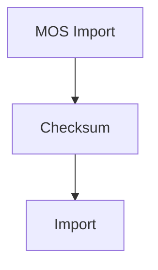
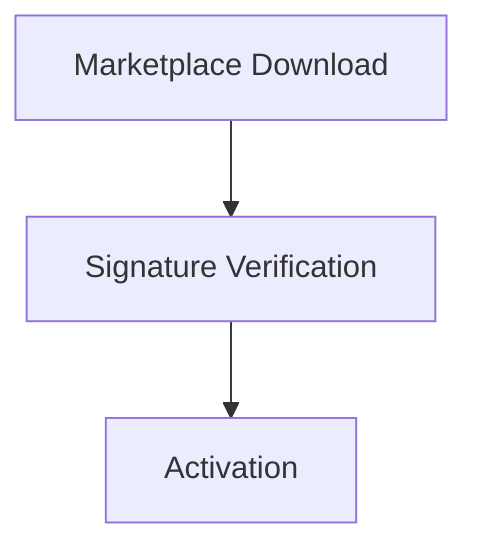

<!--
File: docs/engineering/guides/meg-009-security-architecture/07-data-protection.md
Document: MEG-009
Status: Draft
Version: 0.4
-->

# Data Protection

> *The platform exists to protect information. Security exists to protect the trust placed in that information.*

---

# Purpose

Every piece of information managed by Mosaic possesses different security requirements.

Examples include:

- user accounts
- playback history
- capability configuration
- API credentials
- media metadata
- artwork
- MOS archives

Not all information requires identical protection.

This document defines how Mosaic classifies and protects information throughout its lifecycle.

Protection includes:

- confidentiality
- integrity
- availability

The platform should protect information according to its value.

---

# Philosophy

Within Mosaic:

> **Protect information according to ownership, sensitivity and recoverability.**

Information should never receive protection merely because of where it is stored.

Instead, protection should follow:

- business ownership
- storage taxonomy
- trust boundaries

Architecture determines protection.

Not implementation.

---

# Information Classification

Every category of information SHOULD be classified.

Examples include:

```text
Public
```

Artwork.

Documentation.

Static assets.

```text
Internal
```

Runtime configuration.

Capability manifests.

Diagnostics.

```text
Confidential
```

User information.

Playback history.

API credentials.

```text
Restricted
```

Signing keys.

Encryption keys.

Administrative secrets.

Protection increases as sensitivity increases.

---

# Confidentiality

Confidentiality ensures information is accessible only to authorised identities.

Examples include:

- user profiles
- API credentials
- session tokens
- configuration secrets

Confidentiality should be enforced through:

- authentication
- authorisation
- permissions
- encryption

No single mechanism is sufficient.

---

# Integrity

Integrity ensures information cannot be modified without authorisation.

Examples include:

- MOS archives
- capability manifests
- business state
- configuration

Integrity mechanisms include:

- cryptographic hashes
- digital signatures
- checksums
- transactional guarantees

Operators should always detect unauthorised modification.

---

# Availability

Availability ensures authorised users can continue accessing information.

Examples include:

- PostgreSQL
- Blob Storage
- Runtime configuration
- MOS archives

Availability is supported through:

- backup
- replication
- recovery
- monitoring

Availability should not compromise confidentiality.

The three security properties should remain balanced.

---

# Business State

Business State receives the highest level of protection.

Examples include:

- users
- libraries
- playback history
- capability configuration

Business State SHOULD be:

- durable
- encrypted where appropriate
- transactionally consistent
- backed up

Loss or corruption directly affects users.

Business State deserves the strongest protection.

---

# Binary Assets

Binary assets require different protection.

Examples include:

- artwork
- subtitles
- previews

Protection should prioritise:

- integrity
- availability

Confidentiality depends upon the asset.

Public artwork does not require the same protection as user-uploaded media.

---

# MOS Archives

MOS archives represent portable business information.

They SHOULD support:

- integrity verification
- optional encryption
- version validation
- signature verification

Archive portability should never weaken archive integrity.

Portability and protection should coexist.

---

# Derived Data

Derived information includes:

- MOS Cache
- recommendation vectors
- search indexes

Derived information SHOULD prioritise:

- integrity
- rebuildability

Confidentiality depends upon source information.

Derived information should rarely become more sensitive than the information from which it originated.

---

# Encryption At Rest

Sensitive information SHOULD support encryption at rest.

Examples include:

- credential storage
- restricted configuration
- signing keys
- encrypted backups

Encryption protects information even if physical storage is compromised.

The Runtime should determine which information requires encryption.

Capabilities should remain unaware of storage implementation.

---

# Encryption In Transit

Every network boundary SHOULD support encrypted transport.

Examples include:

- HTTPS
- TLS
- secure WebSocket connections

Information crossing trust boundaries should remain protected during transmission.

Unencrypted transport should remain exceptional.

---

# Data Minimisation

The Runtime SHOULD minimise retained information.

Examples include:

- temporary credentials
- transient Runtime state
- expired sessions

Information that no longer provides operational or business value should be removed.

Keeping less information reduces long-term security risk.

---

# Data Retention

Different information requires different retention policies.

Examples.

Business State.

```text
Long-Term
```

Runtime logs.

```text
Configurable
```

Temporary caches.

```text
Short-Term
```

Retention should follow business requirements.

Not storage convenience.

---

# Personal Information

Personally identifiable information (PII) SHOULD receive additional protection.

Examples include:

- usernames
- email addresses
- profile information

PII should:

- remain encrypted where appropriate
- avoid unnecessary duplication
- remain absent from logs
- remain absent from traces

Privacy should be preserved by design.

---

# Integrity Verification

The Runtime SHOULD verify integrity whenever information crosses trust boundaries.

Examples include:





Validation should occur before information becomes trusted.

---

# Tamper Detection

Sensitive information SHOULD support tamper detection.

Examples include:

- configuration
- archives
- manifests
- signatures

Detection should be observable.

Operators should know:

- what changed
- when
- whether it was expected

---

# Secure Deletion

Information SHOULD be removed according to its sensitivity.

Examples include:

- expired sessions
- revoked secrets
- temporary credentials

Secure deletion policies depend upon:

- storage implementation
- regulatory requirements
- operational needs

The platform should avoid retaining confidential information unnecessarily.

---

# Data Sharing

Capabilities SHOULD exchange information through:

- Runtime contracts
- Runtime Events

They SHOULD NOT share:

- database tables
- storage implementation
- secret stores

Protection naturally follows architectural boundaries.

---

# Backup Protection

Backups SHOULD receive the same protection as primary storage.

Examples include:

- encryption
- integrity verification
- access control

A secure Runtime with insecure backups remains insecure.

Protection must remain consistent.

---

# Observability

Sensitive information MUST remain absent from:

- logs
- traces
- metrics
- diagnostics
- support bundles

Observability should explain:

Platform behaviour.

Never expose:

Protected information.

---

# Testing

Data protection SHOULD be tested.

Typical tests verify:

- encryption
- integrity validation
- permission enforcement
- archive verification
- secure deletion

Protection should remain verifiable.

Not assumed.

---

# Anti-Patterns

The following practices are prohibited.

## Plaintext Secrets

Persisting confidential information without appropriate protection.

---

## Credential Logging

Writing secrets into logs or traces.

---

## Permanent Retention

Retaining sensitive information indefinitely without justification.

---

## Trust Without Verification

Importing archives or manifests without integrity validation.

---

## Shared Confidential Data

Capabilities sharing protected information directly.

---

## Backup Without Protection

Leaving backup media less protected than primary storage.

---

# Mosaic Guidelines

Within Mosaic:

- Information MUST be protected according to its sensitivity.
- Business State MUST receive the strongest protection.
- Integrity MUST be verified across trust boundaries.
- Encryption SHOULD protect sensitive information at rest and in transit.
- Personally identifiable information MUST remain absent from telemetry.
- Derived information SHOULD remain rebuildable.
- Backup protection MUST match primary storage protection.
- Data retention SHOULD follow business value rather than convenience.

---

# Relationship to MEG

Secrets Management defines:

> **How confidential information is managed.**

Data Protection defines:

> **How all platform information is protected throughout its lifecycle.**

The next chapter introduces **Module Trust**, defining how the Runtime evaluates, validates and safely executes third-party capabilities while preserving the trust model established earlier in this specification.

---

# Summary

Protecting information is one of the Runtime's primary responsibilities.

Within Mosaic, protection follows:

- ownership
- sensitivity
- lifecycle
- trust

rather than:

- storage engine
- implementation
- convenience

By making information protection an architectural property rather than a collection of isolated security features, the platform preserves both security and long-term maintainability.
