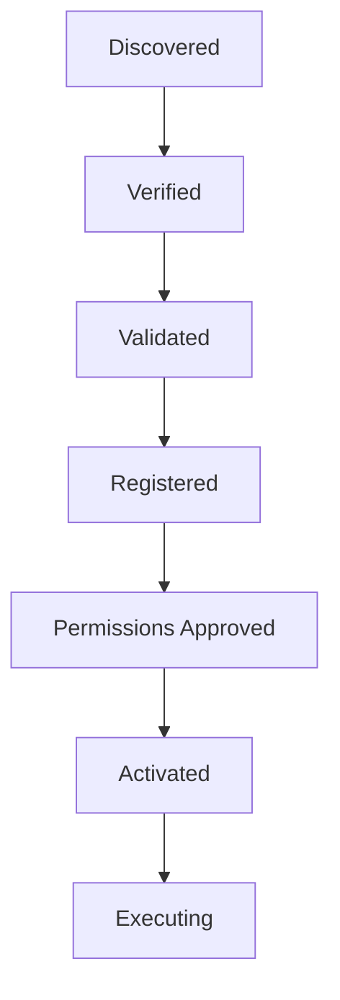
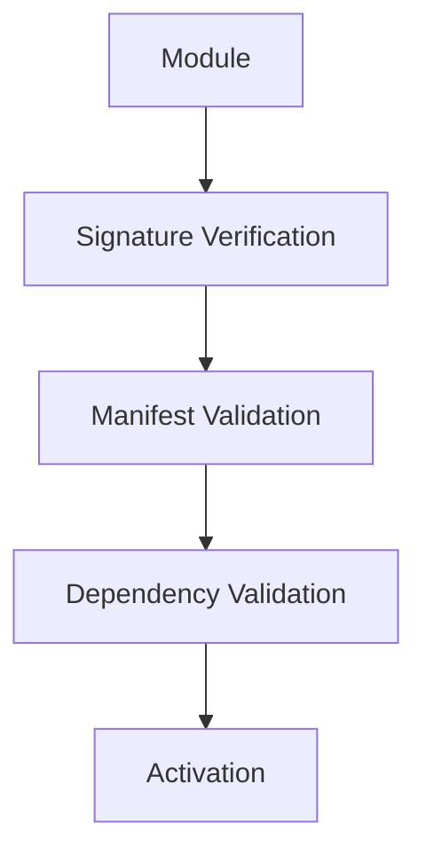
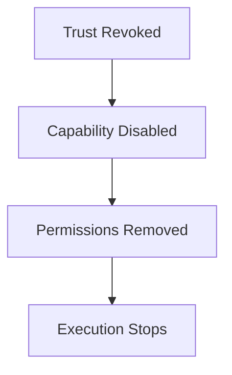

<!--
File: docs/engineering/guides/meg-009-security-architecture/08-module-trust.md
Document: MEG-009
Status: Draft
Version: 0.4
-->

# Module Trust

> *Installing a module should never imply trusting it. Trust is earned through verification, validation and controlled execution.*

---

# Purpose

One of Mosaic's defining characteristics is its Module Platform.

Capabilities may originate from:

- Platform capabilities
- first-party modules
- third-party developers
- enterprise deployments
- future marketplaces

The Runtime therefore cannot assume that every capability deserves equal trust.

Module Trust defines how the Runtime evaluates, validates and safely executes capabilities while preserving platform security.

---

# Philosophy

Within Mosaic:

> **Modules begin untrusted. The Runtime decides whether they become trusted enough to execute.**

A module should never receive authority because:

- it exists
- it was downloaded
- it compiled successfully

Trust is earned through:

- identity
- verification
- compatibility
- permissions
- Runtime validation

---

# Trust Lifecycle

Every module follows the same trust lifecycle.



Every stage increases confidence.

None should be skipped.

---

# Module Identity

Every module MUST possess a unique identity.

Examples include:

- capability identifier
- publisher identifier
- version
- manifest version

Identity allows the Runtime to answer:

> **Exactly what is being executed?**

Identity precedes trust.

---

# Publisher Identity

The Runtime SHOULD recognise module publishers.

Examples include:

```text
Platform Capability
```

```text
First-Party
```

```text
Enterprise
```

```text
Community
```

Publisher identity describes origin.

It does **not** automatically determine trust.

A recognised publisher still requires verification.

---

# Manifest Verification

The Capability Manifest remains the Runtime's primary trust contract.

Before execution the Runtime SHOULD validate:

- schema
- version
- identity
- dependencies
- permissions

An invalid manifest MUST prevent activation.

Manifest validation is the first trust boundary.

---

# Package Integrity

Module packages SHOULD support integrity verification.

Examples include:

- SHA-256 hashes
- cryptographic checksums
- digital signatures

Integrity answers:

> **Has this package changed?**

Integrity does not answer:

> **Should it be trusted?**

These are separate questions.

---

# Digital Signatures

Module packages SHOULD support digital signatures.

A signature proves:

- publisher identity
- package integrity

It does **not** imply:

- correctness
- security
- quality

Signed code can still contain defects.

The Runtime should distinguish:

Identity.

from.

Trust.

---

# Signature Validation

Before activation:



Every stage contributes to trust.

Failure at any stage should prevent execution.

---

# Compatibility

Trust also depends upon compatibility.

The Runtime SHOULD validate:

- SDK version
- Runtime version
- manifest version
- dependency graph

Compatible software is not automatically trustworthy.

Incompatible software should never execute.

---

# Permission Review

Requested permissions contribute to trust evaluation.

Example.

```yaml
permissions:

  - blob.read

  - scheduler.use
```

↓

Reasonable.

Example.

```yaml
permissions:

  - runtime.*
```

↓

Requires investigation.

Permission requests should influence operator confidence.

---

# Capability Isolation

Even trusted capabilities remain isolated.

The Runtime continues enforcing:

- permissions
- SDK boundaries
- Runtime contracts
- storage ownership

Trust should never weaken isolation.

Isolation remains one of the platform's strongest security guarantees.

---

# Marketplace Trust

Marketplace distribution SHOULD separate:

```text
Available
```

from:

```text
Trusted
```

A module may be:

- published
- downloaded

without yet being:

- verified
- activated

Distribution should never imply execution.

---

# First-Party Modules

First-party modules SHOULD still participate in:

- discovery
- validation
- activation

The Runtime should avoid special execution paths.

Architectural equality simplifies security review.

Platform capabilities and modules should follow the same lifecycle.

---

# Built-In Capabilities

Platform capabilities represent the highest trust level.

Nevertheless:

They SHOULD still satisfy:

- manifests
- lifecycle
- Runtime contracts
- permissions

The Runtime should avoid hidden exceptions for built-in capabilities.

Consistency strengthens security.

---

# Enterprise Modules

Enterprise deployments MAY establish additional trust policies.

Examples include:

- internal signing
- organisation allow-lists
- private marketplaces

These policies extend Runtime trust.

They should not replace it.

---

# Revocation

Module trust MUST remain revocable.

Examples include:

- compromised publisher
- vulnerable module
- revoked signature
- unsupported version

Revocation flow.



Trust should never become permanent.

---

# Quarantine

The Runtime MAY quarantine modules.

Quarantined modules:

- remain installed
- do not execute
- remain inspectable

Quarantine allows investigation without compromising Runtime stability.

---

# Trust Metadata

The Runtime SHOULD expose trust metadata.

Examples include:

- publisher
- signature status
- verification date
- permission approval
- compatibility

Operators should answer:

> **Why does the Runtime trust this capability?**

Trust should remain explainable.

---

# Runtime Events

Trust changes SHOULD generate Runtime Events.

Examples include:

```text
ModuleVerified
```

```text
ModuleRejected
```

```text
ModuleRevoked
```

```text
ModuleQuarantined
```

Trust changes are operational events.

Not business events.

---

# Security Observability

Module trust SHOULD remain observable.

Operators should inspect:

- verification status
- trust level
- signature validity
- permission history
- revocation history

Security decisions should never become hidden Runtime behaviour.

---

# Trust Does Not Equal Authority

One of the most important distinctions is:

```text
Trusted Module

≠

Unlimited Permissions
```

Trust allows execution.

Permissions determine authority.

These concepts remain intentionally separate.

---

# Performance

Trust verification generally occurs during:

- installation
- startup
- activation

Verification SHOULD remain inexpensive during normal execution.

Runtime performance should not depend upon repeatedly validating trusted artefacts.

---

# Anti-Patterns

The following practices are prohibited.

## Download Equals Trust

Executing downloaded modules immediately.

---

## Unsigned Packages

Skipping integrity validation for production modules.

---

## Permanent Trust

Granting irrevocable execution authority.

---

## Hidden Platform Privileges

Platform capabilities bypassing Runtime permission enforcement.

---

## Publisher Trust

Granting unrestricted authority because of publisher identity.

---

## Runtime Bypass

Modules accessing Runtime internals directly because they are "trusted."

---

# Mosaic Guidelines

Within Mosaic:

- Modules MUST begin untrusted.
- Manifest validation MUST precede activation.
- Package integrity SHOULD be verified.
- Digital signatures SHOULD verify publisher identity.
- Compatibility MUST be validated.
- Trust MUST remain revocable.
- Trust MUST NOT weaken Runtime isolation.
- Module trust SHOULD remain observable.
- Trust and authority MUST remain separate concepts.

---

# Relationship to MEG

Data Protection defines:

> **How information is protected.**

Module Trust defines:

> **How executable code becomes trusted enough to operate within the Runtime.**

The next chapter introduces **Network Security**, defining how Mosaic protects communication between users, capabilities, storage systems and external services while preserving the architectural trust boundaries established throughout this specification.

---

# Summary

Module Trust transforms third-party code from:

> **Unknown software**

into

> **A controlled Runtime participant**

through a deterministic sequence of:

- verification
- validation
- compatibility
- permission approval

Within Mosaic, trust is never assumed.

The Runtime earns confidence in every capability before allowing it to execute, and even then, that capability continues operating inside strict architectural boundaries enforced by the Runtime itself.
