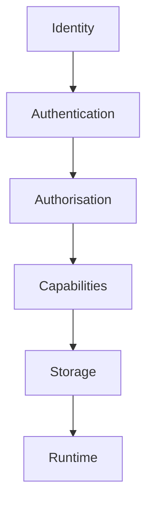
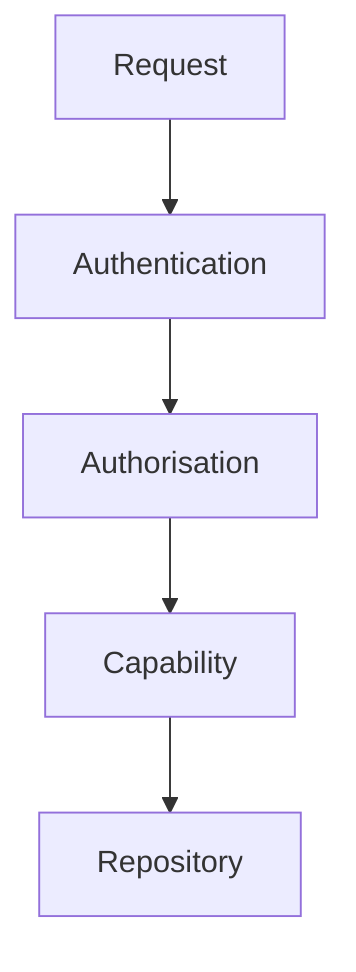
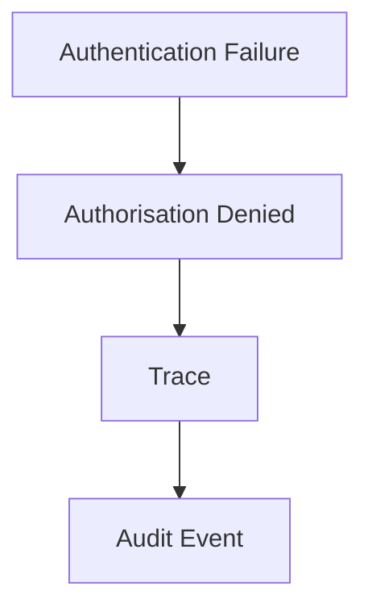

<!--
File: docs/engineering/guides/meg-009-security-architecture/11-security-observability.md
Document: MEG-009
Status: Draft
Version: 0.4
-->

# Security Observability

> *A secure platform should explain every significant security decision without exposing the information it is protecting.*

---

# Purpose

Throughout MEG-009 the Runtime has established:

- trust
- authentication
- authorisation
- permissions
- secrets
- module validation
- cryptography

Security mechanisms that cannot be observed become difficult to:

- audit
- investigate
- improve
- trust

Security Observability ensures that every significant security decision becomes operationally visible while preserving confidentiality.

---

# Philosophy

Within Mosaic:

> **Security decisions should always be observable. Security data should rarely be.**

Operators should understand:

- what happened
- why it happened
- who made the decision
- which architectural component enforced it

They should **not** see:

- passwords
- API keys
- encryption keys
- tokens
- confidential payloads

Security observability explains behaviour.

Not secrets.

---

# Security Observability Hierarchy

Security telemetry follows the Runtime Architecture.



Each layer exposes:

- logs
- metrics
- traces
- audit events
- diagnostics

Ownership remains architectural.

---

# Authentication Observability

Authentication SHOULD expose:

- successful authentication
- failed authentication
- session creation
- session expiry
- session revocation
- MFA challenges

Operators should answer:

> **Who attempted to access the platform?**

Authentication telemetry should never expose credentials.

---

# Authorisation Observability

Every authorisation decision SHOULD remain observable.

Examples include:

```text
Permission Granted
```

```text
Permission Denied
```

```text
Administrative Access
```

```text
Ownership Validation Failed
```

Operators should understand:

- what was requested
- why it succeeded
- why it failed

Authority should remain explainable.

---

# Capability Permission Observability

Capability permissions SHOULD expose:

- requested permissions
- granted permissions
- denied permissions
- revoked permissions
- unused permissions

Permission changes frequently explain unexpected capability behaviour.

The Runtime should expose them naturally.

---

# Secret Observability

Secret management SHOULD expose:

- retrieval
- rotation
- expiry
- revocation
- provider availability

Secret values MUST NEVER appear.

Example.

Good.

```text
TMDB Secret Rotated
```

Poor.

```text
TMDB Secret:

abcd1234...
```

The Runtime should explain secret lifecycle.

Not reveal secret contents.

---

# Trust Observability

Trust transitions SHOULD remain observable.

Examples include:

```text
Module Verified
```

```text
Signature Invalid
```

```text
Capability Quarantined
```

```text
Trust Revoked
```

Operators should understand:

> **Why is this capability trusted?**

Trust decisions should never become hidden Runtime behaviour.

---

# Network Security Observability

Network security SHOULD expose:

- TLS failures
- authentication failures
- rejected requests
- outbound permission denials
- rate limiting
- invalid certificates

Network telemetry should describe security behaviour.

Not request payloads.

---

# Cryptographic Observability

Cryptographic operations SHOULD expose:

- signature verification
- integrity validation
- key rotation
- archive verification
- encryption failures

They MUST NOT expose:

- key material
- hashes of secrets
- confidential values

Cryptography should remain observable without compromising security.

---

# Audit Events

Certain security operations SHOULD produce immutable audit events.

Examples include:

- administrator login
- permission changes
- capability installation
- capability removal
- secret rotation
- trust revocation
- user creation
- user deletion

Audit events describe:

Security history.

Not Runtime execution.

Audit events should remain durable.

---

# Security Metrics

The Runtime SHOULD expose metrics describing:

- authentication failures
- permission denials
- active sessions
- revoked sessions
- module verification failures
- secret rotations
- trust revocations

Metrics describe:

Security trends.

Not individual incidents.

---

# Security Traces

Security operations SHOULD participate in distributed traces.

Example.



The trace should explain:

Where authority was evaluated.

Not merely:

Where business execution occurred.

---

# Runtime Diagnostics

Security diagnostics SHOULD expose:

- trust state
- active permissions
- capability trust level
- secret provider status
- authentication providers

Diagnostics SHOULD avoid exposing:

- secret values
- tokens
- credentials
- personally identifiable information

Diagnostics explain:

Security architecture.

Not security material.

---

# Incident Investigation

Security observability SHOULD support incident response.

Operators should reconstruct:

- authentication history
- permission evaluation
- capability activation
- trust changes
- Runtime decisions

Security incidents should become explainable without modifying production systems.

---

# Correlation

Security telemetry SHOULD correlate naturally.

Example.



Operators should investigate one incident.

Not manually assemble unrelated evidence.

---

# Alerting

Security alerts SHOULD focus upon:

- repeated authentication failures
- privilege escalation
- trust revocation
- signature failures
- integrity failures
- repeated permission denials
- secret compromise indicators

Routine security events SHOULD remain observable without necessarily becoming alerts.

Alerting should continue following [MEG-008](../meg-008-observability/index.md) principles.

---

# Privacy

Security observability MUST preserve privacy.

Telemetry MUST avoid:

- passwords
- tokens
- personal data
- private content
- encryption keys

Operators should understand:

Security decisions.

Never protected information.

---

# Retention

Security audit events SHOULD remain available longer than ordinary operational telemetry.

Examples include:

- administrative actions
- trust decisions
- permission changes
- authentication history

Retention policy depends upon:

- operational requirements
- regulatory obligations
- organisational policy

Security history often outlives operational metrics.

---

# Runtime Independence

Capabilities SHOULD never implement independent security telemetry.

The Runtime already understands:

- identity
- permissions
- trust
- secrets

Security observability belongs to the Runtime.

Capabilities simply participate.

---

# Testing

Security observability SHOULD be tested.

Typical tests verify:

- audit events
- permission logs
- authentication metrics
- trace propagation
- redaction
- alert generation

Security telemetry should remain deterministic.

Operators should trust it during incidents.

---

# Anti-Patterns

The following practices are prohibited.

## Credential Logging

Logging passwords or authentication tokens.

---

## Secret Diagnostics

Displaying secret values in Runtime diagnostics.

---

## Missing Audit Trail

Administrative actions without durable audit events.

---

## Duplicate Security Logs

Multiple Runtime components reporting the same security decision independently.

---

## Security Through Obscurity

Suppressing security telemetry because "attackers might see it."

---

## Uncorrelated Incidents

Security telemetry requiring manual reconstruction across unrelated systems.

---

# Mosaic Guidelines

Within Mosaic:

- Security decisions MUST remain observable.
- Secret material MUST remain confidential.
- Authentication and authorisation SHOULD generate structured telemetry.
- Trust transitions SHOULD produce audit events.
- Security metrics SHOULD describe trends.
- Security traces SHOULD explain enforcement boundaries.
- Security diagnostics MUST protect confidential information.
- Audit history SHOULD remain durable.
- Security observability MUST complement operational observability rather than duplicate it.

---

# Relationship to MEG

Cryptography defines:

> **How trust is technically enforced.**

Security Observability defines:

> **How operators understand that enforcement while preserving confidentiality.**

The next chapter introduces **Security Guidelines**, bringing together the architectural principles of MEG-009 into practical engineering guidance for contributors implementing secure Runtime Services, capabilities and modules.

---

# Summary

Security should never become invisible.

Within Mosaic, every significant trust decision should leave observable evidence explaining:

- what happened
- who requested it
- why it succeeded
- why it failed

while ensuring the confidential information being protected never becomes part of that evidence.

A secure platform should not only protect itself.

It should continuously demonstrate that protection through clear, explainable and auditable behaviour.
