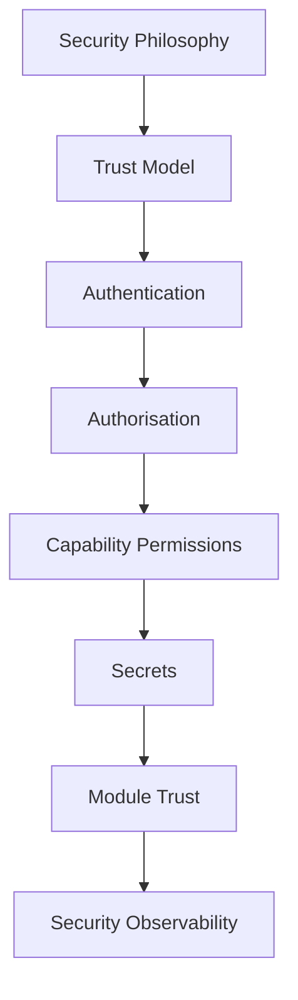

<!--
File: docs/engineering/guides/meg-009-security-architecture/14-contributor-guidance.md
Document: MEG-009
Status: Draft
Version: 0.4
-->

# Contributor Guidance

> *Every line of code either strengthens or weakens the platform's trust model. Security is built through thousands of small architectural decisions rather than one large feature.*

---

# Purpose

The Mosaic Security Architecture establishes how the platform:

- trusts
- authenticates
- authorises
- isolates
- protects
- observes

Every contributor shares responsibility for preserving those guarantees.

This document provides practical guidance for engineers implementing Runtime Services, capabilities and modules while maintaining the architectural security model defined throughout MEG-009.

---

# Philosophy

Within Mosaic:

> **Preserve trust before adding functionality.**

Features are valuable.

Trust is essential.

Whenever those priorities conflict:

The Runtime should remain trustworthy.

---

# Before Writing Code

Before implementing a feature ask:

- What trust boundary does this cross?
- What authority does this require?
- What information does this expose?
- What assumptions am I making?

If any assumption begins with:

> "This will probably..."

The trust model should be reconsidered.

Security should remain explicit.

---

# Before Adding A Capability

Every capability should answer:

- What permissions do I require?
- What Runtime contracts do I consume?
- Which secrets do I need?
- Which external services do I contact?

If the capability cannot explain its authority:

It should not receive that authority.

---

# Before Requesting Permissions

Every permission request should answer:

> **Why is this permission required?**

Prefer:

```text
blob.read
```

Avoid:

```text
runtime.*
```

Permissions should remain:

- narrow
- intentional
- reviewable

Authority expands over time.

Engineers should continually resist unnecessary growth.

---

# Before Reading Secrets

Capabilities should never access:

- environment variables
- configuration files
- secret stores

Instead:

Use Runtime SDK contracts.

The Runtime owns:

- retrieval
- rotation
- revocation

Capabilities consume only what they require.

---

# Before Using Storage

Storage ownership reinforces security.

Ask:

- Does this capability own this information?
- Am I crossing capability boundaries?
- Does a Runtime Event provide a better integration?

Direct storage coupling frequently becomes security coupling.

Repositories should remain the only persistence boundary.

---

# Before Accepting User Input

Assume every external input is:

- malformed
- incomplete
- malicious

Validation should occur:

Before.

Business execution.

Capabilities should consume validated requests.

The Runtime protects the boundary.

---

# Before Calling External APIs

Every outbound request should answer:

- Which host?
- Which permission?
- Which timeout?
- Which retry policy?

Capabilities should never assume:

Remote systems are trustworthy.

The network remains an untrusted environment.

---

# Before Logging

Never log:

- passwords
- tokens
- secrets
- personally identifiable information
- encryption keys

Instead log:

- authentication results
- permission decisions
- trust transitions
- Runtime enforcement

Security logs should explain:

Behaviour.

Not expose protected information.

---

# Before Creating Runtime Contracts

Every Runtime contract becomes a security boundary.

Ask:

- Does this expose unnecessary authority?
- Can permissions become narrower?
- Can ownership become clearer?

Runtime contracts should minimise privilege naturally.

---

# Before Changing Authentication

Authentication changes affect:

- every user
- every administrator
- every API client

Authentication should remain:

- provider independent
- deterministic
- observable

Identity mechanisms should evolve cautiously.

---

# Before Changing Authorisation

Authorisation changes affect:

- permissions
- Runtime behaviour
- capability execution

Before modifying authorisation ask:

> **Can existing permissions express this requirement?**

Expanding the permission model should remain exceptional.

---

# Before Changing Trust

The Trust Model underpins the entire Security Architecture.

Changes affecting:

- trusted components
- module trust
- Runtime trust

should generally require:

- architectural review
- ADR
- migration plan

Trust boundaries are among the most expensive architectural decisions to change.

---

# Before Using Cryptography

Never ask:

> **Which algorithm should I use?**

First ask:

> **Which architectural property am I protecting?**

Examples.

Integrity.

↓

Hash.

Authenticity.

↓

Signature.

Confidentiality.

↓

Encryption.

Architecture determines cryptography.

Not the reverse.

---

# Before Requesting Review

Every security contribution SHOULD satisfy the following checklist.

## Trust

- [ ] Trust boundary explicit.
- [ ] Trust assumptions documented.
- [ ] Revocation possible.

---

## Permissions

- [ ] Least privilege maintained.
- [ ] Manifest updated.
- [ ] Runtime enforcement preserved.

---

## Secrets

- [ ] Runtime ownership maintained.
- [ ] No secret persistence.
- [ ] No secret logging.

---

## Data

- [ ] Information classified.
- [ ] Confidentiality preserved.
- [ ] Integrity maintained.

---

## Observability

- [ ] Security decisions observable.
- [ ] Audit events generated.
- [ ] Sensitive information protected.

---

## Documentation

- [ ] MEG updated.
- [ ] ADR created if required.
- [ ] Security assumptions documented.
- [ ] Examples remain accurate.

---

# Recognising Security Drift

The following symptoms usually indicate architectural drift.

- Capabilities reading secrets directly.
- Runtime contracts continually expanding.
- Broad wildcard permissions.
- Shared credentials.
- Authentication inside capabilities.
- Direct Runtime implementation imports.
- Implicit trust assumptions.
- Security exceptions becoming permanent.

Security drift should be corrected immediately.

Trust becomes increasingly difficult to recover once lost.

---

# Refactoring Security

When improving security ask:

- Can trust become simpler?
- Can permissions become narrower?
- Can Runtime ownership become clearer?
- Can assumptions become explicit?
- Can observability improve?

Security refactoring should reduce authority.

Not merely relocate it.

---

# Review Mindset

Security reviews should focus upon:

- trust
- ownership
- isolation
- least privilege
- observability

Questions such as:

> **Why is this trusted?**

are usually more valuable than:

> **Can this be encrypted?**

Architecture almost always precedes implementation.

---

# Learning The Security Architecture

New contributors SHOULD study MEG-009 in the following order.



Understanding trust first makes every later security concept significantly easier.

---

# Engineering Culture

Security contributors should strive to:

- minimise authority
- simplify trust
- preserve Runtime ownership
- improve observability
- reduce assumptions
- document security decisions

Strong security usually results from disciplined architecture rather than increasingly complicated implementation.

---

# Contributor Checklist

Before requesting review, confirm:

- [ ] Trust remains explicit.
- [ ] Identity precedes authority.
- [ ] Least privilege preserved.
- [ ] Runtime ownership maintained.
- [ ] Secrets remain protected.
- [ ] Security decisions remain observable.
- [ ] Confidential information remains confidential.
- [ ] Documentation updated.
- [ ] The platform is more trustworthy than before.

---

# Relationship to MEG

This document explains how contributors should evolve the Security Architecture established throughout MEG-009.

The previous chapters define:

> **How the platform protects itself.**

This chapter defines:

> **How engineers preserve that protection over time.**

Security remains effective only while contributors continue reinforcing the architectural trust boundaries established throughout the platform.

---

# Summary

Security is not something added after the platform is complete.

It is one of the architectural qualities that defines whether the platform deserves to be trusted at all.

Within Mosaic, every contribution should strengthen:

- trust
- authority
- ownership
- isolation
- observability

because every engineering decision ultimately becomes a security decision.

The most secure platforms are rarely the most complicated.

They are the ones whose trust model remains consistently simple, explicit and enforceable.
