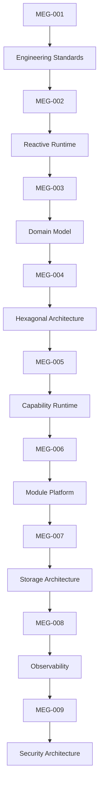
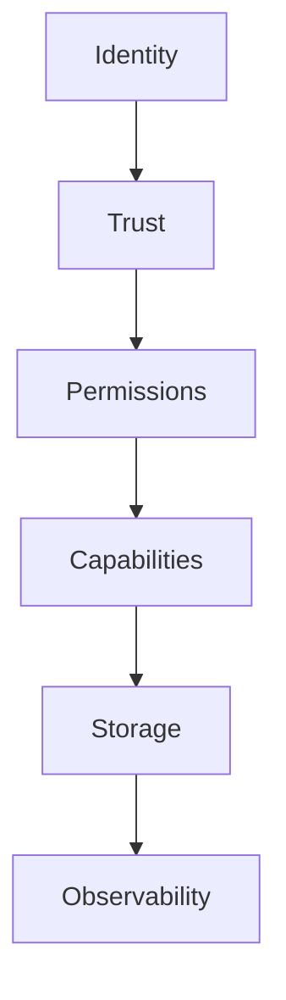

<!--
File: docs/engineering/guides/meg-009-security-architecture/index.md
Document: MEG-009
Status: Draft
Version: 0.4
-->

# MEG-009 — Security Architecture

> *Security is not a collection of features. It is the architectural discipline of deciding what the platform trusts, what it protects and what it refuses to assume.*

---

# Purpose

Previous engineering specifications established:

- how software is written
- how work executes
- how the business is modelled
- how the Domain is protected
- how the Runtime operates
- how the platform evolves
- how information is stored
- how the platform explains itself

MEG-009 answers the next architectural question.

> **How does the platform protect itself while remaining extensible?**

Unlike traditional applications, Mosaic executes:

- Platform capabilities
- first-party capabilities
- third-party capabilities
- user configuration
- external APIs
- remote media providers

Security therefore cannot be treated as an implementation detail.

It must become part of the architecture itself.

---

# Relationship to MEG



Previous specifications define:

> **How the platform behaves.**

MEG-009 defines:

> **How the platform remains trustworthy while behaving that way.**

---

# Scope

This specification defines:

- Security philosophy
- Trust model
- Authentication
- Authorisation
- Capability permissions
- Secrets management
- Data protection
- Module trust
- Network security
- Cryptography
- Security observability
- Security guidelines

This specification intentionally does **not** define:

- Runtime execution
- business modelling
- storage implementation
- deployment topology

Those concerns belong to previous or future MEG specifications.

---

# Guiding Question

MEG-009 exists to answer one question.

> **How should Mosaic protect users, capabilities and information without sacrificing the architectural principles established throughout the previous MEGs?**

---

# Security Statement

Within Mosaic:

> **Every capability begins with zero trust and earns authority through explicit Runtime contracts.**

The platform trusts:

- architectural boundaries
- explicit permissions
- verified identities
- deterministic Runtime behaviour

It does **not** trust:

- arbitrary module code
- user input
- remote services
- implicit assumptions

Trust should always be:

- explicit
- observable
- reviewable

---

# Security Hierarchy

Security intentionally follows the architecture.



Every layer reinforces the next.

Security should emerge naturally from architectural ownership rather than scattered implementation checks.

---

# Expected Outcome

After reading MEG-009 contributors should understand:

- how trust is established
- how identities are verified
- how capabilities receive authority
- how secrets are managed
- how information is protected
- how third-party modules remain isolated
- how security integrates with every previous MEG

without weakening the capability-oriented architecture.

---

# Repository Structure

```text
engineering/

└── meg/

    └── MEG-009 Security Architecture/

        README.md

        00-document-control.md

        01-security-philosophy.md

        02-trust-model.md

        03-authentication.md

        04-authorisation.md

        05-capability-permissions.md

        06-secrets-management.md

        07-data-protection.md

        08-module-trust.md

        09-network-security.md

        10-cryptography.md

        11-security-observability.md

        12-security-guidelines.md

        13-adrs.md

        14-contributor-guidance.md

        references.md

        glossary.md
```

---

# Dependencies

Required reading:

- [MEG-001 — Go Engineering Standards](../meg-001-go-engineering-standards/index.md)
- [MEG-002 — Event-Driven Runtime](../meg-002-event-driven-runtime/index.md)
- [MEG-003 — Domain-Driven Design](../meg-003-domain-driven-design/index.md)
- [MEG-004 — Hexagonal Architecture](../meg-004-hexagonal-architecture/index.md)
- [MEG-005 — Runtime Architecture](../meg-005-runtime-architecture/index.md)
- [MEG-006 — Module Platform](../meg-006-module-platform/index.md)
- [MEG-007 — Storage Architecture](../meg-007-storage-architecture/index.md)
- [MEG-008 — Observability](../meg-008-observability/index.md)

Future companion specifications:

- [MEG-010 — Performance Engineering](../meg-010-performance-engineering/index.md)
- MEG-011 Deployment Architecture *(planned; not yet published)*
- MEG-012 API Architecture *(planned; not yet published)*

---

# Design Goals

The Security Architecture is intended to produce a platform that is:

- Trustworthy
- Least-privileged
- Capability-aware
- Auditable
- Observable
- Extensible
- Replaceable
- Secure by default

Security should reinforce every previous architectural decision rather than introducing a parallel architecture.
