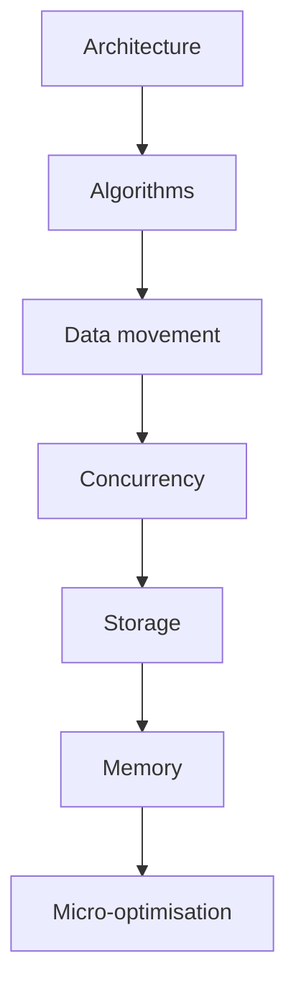

<!--
File: docs/engineering/guides/meg-010-performance-engineering/01-performance-philosophy.md
Document: MEG-010
Status: Draft
Version: 0.4
-->

# Performance Philosophy

---

# Purpose

This chapter defines the philosophy that governs all performance decisions within Mosaic.

Performance work without philosophy tends to become reactive, fragmented and inconsistent.

Teams begin optimising whichever symptom is loudest, often improving one part of the system while quietly damaging another.

This chapter exists to prevent that behaviour from becoming architecture.

---

# Guiding Statement

Within Mosaic:

> **Performance is an architectural property, not a late-stage enhancement.**

Performance must be treated as a first-class concern during design, implementation, review and operation.

It is not something to be added after correctness, after security, after observability or after delivery.

If performance is not considered early, the platform will eventually pay for that omission in complexity, latency or operational instability.

---

# Performance Principles

## 1. Performance Must Be Designed

Performance does not appear by accident.

It must be shaped through deliberate choices about:

- runtime behaviour
- data flow
- ownership
- storage access
- concurrency
- caching
- scheduling
- event volume
- back-pressure

A system with no performance intent will still have performance characteristics.

They will simply be accidental ones.

---

## 2. Correctness Comes First

Incorrect code that is fast is still incorrect.

Mosaic does not permit performance work that weakens:

- correctness
- security
- observability
- maintainability
- architectural boundaries

A slower correct system is preferable to a faster broken one.

This is not a romantic ideal.

It is the difference between a platform and a fire.

---

## 3. Architecture Precedes Optimisation

Performance improvement must begin at the architectural level.

The preferred order of attention is:

- eliminate unnecessary work
- simplify the data path
- reduce copying and allocation
- remove blocking behaviour
- improve scheduling
- tune storage access
- improve caching
- optimise low-level code only when justified

Premature micro-optimisation is usually a sign that the contributor has optimised the wrong abstraction layer.

It is a familiar and very expensive human hobby.

---

## 4. Measure Before You Guess

Performance changes must be grounded in evidence.

Before changing a system for performance reasons, contributors should identify:

- the observed bottleneck
- the workload that triggers it
- the measurement method
- the acceptable target
- the risk of regression

If the bottleneck is not measurable, it is not yet understood.

If it is not understood, it should not be optimised.

---

## 5. Optimise the Common Path

The platform should be efficient where it matters most.

Common operations should be:

- simple
- predictable
- low-overhead
- easy to observe
- easy to test

Rare paths may be slower if that preserves clarity and performance in the common case.

The architecture is not required to contort itself for edge cases that mostly exist in whiteboard conversations.

---

## 6. Prefer Less Work Over Faster Work

The best performance gain is often removal.

Before making a task faster, contributors should ask whether the task can be:

- removed
- deferred
- batched
- cached
- merged
- moved off the critical path
- avoided entirely

A system that does less is usually easier to scale than one that merely does the same work more aggressively.

---

## 7. Prefer Predictability Over Peaks

Peak speed is less valuable than stable performance.

A system that is occasionally brilliant but usually erratic is harder to operate than one that is consistently good.

Mosaic values:

- bounded latency
- bounded memory usage
- controlled throughput
- observable back-pressure
- graceful degradation

Predictability makes the platform supportable.

Supportability is a performance feature, even if nobody puts it on a dashboard.

---

## 8. Performance Must Survive Failure

Performance is not only a success-state concern.

The system must remain responsive when:

- a dependency slows down
- a cache is cold
- a queue grows
- a worker retries
- a storage engine is under pressure
- a network call fails
- a capability misbehaves

Failure behaviour must be intentional.

Unbounded waits, retries and queues are performance failures pretending to be resilience.

---

## 9. Readability Is Performance Work

Readable code is easier to profile, easier to tune and easier to keep efficient over time.

An obscure optimisation that makes future maintenance harder often destroys the gain it created.

Long-term performance depends on long-term maintainability.

A clever trick that nobody can safely touch is not a performance improvement.

It is a time-delayed regression with confidence issues.

---

## 10. Avoid Specialisation Without Evidence

Mosaic should begin with clear, general-purpose behaviour and only specialise when evidence demands it.

Do not introduce:

- custom pools
- custom caches
- custom queues
- custom concurrency patterns
- custom storage shortcuts

unless there is a documented and measurable reason.

Specialisation is a tool.

It is not a personality.

---

# Performance Definition

Performance in Mosaic has four primary dimensions.

| Dimension | Meaning |
|-----------|---------|
| Latency | How long a single operation takes |
| Throughput | How many operations are processed in a period |
| Efficiency | How much resource is consumed per unit of work |
| Predictability | How stable the above remain under load |

A system is not performant simply because one dimension is strong.

A high-throughput system with terrible latency may still feel unusable.

A low-latency system with poor efficiency may collapse under load.

A predictable system with acceptable latency and throughput is often the best operational choice.

---

# Optimisation Hierarchy

When performance work is required, the preferred order of investigation is:

The higher levels should be addressed first because they often produce the largest gains with the least complexity.

Lower-level optimisation should only begin once the higher-level options have been examined and rejected for clear reasons.

---

# Performance Attitude

Contributors should approach performance with discipline rather than enthusiasm.

Useful questions include:

- Is this work necessary?
- Is this the right place to do it?
- Can the work be reduced?
- Can the work be moved?
- Can the work be made observable?
- Can the work be measured?
- Can the work be proven to improve the system?

Unhelpful instincts include:

- optimising for ego
- optimising for novelty
- optimising because a benchmark looked ugly once
- optimising because the code "feels slow"
- optimising without understanding the workload

If the measurement is vague, the fix will probably be vague too.

---

# Design Implications

Performance philosophy affects every architectural decision.

That means contributors must consider performance when:

- defining capability boundaries
- designing repositories
- choosing storage engines
- selecting cache scopes
- planning event flows
- writing background jobs
- deciding where data is owned
- deciding when work should run

Performance is therefore not a separate discipline.

It is a property that emerges from sound design choices made consistently.

---

# Anti-Patterns

The following behaviours are discouraged:

- premature optimisation
- hidden blocking work
- repeated data copying
- unbounded queues
- unnecessary synchronisation
- cache duplication without ownership
- speculative abstraction
- profiling after guessing
- tuning before measuring
- adding complexity for theoretical gains

These patterns rarely improve the platform in practice.

They usually just make the system harder to understand, harder to change and harder to trust.

---

# Expected Outcome

After reading this chapter, contributors should understand that performance in Mosaic is:

- intentional
- measurable
- architectural
- contextual
- stable
- maintainable

and that the platform should be improved by reducing waste before increasing complexity.

That is the whole trick, really. A maddeningly sensible one.
