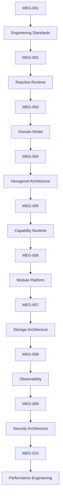
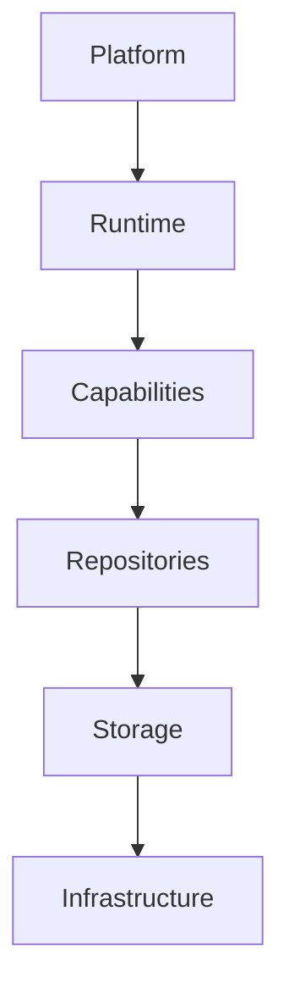

<!--
File: docs/engineering/guides/meg-010-performance-engineering/index.md
Document: MEG-010
Status: Draft
Version: 0.4
-->

# MEG-010 — Performance Engineering

> *Performance is not an optimisation step. It is an architectural property that must be designed, measured and protected from the beginning.*

---

# Purpose

Previous engineering specifications established:

- how software is written
- how work executes
- how the business is modelled
- how the Domain is protected
- how the Runtime operates
- how the platform evolves
- how information is stored
- how the platform explains itself
- how the platform protects itself

MEG-010 answers the next architectural question.

> **How should Mosaic remain fast, responsive and efficient without compromising clarity or correctness?**

Performance is not simply a matter of faster code.

Within Mosaic, performance is shaped by:

- Runtime scheduling
- capability design
- repository behaviour
- storage selection
- event throughput
- memory ownership
- caching strategy
- deployment topology
- observability

Performance must therefore be treated as a cross-cutting architectural concern rather than a narrow implementation concern.

---

# Relationship to MEG



Previous specifications define:

> **How the platform behaves.**

MEG-010 defines:

> **How the platform stays efficient while behaving that way.**

---

# Scope

This specification defines:

- Performance philosophy
- Performance ownership
- Runtime performance
- Capability performance
- Repository performance
- Storage performance
- Event throughput
- Scheduling efficiency
- Memory behaviour
- Caching strategy
- Back-pressure
- Benchmarking
- Profiling
- Load testing
- Performance observability
- Performance guidelines

This specification intentionally does **not** define:

- business behaviour
- security policy
- storage implementation
- deployment infrastructure

Those concerns belong to previous or future MEG specifications.

---

# Guiding Question

MEG-010 exists to answer one question.

> **How should Mosaic remain performant while preserving the architecture already defined by the previous MEGs?**

---

# Performance Statement

Within Mosaic:

> **Performance is the measurable expression of good architecture.**

Performance should not be achieved by compromising:

- ownership
- boundaries
- trust
- observability
- correctness

The fastest system is not always the best system.

The best system is the one that remains fast enough while staying understandable, secure and maintainable.

---

# Performance Hierarchy

Performance intentionally follows the platform architecture.



Every layer contributes to platform performance.

Every layer therefore owns its own performance responsibilities.

---

# Expected Outcome

After reading MEG-010 contributors should understand:

- how performance is owned
- how latency should be measured
- how throughput should be improved
- how memory should be managed
- how back-pressure should operate
- how storage selection affects speed
- how to benchmark the platform
- how to improve performance without weakening architecture

without turning the platform into a performance-driven mess. Humans do love creating those.

---

# Repository Structure

```text
engineering/

└── meg/

    └── MEG-010 Performance Engineering/

        README.md

        00-document-control.md

        01-performance-philosophy.md

        02-runtime-performance.md

        03-capability-performance.md

        04-repository-performance.md

        05-storage-performance.md

        06-event-throughput.md

        07-scheduling-efficiency.md

        08-memory-ownership.md

        09-caching-strategy.md

        10-back-pressure.md

        11-benchmarking.md

        12-profiling.md

        13-performance-guidelines.md

        14-adrs.md

        15-contributor-guidance.md

        references.md

        glossary.md
```

---

# Dependencies

Required reading:

- [MEG-001 — Go Engineering Standards](../meg-001-go-engineering-standards/index.md)
- [MEG-002 — Event-Driven Runtime](../meg-002-event-driven-runtime/index.md)
- [MEG-003 — Domain-Driven Design](../meg-003-domain-driven-design/index.md)
- [MEG-004 — Hexagonal Architecture](../meg-004-hexagonal-architecture/index.md)
- [MEG-005 — Runtime Architecture](../meg-005-runtime-architecture/index.md)
- [MEG-006 — Module Platform](../meg-006-module-platform/index.md)
- [MEG-007 — Storage Architecture](../meg-007-storage-architecture/index.md)
- [MEG-008 — Observability](../meg-008-observability/index.md)
- [MEG-009 — Security Architecture](../meg-009-security-architecture/index.md)

Future companion specifications:

- MEG-011 Deployment Architecture *(planned; not yet published)*
- MEG-012 API Architecture *(planned; not yet published)*
- MEG-013 Event Architecture *(planned; not yet published)*

---

# Design Goals

The Performance Architecture is intended to produce a platform that is:

- Fast
- Responsive
- Efficient
- Predictable
- Measurable
- Scalable
- Resource-conscious
- Operationally stable

Performance should emerge from architecture rather than being retrofitted onto it.
