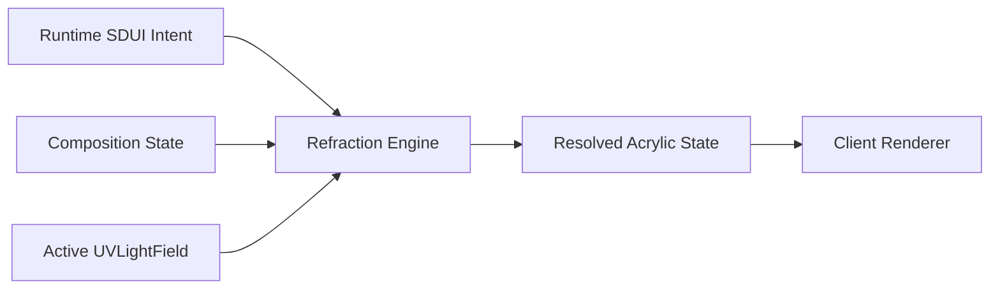

<!--
File: docs/engineering/guides/meg-014-refraction-engine/01-engine-boundary.md
Document: MEG-014
Status: Draft
Version: 0.1
-->

# 01 — Engine Boundary

---

# Responsibilities

The Refraction Engine converts semantic Material and Composition state into renderer-ready Acrylic state.

The engine should own:

- primary artwork-source selection
- source-field reconstruction
- artwork-to-Acrylic mapping
- backdrop participation parameters
- direct and secondary transport approximation
- edge response
- internal optical parallax
- capability and budget adaptation
- stable-state reuse

---

# Client Ownership

Runtime SDUI communicates Material identity, Composition hierarchy, artwork identity, Focus and accessibility intent.

The client owns all rendering technique choices.

It must not require server-authored CSS, shader code, renderer tiers or device classifications.

---

# Two-Dimensional Rendering Model

Artwork and Acrylic are two-dimensional surfaces or layered composites.

Each surface may possess `x`, `y`, `z`, scale and orientation within Composition Space.

These values express ordering, projection and spatial relationship.

They do not imply:

- meshes
- extrusion
- ray-to-triangle intersection
- volumetric scene data
- a general-purpose three-dimensional engine

GPU renderers may use triangles internally as raster primitives without making mesh geometry part of the Refraction model.
