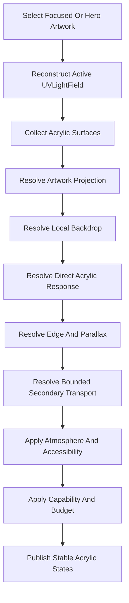

<!--
File: docs/engineering/guides/meg-014-refraction-engine/05-resolution-pipeline.md
Document: MEG-014
Status: Draft
Version: 0.1
-->

# 05 — Resolution Pipeline

---

# Pipeline

---

# Direct Response

The engine should sample the active field across the projected Acrylic footprint rather than reducing the entire artwork to one colour.

It should preserve:

- relative bright and dark regions
- local colour variation
- source-to-receiver direction
- apparent-thickness response

The selected Material profile constrains final intensity and saturation.

---

# Backdrop Response

Backdrop distortion should remain local and bounded.

The engine should prevent displacement from revealing pixels outside an allowed sampling margin or destabilising foreground readability.

Foreground text, icons and interaction affordances should normally render above the distorted Material layer.

---

# Edge Response

Edge emission should be derived after artwork projection so its position moves with source content and receiver transform.

The engine may resolve boundary segments or a smaller renderer-specific representation.

It should retain directional asymmetry rather than applying one uniform glowing border.

---

# Secondary Response

Secondary transport should aggregate only visible, spatially related contributions.

Each pass should reduce remaining energy.

The engine should stop by energy threshold, depth limit or both.

Direct artwork response must retain priority over secondary refinement.
