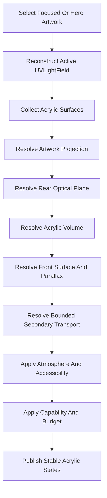

<!--
File: docs/engineering/guides/meg-014-refraction-engine/05-resolution-pipeline.md
Document: MEG-014
Status: Draft
Version: 0.1
-->

# 05 — Resolution Pipeline

---

# Pipeline

---

# Direct Response

The engine should sample the active field across the projected Acrylic footprint rather than reducing the entire artwork to one colour.

It should preserve:

- relative bright and dark regions
- local colour variation
- source-to-receiver direction
- apparent-thickness response

The selected Material profile constrains final intensity and saturation.

---

# Three-Layer Resolution

Every receiver should resolve the same fixed three-layer Material meaning.

## Rear Optical Plane

The engine should resolve a world-anchored backdrop sampling window, fixed bounded displacement and sufficient overscan.

The sample should preserve structured backdrop detail so displacement remains perceptible.

Uniform full-face blur is not a substitute for the Rear Optical Plane.

## Acrylic Volume

The engine should transform incident `UVLightField` colour and energy through the governed tint transmission, absorption and scattering profile.

Directional source-facing contour energy should spread inward with the fixed Material falloff rather than appear as a flat tint overlay.

## Front Surface Response

The engine should resolve restrained Fresnel, reflection and specular values plus a thin contour-bound response.

It should not create a detached highlight stroke, thick bezel or uniform glowing perimeter.

---

# Backdrop Response

Backdrop distortion should remain local and bounded.

The engine should prevent displacement from revealing pixels outside an allowed sampling margin or destabilising foreground readability.

Foreground text, icons and interaction affordances should normally render above the distorted Material layer.

---

# Edge Response

Edge emission should be derived after artwork projection so its position moves with source content and receiver transform.

The engine may resolve boundary segments or a smaller renderer-specific representation.

It should retain directional asymmetry rather than applying one uniform glowing border.

Renderer geometry should clip the response to the actual contour so illuminated energy follows straight boundaries and wraps continuously around curved corners.

Most incident hue should be transported inward by the Acrylic Volume.

The Front Surface contour response remains narrower than the Volume pigmentation region.

---

# Secondary Response

Secondary transport should aggregate only visible, spatially related contributions.

Each pass should reduce remaining energy.

The alpha should use one secondary bounce, no cyclic feedback and a governed maximum contributor count per receiver.

The engine should stop by energy threshold, bounce limit, contributor limit or available frame budget.

Direct artwork response must retain priority over secondary refinement.
