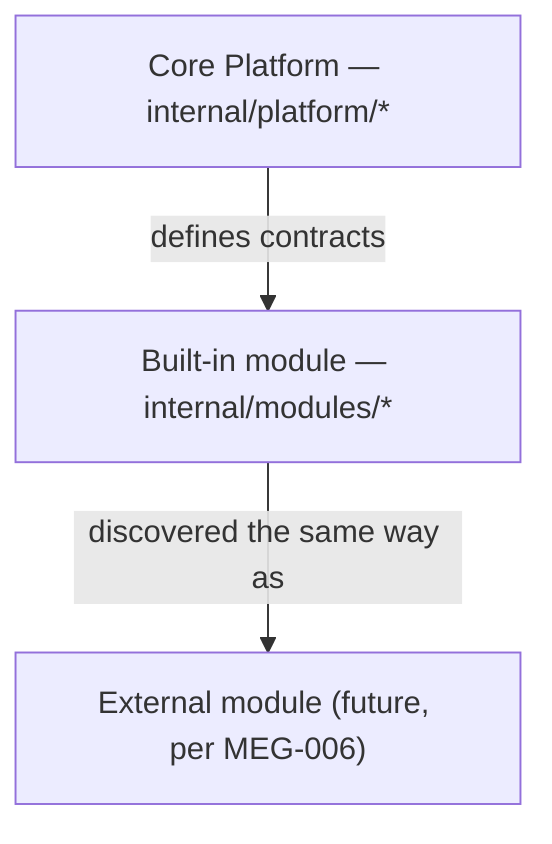
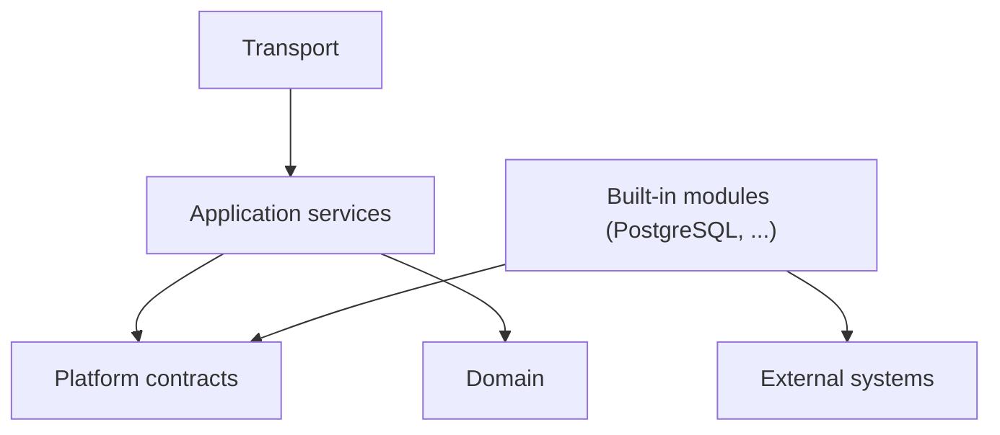

<!--
File: docs/engineering/guides/meg-015-platform-foundation-implementation/02-repository-layout.md
Document: MEG-015
Status: Draft
Version: 0.1
-->

# 02 — Repository Layout

---

# Package Tier Model

Implementation feedback from the first Platform build (`mosaic-platform`) showed that a flat two-tier split between `internal/platform/*` and `internal/adapters/*` does not distinguish a mandatory, Module-shaped built-in adapter (PostgreSQL) from genuinely internal, non-Module-shaped helpers (filesystem utilities, crypto helpers). The Platform repository therefore separates into three tiers of trust and delivery.



**Core Platform** (`internal/platform/*`) — domain, contracts and application services. Fully trusted, compiled in, defines the rules everything else follows.

**Built-in module** (`internal/modules/*`) — infrastructure that implements Platform contracts using the same registration and manifest shape a future external Module would use ([MEG-006 — Module Platform](../meg-006-module-platform/index.md)), but compiled in, required and fully trusted — not sandboxed, not independently versioned, not optional. PostgreSQL is the first example: it lives at `internal/modules/postgres/`, registered through `internal/composition/builtin/` the same way an external Module would be discovered.

**External module** (future, per [MEG-006 — Module Platform](../meg-006-module-platform/index.md)) — product and domain capability packs (anime, manga, and so on). Governed, independently versioned, discovered at runtime. Not part of the Platform foundation's initial scaffold.

`internal/adapters/` is reserved for helpers that are **not** Module-shaped — code that does not implement a full contract surface on its own, such as filesystem utilities or crypto helpers. PostgreSQL, and any future built-in storage or eventing adapter, does not belong there.

---

# Initial Layout

The initial Go repository should separate public entry points, Core Platform code, built-in modules and future generated contracts.

```text
cmd/
  mosaic-platform/
    main.go
internal/
  platform/
    app/
    contracts/
    domain/
    runtime/
    policy/
    sessions/
    config/
    secrets/
    diagnostics/
  modules/
    postgres/
      migrations/
  adapters/
    filesystem/
    crypto/
  transport/
    graphql/
    health/
  composition/
    builtin/
contracts/
  platform/
    v1/
test/
  contract/
  integration/
  fixtures/
```

The exact names may change during implementation, but the tier model and dependency rules must not.

---

# Package Responsibilities

| Package area | Responsibility |
|--------------|----------------|
| `cmd/mosaic-platform` | Process entry point and dependency bootstrap only |
| `internal/platform/app` | Application services, transaction orchestration and command handling |
| `internal/platform/contracts` | Private contract definitions used before SDK extraction |
| `internal/platform/domain` | Platform domain types and invariants |
| `internal/platform/runtime` | Lifecycle, registry, startup and shutdown |
| `internal/platform/policy` | Permission decision and enforcement helpers |
| `internal/platform/sessions` | Session issuance, validation and revocation |
| `internal/platform/config` | Configuration schema, validation and activation |
| `internal/platform/secrets` | Secret access through broker interfaces |
| `internal/platform/diagnostics` | Health model, logs and redaction |
| `internal/modules/postgres` | Built-in PostgreSQL module: storage, migrations, outbox and the remaining Core Platform contracts it fulfils |
| `internal/adapters/filesystem` | Non-Module-shaped filesystem helpers |
| `internal/adapters/crypto` | Non-Module-shaped crypto helpers |
| `internal/transport/graphql` | GraphQL projection and command transport |
| `internal/transport/health` | Supervisor-facing health endpoints |
| `internal/composition/builtin` | Built-in module manifest, registration and discovery shape |
| `contracts/platform/v1` | Candidate source for generated SDK contracts |
| `test/contract` | Adapter contract tests reused across implementations |

---

# Dependency Direction

Implementation dependencies must point inward.



The domain must not import transport, module or database packages. Application services may depend on contracts, but not on concrete PostgreSQL (or other module) types. Built-in modules depend on Platform contracts and external systems; nothing in Core Platform depends on a built-in module.

---

# Public Surface Control

Only `contracts/platform/v1` may be treated as a candidate public contract source. Everything under `internal/` — Core Platform, built-in modules and adapters alike — is private and must not be imported by external Modules.

Before SDK generation exists, tests should enforce this with import checks.
