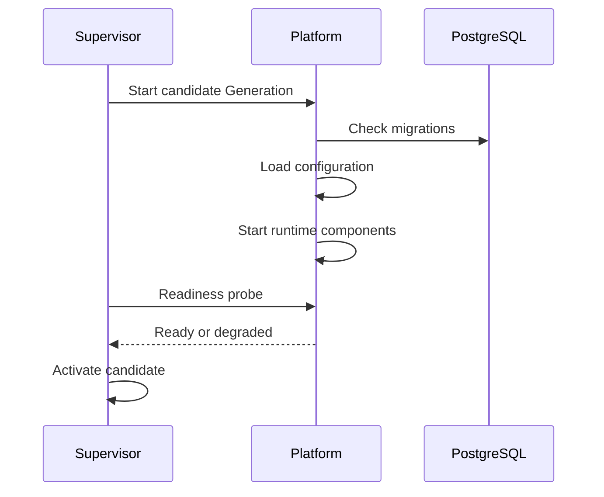

<!--
File: docs/engineering/guides/meg-015-platform-foundation-implementation/10-supervisor-handoff.md
Document: MEG-015
Status: Draft
-->

# 10 — Supervisor Handoff

---

# Platform Responsibility

The Platform must expose enough metadata and health information for the Supervisor to activate, observe and roll back a Generation.

The Platform must not manage its own installation lifecycle.

---

# Required Handoff Surface

| Surface | Purpose |
|---------|---------|
| Generation metadata | Identifies Platform version, contract version, built-in Modules and assets |
| Readiness health | Tells Supervisor when activation is safe |
| Liveness health | Tells Supervisor whether the process should keep running |
| Migration status | Shows whether database migration is required, running, complete or failed |
| Config activation status | Shows active configuration version and reload class |
| Shutdown hook | Allows graceful worker drain and outbox checkpointing |

---

# Activation Sequence

---

# Rollback Boundary

Platform rollback means Supervisor activates an earlier Generation.

The Platform must not attempt to reverse database mutations during Generation rollback. Database recovery belongs to the persistence and recovery strategy in [MEG-005 — Runtime Architecture](../meg-005-runtime-architecture/20-persistence-and-recovery.md).
