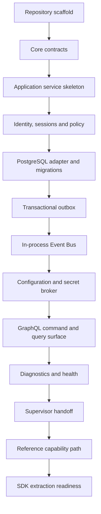

<!--
File: docs/engineering/guides/meg-015-platform-foundation-implementation/12-build-sequence.md
Document: MEG-015
Status: Draft
Version: 0.1
-->

# 12 — Build Sequence

---

# Sequence

The Platform should be built in the following order.

---

# Slice Definitions

| Slice | Exit criteria |
|-------|---------------|
| Repository scaffold | Process boots, config loads and core packages compile |
| Core contracts | First contract set exists with compile-time tests |
| Application skeleton | One command and one query pass through service boundaries |
| Identity and policy | Local user, session and permission denial path work |
| PostgreSQL | Migrations run and adapter passes contract tests |
| Outbox | Command persists state and event atomically |
| Event Bus | Outbox worker publishes to an idempotent local subscriber |
| Configuration | Versioned config validates and activates |
| Secret broker | Secret references resolve without direct file reads |
| GraphQL | Auth, config, health and jobs surfaces call application services |
| Diagnostics | Component health and redacted support bundle exist |
| Supervisor handoff | Readiness, liveness, shutdown and metadata are available |
| Reference capability | Proven contracts are promoted into `contracts/platform/v1`, then one non-media capability proves the registration path using only those packages |
| SDK readiness | Import boundaries are enforced and the promoted `contracts/platform/v1` surface is confirmed to expose no private Platform internals |

---

# Contract Promotion Within Slice 13

Promoting the proven contracts into `contracts/platform/v1` is the first step of the Reference capability slice, not a later one.

The Stop Point below requires the reference capability to build against candidate contract packages only. Those packages must therefore exist before the reference capability is written, so `contracts/platform/v1` is populated at the start of this slice. SDK readiness then verifies isolation and import boundaries rather than populating the surface for the first time.

---

# Storage Contract Correction

The Reference capability slice was initially blocked by the transaction contract shape in [03 — Platform Contracts](03-platform-contracts.md).

A closed `Tx` interface enumerating Core Platform stores gave a capability no way to participate in a transaction without editing Core Platform on its behalf, contradicting [MEG-006 — Module Platform](../meg-006-module-platform/index.md)'s principle that the Runtime require no modification to support new capabilities, and the equality of built-in and Module-delivered capabilities in [MAC-001 — Platform Architecture](../../architecture/mac-001-platform-architecture/index.md).

It is unblocked by moving to uniform, port-based store resolution ([03 — Platform Contracts](03-platform-contracts.md)): Core Platform and capability stores are resolved identically, and the storage adapter is a replaceable port. The promoted `contracts/platform/v1` surface therefore includes the storage port the reference capability depends on.

The reasoning, the alternatives weighed and the deferred follow-ups are recorded in [MAD-001 — Transactional Store Extensibility](../../architecture/mad-001-transactional-store-extensibility/index.md).

---

# Stop Point Before SDK

The Platform is ready for SDK work when the reference capability uses only candidate contract packages and no private Platform internals.

If the reference capability requires private imports, the Platform contracts are not ready to generate or publish.
