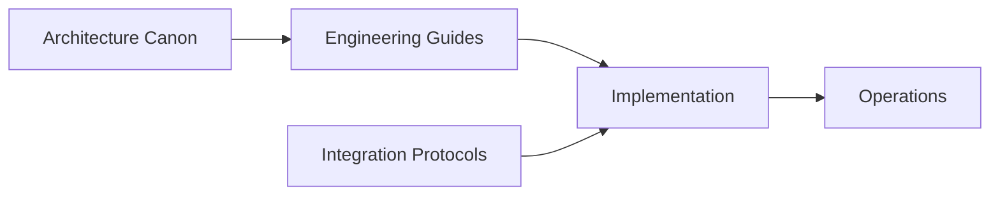

<!--
File: docs/engineering/index.md
Document: Engineering
Status: Draft
Version: 0.4
-->

# Engineering

Engineering documentation defines how Mosaic software is structured, operated, and evolved.

## At a Glance

| Area | Responsibility | Use it when |
|------|----------------|-------------|
| [Architecture](architecture/index.md) | Defines accepted Platform architecture | You need to understand what Mosaic is and where responsibilities belong |
| [Guides](guides/index.md) | Explains implementation practices | You are designing or building Mosaic software |
| [Protocols](protocols/index.md) | Defines interoperability contracts | Components or Modules must communicate compatibly |
| [Operations](operations/index.md) | Defines operational procedures and expectations | You are deploying, diagnosing, maintaining or recovering Mosaic |
| [Documentation](documentation/index.md) | Governs the documentation system | You are authoring or maintaining Mosaic documentation |

## Recommended Reading Paths

- For architectural orientation, read [MAC-001 — Platform Architecture](architecture/mac-001-platform-architecture/index.md) before implementation-facing guidance.
- For engineering foundations, begin with [MEG-001 — Go Engineering Standards](guides/meg-001-go-engineering-standards/index.md) and follow the [Engineering Guides](guides/index.md) in sequence.
- For Module development, continue from [MEG-006 — Module Platform](guides/meg-006-module-platform/index.md) to the [MIP-002 — Module Manifest Protocol](protocols/mip-002-module-manifest-protocol/index.md) and [MIP-001 — Event Protocol](protocols/mip-001-event-protocol/index.md).
- For artwork-light interchange, continue from [MDS-003 — Material System](../design/system/mds-003-material-system/index.md) to [MIP-003 — UVLightFrame Protocol](protocols/mip-003-uv-light-frame-protocol/index.md).
- For Refraction Engine implementation, continue from [MIP-003 — UVLightFrame Protocol](protocols/mip-003-uv-light-frame-protocol/index.md) to [MEG-014 — Refraction Engine](guides/meg-014-refraction-engine/index.md).
- For operations, pair [MEG-008 — Observability](guides/meg-008-observability/index.md) with [MOP-001 — Observability Operations](operations/mop-001-observability-operations/index.md).

These summaries provide orientation. The linked specifications remain authoritative.
