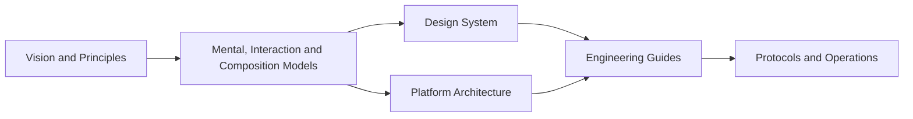

<!--
File: docs/index.md
Document: Mosaic Architecture
Status: Draft
Version: 0.2
-->

# Mosaic Architecture

Mosaic brings product experience, platform architecture, engineering practice and operations into one connected body of documentation.

## Mosaic at a Glance

The documentation follows two complementary paths:

- [Design](design/index.md) defines why Mosaic exists, how it should feel and behave, and how that intent becomes reusable design infrastructure.
- [Engineering](engineering/index.md) defines the accepted Platform architecture, implementation guidance, integration contracts, operational practices and documentation governance.

!!! note "Overview, not authority"
    Landing pages provide orientation and reading paths. The linked specifications remain the authoritative source for architectural requirements, definitions and decisions.

## Start with Your Goal

| Goal | Start here | Continue with |
|------|------------|---------------|
| Understand Mosaic's product and design intent | [MDL-001 — Mosaic Design Language Vision](design/language/mdl-001-vision/index.md) | [Design Language](design/language/index.md) |
| Design a Mosaic experience | [MDL-003 — Mental Model](design/language/mdl-003-mental-model/index.md) | [Design System](design/system/index.md) |
| Understand the accepted Platform architecture | [MAC-001 — Platform Architecture](engineering/architecture/mac-001-platform-architecture/index.md) | [Engineering Guides](engineering/guides/index.md) |
| Build Mosaic software | [MEG-001 — Go Engineering Standards](engineering/guides/meg-001-go-engineering-standards/index.md) | [Engineering](engineering/index.md) |
| Build or integrate a Module | [MEG-006 — Module Platform](engineering/guides/meg-006-module-platform/index.md) | [Integration Protocols](engineering/protocols/index.md) |
| Operate or diagnose Mosaic | [MEG-008 — Observability](engineering/guides/meg-008-observability/index.md) | [Operations](engineering/operations/index.md) |
| Author or maintain documentation | [MDG-001 — Documentation Authority Guide](engineering/documentation/mdg-001-documentation-authority-guide/index.md) | [Documentation](engineering/documentation/index.md) |

## How to Use This Site

Each specification is maintained as a separate book. Its landing page summarises purpose and scope; focused chapters contain the detail. Use the navigation or search to move directly to a topic, and follow cross-references when a concept is owned by another specification.

## Current Documentation

The current documentation set is draft material. Draft does not mean disposable: changes should be intentional, reviewed, and traceable.
