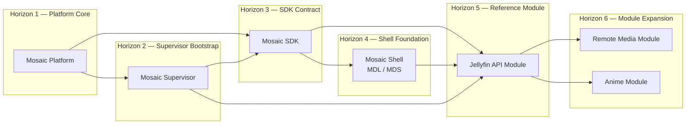

<!--
File: docs/roadmaps/mrm-001-mosaic-platform-foundation/02-delivery-horizons.md
Document: MRM-001
Chapter: 02
Status: Draft
Version: 0.1
-->

# 02 — Delivery Horizons

The roadmap uses capability horizons rather than fixed dates. Work may run in parallel when its dependency contract is stable.

## Roadmap View

The primary path moves left to right. SDK, Shell and Supervisor work can overlap where their contracts are stable; the first complete Module remains gated by the Supervisor.

## Horizon 1 — Platform Core

Deliver the minimum Mosaic Platform foundation:

- authentication and session lifecycle,
- storage and persistence contracts,
- GraphQL boundary,
- event bus and event contracts,
- capability registration,
- configuration and health surfaces.

Exit when a local or development deployment can authenticate a user, persist state, expose a typed API and publish/consume a representative event.

## Horizon 2 — Supervisor Bootstrap

Build the Mosaic Supervisor against the Platform foundation.

The Supervisor should be able to assemble the Mosaic binary, start it, observe health, surface diagnostics and perform controlled restart or recovery actions.

This horizon may overlap late Platform work, but it must complete before the first Module exits integration readiness.

## Horizon 3 — SDK Contract

Generate or implement the SDK from the stable Platform contracts.

The SDK should provide typed access, lifecycle handling, event integration, authentication/session handling and Module registration without exposing internal Platform implementation details.

## Horizon 4 — Shell Foundation

Build the Mosaic Shell using the SDK and the client-side MDL/MDS implementation.

The Shell establishes the host composition, navigation, loading, recovery, accessibility and Module mounting surfaces.

## Horizon 5 — Reference Module

Deliver `mosaic-jellyfin-api-module` as the first complete Module integration.

The Module must be assembled and operated by the Supervisor, consume the SDK, render through Shell contracts and demonstrate the full Platform-to-client path.

## Horizon 6 — Module Expansion

Deliver `mosaic-remote-media-module` and `mosaic-anime-module` against the proven contracts.

These Modules should validate that the SDK and Shell are extensible without requiring Module-specific forks in the Platform or Supervisor.

## Parallel Work

The following work may proceed in parallel after its inputs are stable:

- SDK scaffolding during late Platform contract design,
- Shell component implementation during SDK contract stabilisation,
- Module discovery and adapter research before the SDK is complete,
- Supervisor diagnostics and packaging alongside Supervisor bootstrap.

Parallel work must not silently promote provisional contracts into shared authority.
