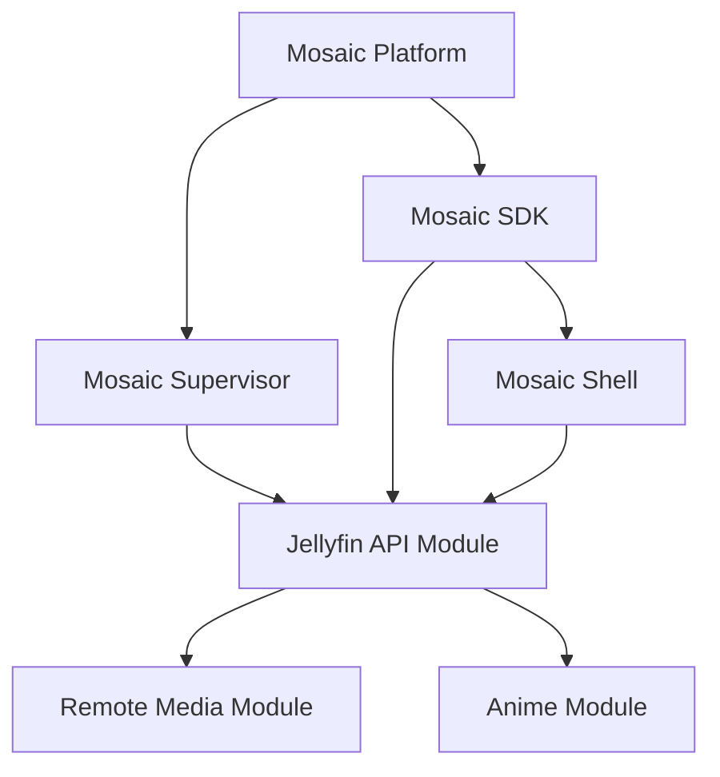

<!--
File: docs/roadmaps/mrm-001-mosaic-platform-foundation/03-dependency-sequence.md
Document: MRM-001
Chapter: 03
Status: Draft
Version: 0.1
-->

# 03 — Dependency Sequence

The sequence below expresses delivery dependencies, not a requirement that every repository be developed serially.

| Capability | Depends on | Why |
|------------|------------|-----|
| Mosaic Platform | None within MRM-001 | Establishes the core authority and contracts. |
| Mosaic Supervisor | Mosaic Platform contracts | Needs a runnable Platform to assemble, launch and supervise. |
| Mosaic SDK | Mosaic Platform contracts | Translates Platform capabilities into stable consumer APIs. |
| Mosaic Shell | Mosaic SDK and client-side MDL/MDS | Needs typed capability access and the rendering host. |
| `mosaic-jellyfin-api-module` | Supervisor, SDK and Shell integration surfaces | Acts as the first end-to-end reference Module. |
| `mosaic-remote-media-module` | SDK, Shell and proven Module lifecycle | Extends media sources without new core coupling. |
| `mosaic-anime-module` | SDK, Shell and proven Module lifecycle | Validates domain-specific media capability extension. |

## Critical Path

The Supervisor is on the critical path before the first Module because it turns the Platform from a set of capabilities into an assembled, operable Mosaic binary.

## Ordering Rules

1. Stabilise the minimum Platform contracts before declaring the SDK usable.
2. Establish Supervisor assembly and lifecycle before declaring the first Module integration-ready.
3. Keep Shell and SDK work aligned through contract fixtures rather than waiting for the entire Platform to be feature-complete.
4. Use the Jellyfin API Module as the first end-to-end reference path.
5. Add Remote Media and Anime capabilities only after the reference path demonstrates that Module extension does not require core forks.
