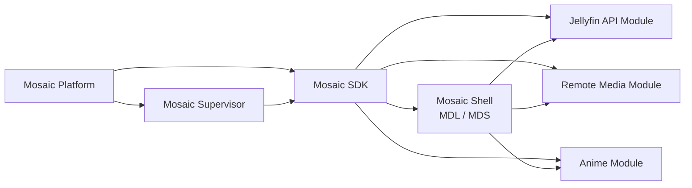

<!--
File: docs/roadmaps/mrm-001-mosaic-platform-foundation/index.md
Document: MRM-001
Status: Draft
Version: 0.1
-->

# MRM-001 — Mosaic Platform Foundation

> *Build the platform that can build, operate and extend the first Mosaic experience.*

MRM-001 defines the first Mosaic delivery sequence across the Platform, SDK, Shell, Supervisor and media Modules.

This Roadmap is planning authority only. The linked Architecture Canon, Design System, Engineering Guides and Protocols remain authoritative for their respective requirements.

## Delivery Intent

The first Mosaic release should establish a usable vertical foundation rather than a collection of disconnected repositories.

The sequence therefore prioritises:

1. a Platform that owns core runtime capabilities,
2. a Supervisor that can assemble and operate the Mosaic binary,
3. an SDK that makes Platform capabilities consumable by products and Modules,
4. a Shell that renders Mosaic through the client-side MDL/MDS implementation,
5. a first reference media Module, and
6. additional media Modules built against the same contracts.

## Planned Delivery Shape

The Supervisor is intentionally established before the first Module reaches completion so the Platform can produce, start, supervise and diagnose a real Mosaic binary before Module breadth expands.

## Reading Guidance

- Read [01 — Release Outcomes](01-release-outcomes.md) for the intended first-release result.
- Read [02 — Delivery Horizons](02-delivery-horizons.md) for the proposed sequence and parallel work.
- Read [03 — Dependency Sequence](03-dependency-sequence.md) for ordering constraints.
- Read [04 — Completion Evidence](04-completion-evidence.md) for the evidence required to close the roadmap.
